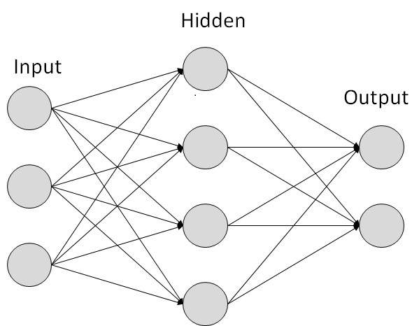
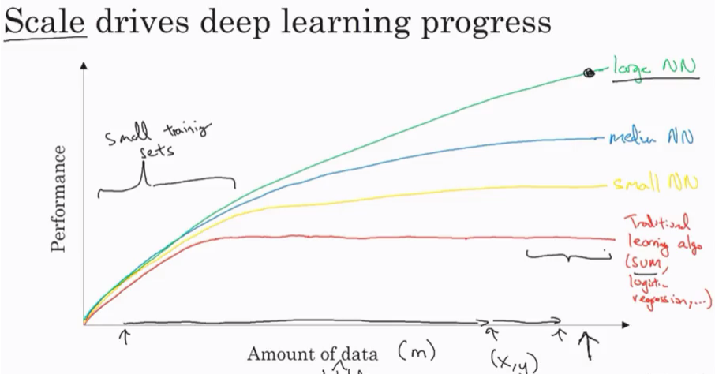
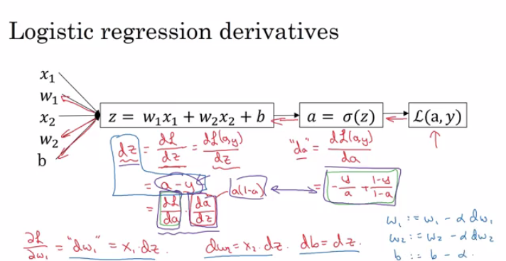
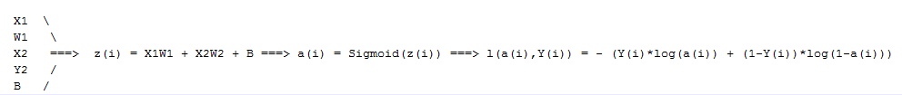
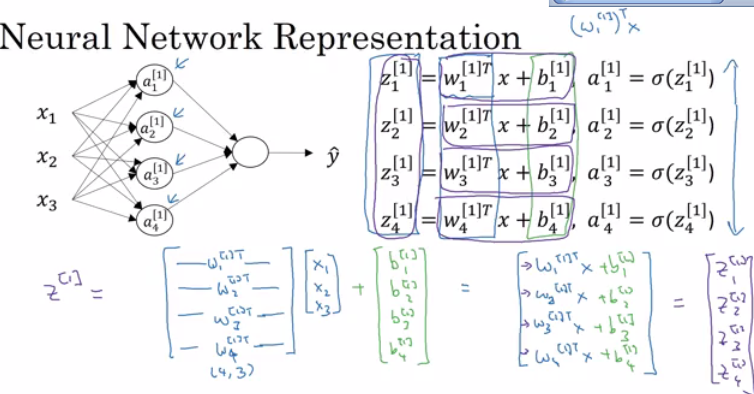
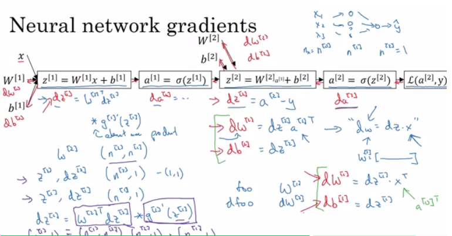
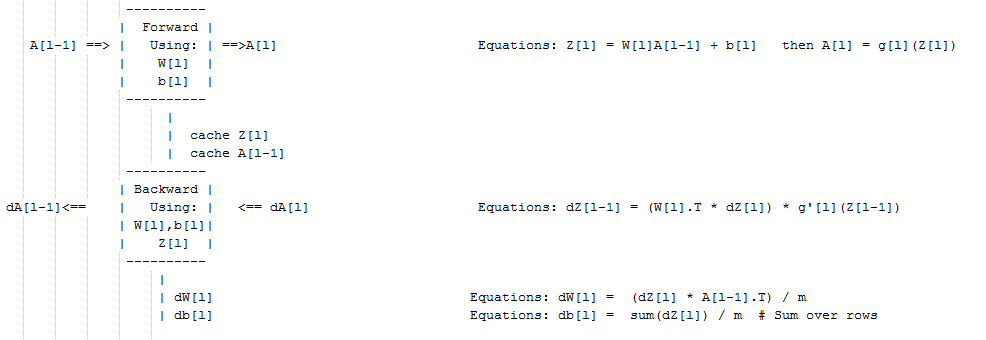

# Neural Networks and Deep Learning

This is the first course of the deep learning specialization at [Coursera](https://www.coursera.org/specializations/deep-learning) which is moderated by [DeepLearning.ai](http://deeplearning.ai/). The course is taught by Andrew Ng.

## Table of contents

* [Neural Networks and Deep Learning](#neural-networks-and-deep-learning)
   * [Table of contents](#table-of-contents)
   * [Course summary](#course-summary)
   * [Introduction to deep learning](#introduction-to-deep-learning)
      * [What is a (Neural Network) NN?](#what-is-a-neural-network-nn)
      * [Supervised learning with neural networks](#supervised-learning-with-neural-networks)
      * [Why is deep learning taking off?](#why-is-deep-learning-taking-off)
   * [Neural Networks Basics](#neural-networks-basics)
      * [Binary classification](#binary-classification)
      * [Logistic regression](#logistic-regression)
      * [Logistic regression cost function](#logistic-regression-cost-function)
      * [Gradient Descent](#gradient-descent)
      * [Derivatives](#derivatives)
      * [More Derivatives examples](#more-derivatives-examples)
      * [Computation graph](#computation-graph)
      * [Derivatives with a Computation Graph](#derivatives-with-a-computation-graph)
      * [Logistic Regression Gradient Descent](#logistic-regression-gradient-descent)
      * [Gradient Descent on m Examples](#gradient-descent-on-m-examples)
      * [Vectorization](#vectorization)
      * [Vectorizing Logistic Regression](#vectorizing-logistic-regression)
      * [Notes on Python and NumPy](#notes-on-python-and-numpy)
      * [General Notes](#general-notes)
   * [Shallow neural networks](#shallow-neural-networks)
      * [Neural Networks Overview](#neural-networks-overview)
      * [Neural Network Representation](#neural-network-representation)
      * [Computing a Neural Network's Output](#computing-a-neural-networks-output)
      * [Vectorizing across multiple examples](#vectorizing-across-multiple-examples)
      * [Activation functions](#activation-functions)
      * [Why do you need non-linear activation functions?](#why-do-you-need-non-linear-activation-functions)
      * [Derivatives of activation functions](#derivatives-of-activation-functions)
      * [Gradient descent for Neural Networks](#gradient-descent-for-neural-networks)
      * [Random Initialization](#random-initialization)
   * [Deep Neural Networks](#deep-neural-networks)
      * [Deep L-layer neural network](#deep-l-layer-neural-network)
      * [Forward Propagation in a Deep Network](#forward-propagation-in-a-deep-network)
      * [Getting your matrix dimensions right](#getting-your-matrix-dimensions-right)
      * [Why deep representations?](#why-deep-representations)
      * [Building blocks of deep neural networks](#building-blocks-of-deep-neural-networks)
      * [Forward and Backward Propagation](#forward-and-backward-propagation)
      * [Parameters vs Hyperparameters](#parameters-vs-hyperparameters)
      * [What does this have to do with the brain](#what-does-this-have-to-do-with-the-brain)
   * [Extra: Ian Goodfellow interview](#extra-ian-goodfellow-interview)

## Course summary

Here are the course summary as its given on the course [link](https://www.coursera.org/learn/neural-networks-deep-learning):

> If you want to break into cutting-edge AI, this course will help you do so. Deep learning engineers are highly sought after, and mastering deep learning will give you numerous new career opportunities. Deep learning is also a new "superpower" that will let you build AI systems that just weren't possible a few years ago.
>
> In this course, you will learn the foundations of deep learning. When you finish this class, you will:
> - Understand the major technology trends driving Deep Learning
> - Be able to build, train and apply fully connected deep neural networks
> - Know how to implement efficient (vectorized) neural networks
> - Understand the key parameters in a neural network's architecture
>
> This course also teaches you how Deep Learning actually works, rather than presenting only a cursory or surface-level description. So after completing it, you will be able to apply deep learning to a your own applications. If you are looking for a job in AI, after this course you will also be able to answer basic interview questions.


## Introduction to deep learning

> Be able to explain the major trends driving the rise of deep learning, and understand where and how it is applied today.

### What is a (Neural Network) NN?

- Single neuron == linear regression without applying activation(perceptron)
- Basically a single neuron will calculate weighted sum of input(W.T*X) and then we can set a threshold to predict output in a perceptron. If weighted sum of input cross the threshold, perceptron fires and if not then perceptron doesn't predict.
- Perceptron can take real values input or boolean values.
- Actually, when w⋅x+b=0 the perceptron outputs 0.
- Disadvantage of perceptron is that it only output binary values and if we try to give small change in weight and bais then perceptron can flip the output. We need some system which can modify the output slightly according to small change in weight and bias. Here comes sigmoid function in picture.
- If we change perceptron with a sigmoid function, then we can make slight change in output.
- e.g. output in perceptron = 0, you slightly changed weight and bias, output becomes = 1 but actual output is 0.7. In case of sigmoid, output1 = 0, slight change in weight and bias, output = 0.7. 
- If we apply sigmoid activation function then Single neuron will act as Logistic Regression.
-  we can understand difference between perceptron and sigmoid function by looking at sigmoid function graph.

- Simple NN graph:
  - 
  - Image taken from [tutorialspoint.com](http://www.tutorialspoint.com/)
- RELU stands for rectified linear unit is the most popular activation function right now that makes deep NNs train faster now.
- Hidden layers predicts connection between inputs automatically, thats what deep learning is good at.
- Deep NN consists of more hidden layers (Deeper layers)
  - 
  - Image taken from [opennn.net](http://www.opennn.net/)
- Each Input will be connected to the hidden layer and the NN will decide the connections.
- Supervised learning means we have the (X,Y) and we need to get the function that maps X to Y.

### Supervised learning with neural networks

- Different types of neural networks for supervised learning which includes:
  - CNN or convolutional neural networks (Useful in computer vision)
  - RNN or Recurrent neural networks (Useful in Speech recognition or NLP)
  - Standard NN (Useful for Structured data)
  - Hybrid/custom NN or a Collection of NNs types
- Structured data is like the databases and tables.
- Unstructured data is like images, video, audio, and text.
- Structured data gives more money because companies relies on prediction on its big data.

### Why is deep learning taking off?

- Deep learning is taking off for 3 reasons:
  1. Data:
     - Using this image we can conclude:
       - 
     - For small data NN can perform as Linear regression or SVM (Support vector machine)
     - For big data a small NN is better that SVM
     - For big data a big NN is better that a medium NN is better that small NN.
     - Hopefully we have a lot of data because the world is using the computer a little bit more
       - Mobiles
       - IOT (Internet of things)
  2. Computation:
     - GPUs.
     - Powerful CPUs.
     - Distributed computing.
     - ASICs
  3. Algorithm:
     1. Creative algorithms has appeared that changed the way NN works.
        - For example using RELU function is so much better than using SIGMOID function in training a NN because it helps with the vanishing gradient problem.

  ​

## Neural Networks Basics

> Learn to set up a machine learning problem with a neural network mindset. Learn to use vectorization to speed up your models.

### Binary classification

- Mainly he is talking about how to do a logistic regression to make a binary classifier.
  - 
  - Image taken from [3.bp.blogspot.com](http://3.bp.blogspot.com)
- He talked about an example of knowing if the current image contains a cat or not.
- Here are some notations:
  - `M is the number of training vectors`
  - `Nx is the size of the input vector`
  - `Ny is the size of the output vector`
  - `X(1) is the first input vector`
  - `Y(1) is the first output vector`
  - `X = [x(1) x(2).. x(M)]`
  - `Y = (y(1) y(2).. y(M))`
- We will use python in this course.
- In NumPy we can make matrices and make operations on them in a fast and reliable time.

### Logistic regression

- Algorithm is used for classification algorithm of 2 classes.
- Equations:
  - Simple equation:	`y = wx + b`
  - If x is a vector: `y = w(transpose)x + b`
  - If we need y to be in between 0 and 1 (probability): `y = sigmoid(w(transpose)x + b)`
  - In some notations this might be used: `y = sigmoid(w(transpose)x)`
    - While `b` is `w0` of `w` and we add `x0 = 1`. but we won't use this notation in the course (Andrew said that the first notation is better).
- In binary classification `Y` has to be between `0` and `1`.
- In the last equation `w` is a vector of `Nx` and `b` is a real number

### Logistic regression cost function

- First loss function would be the square root error:  `L(y',y) = 1/2 (y' - y)^2`
  - But we won't use this notation because it leads us to optimization problem which is non convex, means it contains local optimum points.
- This is the function that we will use: `L(y',y) = - (y*log(y') + (1-y)*log(1-y'))`
- To explain the last function lets see:
  - if `y = 1` ==> `L(y',1) = -log(y')`  ==> we want `y'` to be the largest   ==> `y`' biggest value is 1
  - if `y = 0` ==> `L(y',0) = -log(1-y')` ==> we want `1-y'` to be the largest ==> `y'` to be smaller as possible because it can only has 1 value.
- Then the Cost function will be: `J(w,b) = (1/m) * Sum(L(y'[i],y[i]))`
- The loss function computes the error for a single training example; the cost function is the average of the loss functions of the entire training set.

### Gradient Descent

- We want to predict `w` and `b` that minimize the cost function.
- Our cost function is convex.
- First we initialize `w` and `b` to 0,0 or initialize them to a random value in the convex function and then try to improve the values the reach minimum value.
- In Logistic regression people always use 0,0 instead of random.
- The gradient decent algorithm repeats: `w = w - alpha * dw`
  where alpha is the learning rate and `dw` is the derivative of `w` (Change to `w`)
  The derivative is also the slope of `w`
- Looks like greedy algorithms. the derivative give us the direction to improve our parameters.


- The actual equations we will implement:
  - `w = w - alpha * d(J(w,b) / dw)`        (how much the function slopes in the w direction)
  - `b = b - alpha * d(J(w,b) / db)`        (how much the function slopes in the d direction)

### Derivatives

- We will talk about some of required calculus.
- You don't need to be a calculus geek to master deep learning but you'll need some skills from it.
- Derivative of a linear line is its slope.
  - ex. `f(a) = 3a`                    `d(f(a))/d(a) = 3`
  - if `a = 2` then `f(a) = 6`
  - if we move a a little bit `a = 2.001` then `f(a) = 6.003` means that we multiplied the derivative (Slope) to the moved area and added it to the last result.

### More Derivatives examples

- `f(a) = a^2`  ==> `d(f(a))/d(a) = 2a`
  - `a = 2`  ==> `f(a) = 4`
  - `a = 2.0001` ==> `f(a) = 4.0004` approx.
- `f(a) = a^3`  ==> `d(f(a))/d(a) = 3a^2`
- `f(a) = log(a)`  ==> `d(f(a))/d(a) = 1/a`
- To conclude, Derivative is the slope and slope is different in different points in the function thats why the derivative is a function.

### Computation graph

- Its a graph that organizes the computation from left to right.
  - 

### Derivatives with a Computation Graph

- Calculus chain rule says:
  If `x -> y -> z`          (x effect y and y effects z)
  Then `d(z)/d(x) = d(z)/d(y) * d(y)/d(x)`
- The video illustrates a big example.
  - 
- We compute the derivatives on a graph from right to left and it will be a lot more easier.
- `dvar` means the derivatives of a final output variable with respect to various intermediate quantities.

### Logistic Regression Gradient Descent

- In the video he discussed the derivatives of gradient decent example for one sample with two features `x1` and `x2`.
  - 

### Gradient Descent on m Examples

- Lets say we have these variables:

  ```
  	X1					Feature
  	X2                  Feature
  	W1                  Weight of the first feature.
  	W2                  Weight of the second feature.
  	B                   Logistic Regression parameter.
  	M                   Number of training examples
  	Y(i)				Expected output of i
  ```

- So we have:
  

- Then from right to left we will calculate derivations compared to the result:

  ```
  	d(a)  = d(l)/d(a) = -(y/a) + ((1-y)/(1-a))
  	d(z)  = d(l)/d(z) = a - y
  	d(W1) = X1 * d(z)
  	d(W2) = X2 * d(z)
  	d(B) = d(z)
  ```

- From the above we can conclude the logistic regression pseudo code:

  ```
  	J = 0; dw1 = 0; dw2 =0; db = 0;                 # Devs.
  	w1 = 0; w2 = 0; b=0;							# Weights
  	for i = 1 to m
  		# Forward pass
  		z(i) = W1*x1(i) + W2*x2(i) + b
  		a(i) = Sigmoid(z(i))
  		J += (Y(i)*log(a(i)) + (1-Y(i))*log(1-a(i)))

  		# Backward pass
  		dz(i) = a(i) - Y(i)
  		dw1 += dz(i) * x1(i)
  		dw2 += dz(i) * x2(i)
  		db  += dz(i)
  	J /= m
  	dw1/= m
  	dw2/= m
  	db/= m

  	# Gradient descent
  	w1 = w1 - alpa * dw1
  	w2 = w2 - alpa * dw2
  	b = b - alpa * db
  ```

- The above code should run for some iterations to minimize error.

- So there will be two inner loops to implement the logistic regression.

- Vectorization is so important on deep learning to reduce loops. In the last code we can make the whole loop in one step using vectorization!

### Vectorization

- Deep learning shines when the dataset are big. However for loops will make you wait a lot for a result. Thats why we need vectorization to get rid of some of our for loops.
- NumPy library (dot) function is using vectorization by default.
- The vectorization can be done on CPU or GPU thought the SIMD operation. But its faster on GPU.
- Whenever possible avoid for loops.
- Most of the NumPy library methods are vectorized version.

### Vectorizing Logistic Regression

- We will implement Logistic Regression using one for loop then without any for loop.
- As an input we have a matrix `X` and its `[Nx, m]` and a matrix `Y` and its `[Ny, m]`.
- We will then compute at instance `[z1,z2...zm] = W' * X + [b,b,...b]`. This can be written in python as:

    		Z = np.dot(W.T,X) + b    # Vectorization, then broadcasting, Z shape is (1, m)
    		A = 1 / 1 + np.exp(-Z)   # Vectorization, A shape is (1, m)

- Vectorizing Logistic Regression's Gradient Output:

   			dz = A - Y                  # Vectorization, dz shape is (1, m)
   			dw = np.dot(X, dz.T) / m    # Vectorization, dw shape is (Nx, 1)
   			db = dz.sum() / m           # Vectorization, dz shape is (1, 1)

### Notes on Python and NumPy

- In NumPy, `obj.sum(axis = 0)` sums the columns while `obj.sum(axis = 1)` sums the rows.
- In NumPy, `obj.reshape(1,4)` changes the shape of the matrix by broadcasting the values.
- Reshape is cheap in calculations so put it everywhere you're not sure about the calculations.
- Broadcasting works when you do a matrix operation with matrices that doesn't match for the operation, in this case NumPy automatically makes the shapes ready for the operation by broadcasting the values.
- In general principle of broadcasting. If you have an (m,n) matrix and you add(+) or subtract(-) or multiply(*) or divide(/) with a (1,n) matrix, then this will copy it m times into an (m,n) matrix. The same with if you use those operations with a (m , 1) matrix, then this will copy it n times into (m, n) matrix. And then apply the addition, subtraction, and multiplication of division element wise.
- Some tricks to eliminate all the strange bugs in the code:
  - If you didn't specify the shape of a vector, it will take a shape of `(m,)` and the transpose operation won't work. You have to reshape it to `(m, 1)`
  - Try to not use the rank one matrix in ANN
  - Don't hesitate to use `assert(a.shape == (5,1))` to check if your matrix shape is the required one.
  - If you've found a rank one matrix try to run reshape on it.
- Jupyter / IPython notebooks are so useful library in python that makes it easy to integrate code and document at the same time. It runs in the browser and doesn't need an IDE to run.
  - To open Jupyter Notebook, open the command line and call: `jupyter-notebook` It should be installed to work.
- To Compute the derivative of Sigmoid:

  ```
  	s = sigmoid(x)
  	ds = s * (1 - s)       # derivative  using calculus
  ```

- To make an image of `(width,height,depth)` be a vector, use this:

  ```
  v = image.reshape(image.shape[0]*image.shape[1]*image.shape[2],1)  #reshapes the image.
  ```

- Gradient descent converges faster after normalization of the input matrices.

### General Notes

- The main steps for building a Neural Network are:
  - Define the model structure (such as number of input features and outputs)
  - Initialize the model's parameters.
  - Loop.
    - Calculate current loss (forward propagation)
    - Calculate current gradient (backward propagation)
    - Update parameters (gradient descent)
- Preprocessing the dataset is important.
- Tuning the learning rate (which is an example of a "hyperparameter") can make a big difference to the algorithm.
- [kaggle.com](kaggle.com) is a good place for datasets and competitions.
- [Pieter Abbeel](https://www2.eecs.berkeley.edu/Faculty/Homepages/abbeel.html) is one of the best in deep reinforcement learning.


## Shallow neural networks

> Learn to build a neural network with one hidden layer, using forward propagation and backpropagation.

### Neural Networks Overview

- In logistic regression we had:

  ```
  X1  \  
  X2   ==>  z = XW + B ==> a = Sigmoid(z) ==> l(a,Y)
  X3  /
  ```

- In neural networks with one layer we will have:

  ```
  X1  \  
  X2   =>  z1 = XW1 + B1 => a1 = Sigmoid(z1) => z2 = a1W2 + B2 => a2 = Sigmoid(z2) => l(a2,Y)
  X3  /
  ```


- `X` is the input vector `(X1, X2, X3)`, and `Y` is the output variable `(1x1)`
- NN is stack of logistic regression objects.

### Neural Network Representation

- We will define the neural networks that has one hidden layer.
- NN contains of input layers, hidden layers, output layers.
- Hidden layer means we cant see that layers in the training set.
- `a0 = x` (the input layer)
- `a1` will represent the activation of the hidden neurons.
- `a2` will represent the output layer.
- We are talking about 2 layers NN. The input layer isn't counted.

### Computing a Neural Network's Output

- Equations of Hidden layers:
  - 
- Here are some informations about the last image:
  - `noOfHiddenNeurons = 4`
  - `Nx = 3`
  - Shapes of the variables:
    - `W1` is the matrix of the first hidden layer, it has a shape of `(noOfHiddenNeurons,nx)`
    - `b1` is the matrix of the first hidden layer, it has a shape of `(noOfHiddenNeurons,1)`
    - `z1` is the result of the equation `z1 = W1*X + b`, it has a shape of `(noOfHiddenNeurons,1)`
    - `a1` is the result of the equation `a1 = sigmoid(z1)`, it has a shape of `(noOfHiddenNeurons,1)`
    - `W2` is the matrix of the second hidden layer, it has a shape of `(1,noOfHiddenNeurons)`
    - `b2` is the matrix of the second hidden layer, it has a shape of `(1,1)`
    - `z2` is the result of the equation `z2 = W2*a1 + b`, it has a shape of `(1,1)`
    - `a2` is the result of the equation `a2 = sigmoid(z2)`, it has a shape of `(1,1)`

### Vectorizing across multiple examples

- Pseudo code for forward propagation for the 2 layers NN:

  ```
  for i = 1 to m
    z[1, i] = W1*x[i] + b1      # shape of z[1, i] is (noOfHiddenNeurons,1)
    a[1, i] = sigmoid(z[1, i])  # shape of a[1, i] is (noOfHiddenNeurons,1)
    z[2, i] = W2*a[1, i] + b2   # shape of z[2, i] is (1,1)
    a[2, i] = sigmoid(z[2, i])  # shape of a[2, i] is (1,1)
  ```

- Lets say we have `X` on shape `(Nx,m)`. So the new pseudo code:

  ```
  Z1 = W1X + b1     # shape of Z1 (noOfHiddenNeurons,m)
  A1 = sigmoid(Z1)  # shape of A1 (noOfHiddenNeurons,m)
  Z2 = W2A1 + b2    # shape of Z2 is (1,m)
  A2 = sigmoid(Z2)  # shape of A2 is (1,m)
  ```

- If you notice always m is the number of columns.
- In the last example we can call `X` = `A0`. So the previous step can be rewritten as:

  ```
  Z1 = W1A0 + b1    # shape of Z1 (noOfHiddenNeurons,m)
  A1 = sigmoid(Z1)  # shape of A1 (noOfHiddenNeurons,m)
  Z2 = W2A1 + b2    # shape of Z2 is (1,m)
  A2 = sigmoid(Z2)  # shape of A2 is (1,m)
  ```

### Activation functions

- So far we are using sigmoid, but in some cases other functions can be a lot better.
- Sigmoid can lead us to gradient decent problem where the updates are so low.
- Sigmoid activation function range is [0,1]
  `A = 1 / (1 + np.exp(-z)) # Where z is the input matrix`
- Tanh activation function range is [-1,1]   (Shifted version of sigmoid function)
  - In NumPy we can implement Tanh using one of these methods:
    `A = (np.exp(z) - np.exp(-z)) / (np.exp(z) + np.exp(-z)) # Where z is the input matrix`

    Or
    `A = np.tanh(z)   # Where z is the input matrix`
- It turns out that the tanh activation usually works better than sigmoid activation function for hidden units because the mean of its output is closer to zero, and so it centers the data better for the next layer.
- Sigmoid or Tanh function disadvantage is that if the input is too small or too high, the slope will be near zero which will cause us the gradient decent problem.
- One of the popular activation functions that solved the slow gradient decent is the RELU function.
  `RELU = max(0,z) # so if z is negative the slope is 0 and if z is positive the slope remains linear.`
- So here is some basic rule for choosing activation functions, if your classification is between 0 and 1, use the output activation as sigmoid and the others as RELU.
- Leaky RELU activation function different of RELU is that if the input is negative the slope will be so small. It works as RELU but most people uses RELU.
  `Leaky_RELU = max(0.01z,z)  #the 0.01 can be a parameter for your algorithm.`
- In NN you will decide a lot of choices like:
  - No of hidden layers.
  - No of neurons in each hidden layer.
  - Learning rate.       (The most important parameter)
  - Activation functions.
  - And others..
- It turns out there are no guide lines for that. You should try all activation functions for example.

### Why do you need non-linear activation functions?

- If we removed the activation function from our algorithm that can be called linear activation function.
- Linear activation function will output linear activations
  - Whatever hidden layers you add, the activation will be always linear like logistic regression (So its useless in a lot of complex problems)
- You might use linear activation function in one place - in the output layer if the output is real numbers (regression problem). But even in this case if the output value is non-negative you could use RELU instead.

### Derivatives of activation functions

- Derivation of Sigmoid activation function:

  ```
  g(z) = 1 / (1 + np.exp(-z))
  g'(z) = (1 / (1 + np.exp(-z))) * (1 - (1 / (1 + np.exp(-z))))
  g'(z) = g(z) * (1 - g(z))
  ```

- Derivation of Tanh activation function:

  ```
  g(z)  = (e^z - e^-z) / (e^z + e^-z)
  g'(z) = 1 - np.tanh(z)^2 = 1 - g(z)^2
  ```

- Derivation of RELU activation function:

  ```
  g(z)  = np.maximum(0,z)
  g'(z) = { 0  if z < 0
            1  if z >= 0  }
  ```

- Derivation of leaky RELU activation function:

  ```
  g(z)  = np.maximum(0.01 * z, z)
  g'(z) = { 0.01  if z < 0
            1     if z >= 0   }
  ```

### Gradient descent for Neural Networks
- In this section we will have the full back propagation of the neural network (Just the equations with no explanations).
- Gradient descent algorithm:
  - NN parameters:
    - `n[0] = Nx`
    - `n[1] = NoOfHiddenNeurons`
    - `n[2] = NoOfOutputNeurons = 1`
    - `W1` shape is `(n[1],n[0])`
    - `b1` shape is `(n[1],1)`
    - `W2` shape is `(n[2],n[1])`
    - `b2` shape is `(n[2],1)`
  - Cost function `I =  I(W1, b1, W2, b2) = (1/m) * Sum(L(Y,A2))`
  - Then Gradient descent:

    ```
    Repeat:
    		Compute predictions (y'[i], i = 0,...m)
    		Get derivatives: dW1, db1, dW2, db2
    		Update: W1 = W1 - LearningRate * dW1
    				b1 = b1 - LearningRate * db1
    				W2 = W2 - LearningRate * dW2
    				b2 = b2 - LearningRate * db2
    ```

- Forward propagation:

  ```
  Z1 = W1A0 + b1    # A0 is X
  A1 = g1(Z1)
  Z2 = W2A1 + b2
  A2 = Sigmoid(Z2)      # Sigmoid because the output is between 0 and 1
  ```

- Backpropagation (derivations):   
  ```
  dZ2 = A2 - Y      # derivative of cost function we used * derivative of the sigmoid function
  dW2 = (dZ2 * A1.T) / m
  db2 = Sum(dZ2) / m
  dZ1 = (W2.T * dZ2) * g'1(Z1)  # element wise product (*)
  dW1 = (dZ1 * A0.T) / m   # A0 = X
  db1 = Sum(dZ1) / m
  # Hint there are transposes with multiplication because to keep dimensions correct
  ```
- How we derived the 6 equations of the backpropagation:   
  

### Random Initialization

- In logistic regression it wasn't important to initialize the weights randomly, while in NN we have to initialize them randomly.

- If we initialize all the weights with zeros in NN it won't work (initializing bias with zero is OK):
  - all hidden units will be completely identical (symmetric) - compute exactly the same function
  - on each gradient descent iteration all the hidden units will always update the same

- To solve this we initialize the W's with a small random numbers:

  ```
  W1 = np.random.randn((2,2)) * 0.01    # 0.01 to make it small enough
  b1 = np.zeros((2,1))                  # its ok to have b as zero, it won't get us to the symmetry breaking problem
  ```

- We need small values because in sigmoid (or tanh), for example, if the weight is too large you are more likely to end up even at the very start of training with very large values of Z. Which causes your tanh or your sigmoid activation function to be saturated, thus slowing down learning. If you don't have any sigmoid or tanh activation functions throughout your neural network, this is less of an issue.

- Constant 0.01 is alright for 1 hidden layer networks, but if the NN is deep this number can be changed but it will always be a small number.

## Deep Neural Networks

> Understand the key computations underlying deep learning, use them to build and train deep neural networks, and apply it to computer vision.

### Deep L-layer neural network

- Shallow NN is a NN with one or two layers.
- Deep NN is a NN with three or more layers.
- We will use the notation `L` to denote the number of layers in a NN.
- `n[l]` is the number of neurons in a specific layer `l`.
- `n[0]` denotes the number of neurons input layer. `n[L]` denotes the number of neurons in output layer.
- `g[l]` is the activation function.
- `a[l] = g[l](z[l])`
- `w[l]` weights is used for `z[l]`
- `x = a[0]`, `a[l] = y'`
- These were the notation we will use for deep neural network.
- So we have:
  - A vector `n` of shape `(1, NoOfLayers+1)`
  - A vector `g` of shape `(1, NoOfLayers)`
  - A list of different shapes `w` based on the number of neurons on the previous and the current layer.
  - A list of different shapes `b` based on the number of neurons on the current layer.

### Forward Propagation in a Deep Network

- Forward propagation general rule for one input:

  ```
  z[l] = W[l]a[l-1] + b[l]
  a[l] = g[l](a[l])
  ```

- Forward propagation general rule for `m` inputs:

  ```
  Z[l] = W[l]A[l-1] + B[l]
  A[l] = g[l](A[l])
  ```

- We can't compute the whole layers forward propagation without a for loop so its OK to have a for loop here.
- The dimensions of the matrices are so important you need to figure it out.

### Getting your matrix dimensions right

- The best way to debug your matrices dimensions is by a pencil and paper.
- Dimension of `W` is `(n[l],n[l-1])` . Can be thought by right to left.
- Dimension of `b` is `(n[l],1)`
- `dw` has the same shape as `W`, while `db` is the same shape as `b`
- Dimension of `Z[l],` `A[l]`, `dZ[l]`, and `dA[l]`  is `(n[l],m)`

### Why deep representations?

- Why deep NN works well, we will discuss this question in this section.
- Deep NN makes relations with data from simpler to complex. In each layer it tries to make a relation with the previous layer. E.g.:
  - 1) Face recognition application:
      - Image ==> Edges ==> Face parts ==> Faces ==> desired face
  - 2) Audio recognition application:
      - Audio ==> Low level sound features like (sss,bb) ==> Phonemes ==> Words ==> Sentences
- Neural Researchers think that deep neural networks "think" like brains (simple ==> complex)
- Circuit theory and deep learning:
  - 
- When starting on an application don't start directly by dozens of hidden layers. Try the simplest solutions (e.g. Logistic Regression), then try the shallow neural network and so on.

### Building blocks of deep neural networks

- Forward and back propagation for a layer l:
  - 
- Deep NN blocks:
  - 

### Forward and Backward Propagation

- Pseudo code for forward propagation for layer l:

  ```
  Input  A[l-1]
  Z[l] = W[l]A[l-1] + b[l]
  A[l] = g[l](Z[l])
  Output A[l], cache(Z[l])
  ```

- Pseudo  code for back propagation for layer l:

  ```
  Input da[l], Caches
  dZ[l] = dA[l] * g'[l](Z[l])
  dW[l] = (dZ[l]A[l-1].T) / m
  db[l] = sum(dZ[l])/m                # Dont forget axis=1, keepdims=True
  dA[l-1] = w[l].T * dZ[l]            # The multiplication here are a dot product.
  Output dA[l-1], dW[l], db[l]
  ```

- If we have used our loss function then:

  ```
  dA[L] = (-(y/a) + ((1-y)/(1-a)))
  ```

### Parameters vs Hyperparameters

- Main parameters of the NN is `W` and `b`
- Hyper parameters (parameters that control the algorithm) are like:
  - Learning rate.
  - Number of iteration.
  - Number of hidden layers `L`.
  - Number of hidden units `n`.
  - Choice of activation functions.
- You have to try values yourself of hyper parameters.
- In the earlier days of DL and ML learning rate was often called a parameter, but it really is (and now everybody call it) a hyperparameter.
- On the next course we will see how to optimize hyperparameters.

### What does this have to do with the brain

- The analogy that "It is like the brain" has become really an oversimplified explanation.
- There is a very simplistic analogy between a single logistic unit and a single neuron in the brain.
- No human today understand how a human brain neuron works.
- No human today know exactly how many neurons on the brain.
- Deep learning in Andrew's opinion is very good at learning very flexible, complex functions to learn X to Y mappings, to learn input-output mappings (supervised learning).
- The field of computer vision has taken a bit more inspiration from the human brains then other disciplines that also apply deep learning.
- NN is a small representation of how brain work. The most near model of human brain is in the computer vision (CNN)

## Extra: Ian Goodfellow interview

- Ian is one of the world's most visible deep learning researchers.
- Ian is mainly working with generative models. He is the creator of GANs.
- We need to stabilize GANs. Stabilized GANs can become the best generative models.
- Ian wrote the first textbook on the modern version of deep learning with Yoshua Bengio and Aaron Courville.
- Ian worked with [OpenAI.com](https://openai.com/) and Google on ML and NN applications.
- Ian tells all who wants to get into AI to get a Ph.D. or post your code on Github and the companies will find you.
- Ian thinks that we need to start anticipating security problems with ML now and make sure that these algorithms are secure from the start instead of trying to patch it in retroactively years later.


<br><br>
<br><br>
These Notes were made by [Mahmoud Badry](mailto:mma18@fayoum.edu.eg) @2017
