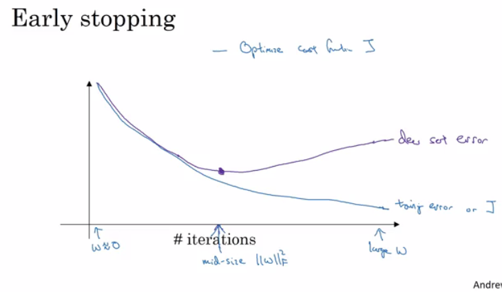
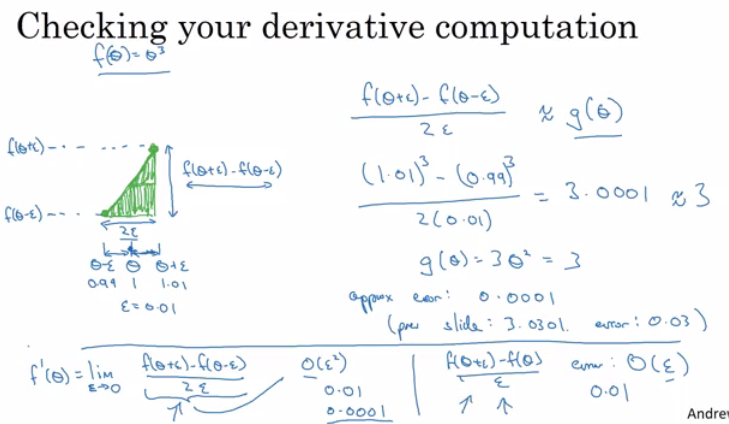
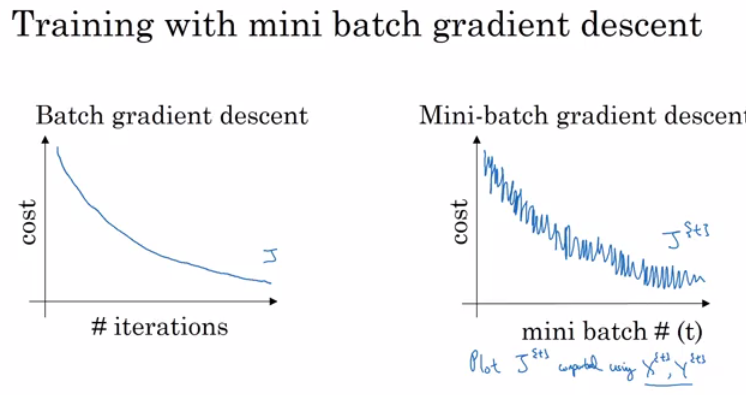
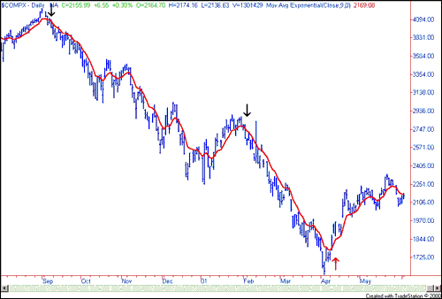
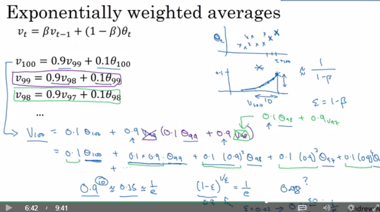
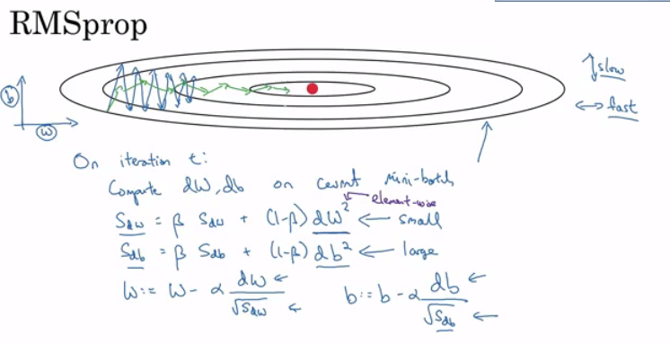
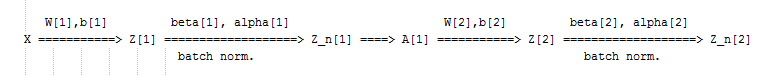
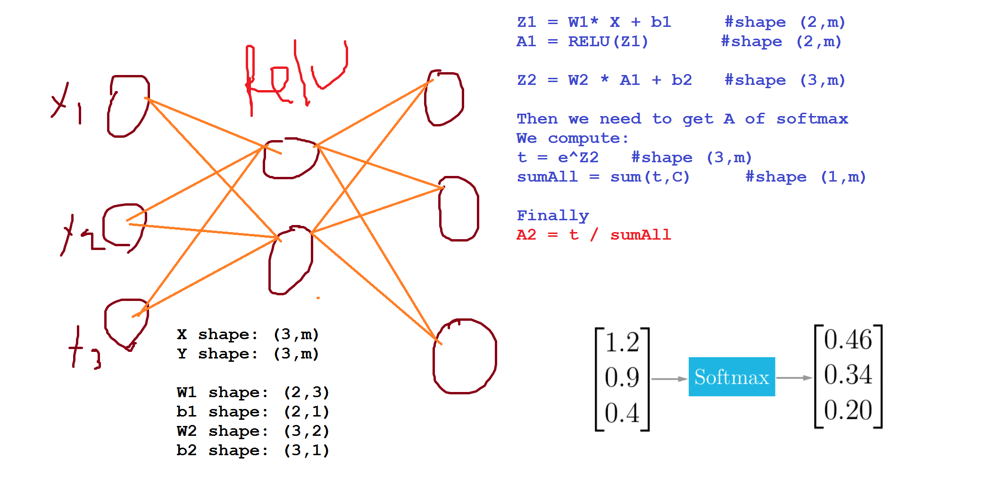

# Improving Deep Neural Networks: Hyperparameter tuning, Regularization and Optimization

This is the second course of the deep learning specialization at [Coursera](https://www.coursera.org/specializations/deep-learning) which is moderated by [DeepLearning.ai](http://deeplearning.ai/). The course is taught by Andrew Ng.

## Table of contents

* [Improving Deep Neural Networks: Hyperparameter tuning, Regularization and Optimization](#improving-deep-neural-networks-hyperparameter-tuning-regularization-and-optimization)
   * [Table of contents](#table-of-contents)
   * [Course summary](#course-summary)
   * [Practical aspects of Deep Learning](#practical-aspects-of-deep-learning)
      * [Train / Dev / Test sets](#train--dev--test-sets)
      * [Bias / Variance](#bias--variance)
      * [Basic Recipe for Machine Learning](#basic-recipe-for-machine-learning)
      * [Regularization](#regularization)
      * [Why regularization reduces overfitting?](#why-regularization-reduces-overfitting)
      * [Dropout Regularization](#dropout-regularization)
      * [Understanding Dropout](#understanding-dropout)
      * [Other regularization methods](#other-regularization-methods)
      * [Normalizing inputs](#normalizing-inputs)
      * [Vanishing / Exploding gradients](#vanishing--exploding-gradients)
      * [Weight Initialization for Deep Networks](#weight-initialization-for-deep-networks)
      * [Numerical approximation of gradients](#numerical-approximation-of-gradients)
      * [Gradient checking implementation notes](#gradient-checking-implementation-notes)
      * [Initialization summary](#initialization-summary)
      * [Regularization summary](#regularization-summary)
   * [Optimization algorithms](#optimization-algorithms)
      * [Mini-batch gradient descent](#mini-batch-gradient-descent)
      * [Understanding mini-batch gradient descent](#understanding-mini-batch-gradient-descent)
      * [Exponentially weighted averages](#exponentially-weighted-averages)
      * [Understanding exponentially weighted averages](#understanding-exponentially-weighted-averages)
      * [Bias correction in exponentially weighted averages](#bias-correction-in-exponentially-weighted-averages)
      * [Gradient descent with momentum](#gradient-descent-with-momentum)
      * [RMSprop](#rmsprop)
      * [Adam optimization algorithm](#adam-optimization-algorithm)
      * [Learning rate decay](#learning-rate-decay)
      * [The problem of local optima](#the-problem-of-local-optima)
   * [Hyperparameter tuning, Batch Normalization and Programming Frameworks](#hyperparameter-tuning-batch-normalization-and-programming-frameworks)
      * [Tuning process](#tuning-process)
      * [Using an appropriate scale to pick hyperparameters](#using-an-appropriate-scale-to-pick-hyperparameters)
      * [Hyperparameters tuning in practice: Pandas vs. Caviar](#hyperparameters-tuning-in-practice-pandas-vs-caviar)
      * [Normalizing activations in a network](#normalizing-activations-in-a-network)
      * [Fitting Batch Normalization into a neural network](#fitting-batch-normalization-into-a-neural-network)
      * [Why does Batch normalization work?](#why-does-batch-normalization-work)
      * [Batch normalization at test time](#batch-normalization-at-test-time)
      * [Softmax Regression](#softmax-regression)
      * [Training a Softmax classifier](#training-a-softmax-classifier)
      * [Deep learning frameworks](#deep-learning-frameworks)
      * [TensorFlow](#tensorflow)
   * [Extra Notes](#extra-notes)

## Course summary

Here are the course summary as its given on the course [link](https://www.coursera.org/learn/deep-neural-network):

> This course will teach you the "magic" of getting deep learning to work well. Rather than the deep learning process being a black box, you will understand what drives performance, and be able to more systematically get good results. You will also learn TensorFlow. 
>
> After 3 weeks, you will: 
> - Understand industry best-practices for building deep learning applications. 
> - Be able to effectively use the common neural network "tricks", including initialization, L2 and dropout regularization, Batch normalization, gradient checking, 
> - Be able to implement and apply a variety of optimization algorithms, such as mini-batch gradient descent, Momentum, RMSprop and Adam, and check for their convergence. 
> - Understand new best-practices for the deep learning era of how to set up train/dev/test sets and analyze bias/variance
> - Be able to implement a neural network in TensorFlow. 
>
> This is the second course of the Deep Learning Specialization.


## Practical aspects of Deep Learning

### Train / Dev / Test sets

- Its impossible to get all your hyperparameters right on a new application from the first time.
- So the idea is you go through the loop: `Idea ==> Code ==> Experiment`.
- You have to go through the loop many times to figure out your hyperparameters.
- Your data will be split into three parts:
  - Training set.       (Has to be the largest set)
  - Hold-out cross validation set / Development or "dev" set.
  - Testing set.
- You will try to build a model upon training set then try to optimize hyperparameters on dev set as much as possible. Then after your model is ready you try and evaluate the testing set.
- so the trend on the ratio of splitting the models:
  - If size of the  dataset is 100 to 1000000  ==> 60/20/20
  - If size of the  dataset is 1000000  to INF  ==> 98/1/1 or  99.5/0.25/0.25
- The trend now gives the training data the biggest sets.
- Make sure the dev and test set are coming from the same distribution.
  - For example if cat training pictures is from the web and the dev/test pictures are from users cell phone they will mismatch. It is better to make sure that dev and test set are from the same distribution.
- The dev set rule is to try them on some of the good models you've created.
- Its OK to only have a dev set without a testing set. But a lot of people in this case call the dev set as the test set. A better terminology is to call it a dev set as its used in the development.

### Bias / Variance

- Bias / Variance techniques are Easy to learn, but difficult to master.
- So here the explanation of Bias / Variance:
  - If your model is underfitting (logistic regression of non linear data) it has a "high bias"
  - If your model is overfitting then it has a "high variance"
  - Your model will be alright if you balance the Bias / Variance
  - For more:
    - 
- Another idea to get the bias /  variance if you don't have a 2D plotting mechanism:
  - High variance (overfitting) for example:
    - Training error: 1%
    - Dev error: 11%
  - high Bias (underfitting) for example:
    - Training error: 15%
    - Dev error: 14%
  - high Bias (underfitting) && High variance (overfitting) for example:
    - Training error: 15%
    - Test error: 30%
  - Best:
    - Training error: 0.5%
    - Test error: 1%
  - These Assumptions came from that human has 0% error. If the problem isn't like that you'll need to use human error as baseline.

### Basic Recipe for Machine Learning

- If your algorithm has a high bias:
  - Try to make your NN bigger (size of hidden units, number of layers)
  - Try a different model that is suitable for your data.
  - Try to run it longer.
  - Different (advanced) optimization algorithms.
- If your algorithm has a high variance:
  - More data.
  - Try regularization.
  - Try a different model that is suitable for your data.
- You should try the previous two points until you have a low bias and low variance.
- In the older days before deep learning, there was a "Bias/variance tradeoff". But because now you have more options/tools for solving the bias and variance problem its really helpful to use deep learning.
- Training a bigger neural network never hurts.

### Regularization

- Adding regularization to NN will help it reduce variance (overfitting)
- L1 matrix norm:
  - `||W|| = Sum(|w[i,j]|)  # sum of absolute values of all w`
- L2 matrix norm because of arcane technical math reasons is called Frobenius norm:
  - `||W||^2 = Sum(|w[i,j]|^2)	# sum of all w squared`
  - Also can be calculated as `||W||^2 = W.T * W if W is a vector`
- Regularization for logistic regression:
  - The normal cost function that we want to minimize is: `J(w,b) = (1/m) * Sum(L(y(i),y'(i)))`
  - The L2 regularization version: `J(w,b) = (1/m) * Sum(L(y(i),y'(i))) + (lambda/2m) * Sum(|w[i]|^2)`
  - The L1 regularization version: `J(w,b) = (1/m) * Sum(L(y(i),y'(i))) + (lambda/2m) * Sum(|w[i]|)`
  - The L1 regularization version makes a lot of w values become zeros, which makes the model size smaller.
  - L2 regularization is being used much more often.
  - `lambda` here is the regularization parameter (hyperparameter)
- Regularization for NN:
  - The normal cost function that we want to minimize is:   
    `J(W1,b1...,WL,bL) = (1/m) * Sum(L(y(i),y'(i)))`

  - The L2 regularization version:   
    `J(w,b) = (1/m) * Sum(L(y(i),y'(i))) + (lambda/2m) * Sum((||W[l]||^2)`

  - We stack the matrix as one vector `(mn,1)` and then we apply `sqrt(w1^2 + w2^2.....)`

  - To do back propagation (old way):   
    `dw[l] = (from back propagation)`

  - The new way:   
    `dw[l] = (from back propagation) + lambda/m * w[l]`

  - So plugging it in weight update step:

    - ```
      w[l] = w[l] - learning_rate * dw[l]
           = w[l] - learning_rate * ((from back propagation) + lambda/m * w[l])
           = w[l] - (learning_rate*lambda/m) * w[l] - learning_rate * (from back propagation) 
           = (1 - (learning_rate*lambda)/m) * w[l] - learning_rate * (from back propagation)
      ```

  - In practice this penalizes large weights and effectively limits the freedom in your model.

  - The new term `(1 - (learning_rate*lambda)/m) * w[l]`  causes the **weight to decay** in proportion to its size.


### Why regularization reduces overfitting?

Here are some intuitions:
  - Intuition 1:
     - If `lambda` is too large - a lot of w's will be close to zeros which will make the NN simpler (you can think of it as it would behave closer to logistic regression).
     - If `lambda` is good enough it will just reduce some weights that makes the neural network overfit.
  - Intuition 2 (with _tanh_ activation function):
     - If `lambda` is too large, w's will be small (close to zero) - will use the linear part of the _tanh_ activation function, so we will go from non linear activation to _roughly_ linear which would make the NN a _roughly_ linear classifier.
     - If `lambda` good enough it will just make some of _tanh_ activations _roughly_ linear which will prevent overfitting.
     
_**Implementation tip**_: if you implement gradient descent, one of the steps to debug gradient descent is to plot the cost function J as a function of the number of iterations of gradient descent and you want to see that the cost function J decreases **monotonically** after every elevation of gradient descent with regularization. If you plot the old definition of J (no regularization) then you might not see it decrease monotonically.


### Dropout Regularization

- In most cases Andrew Ng tells that he uses the L2 regularization.
- The dropout regularization eliminates some neurons/weights on each iteration based on a probability.
- A most common technique to implement dropout is called "Inverted dropout".
- Code for Inverted dropout:

  ```python
  keep_prob = 0.8   # 0 <= keep_prob <= 1
  l = 3  # this code is only for layer 3
  # the generated number that are less than 0.8 will be dropped. 80% stay, 20% dropped
  d3 = np.random.rand(a[l].shape[0], a[l].shape[1]) < keep_prob

  a3 = np.multiply(a3,d3)   # keep only the values in d3

  # increase a3 to not reduce the expected value of output
  # (ensures that the expected value of a3 remains the same) - to solve the scaling problem
  a3 = a3 / keep_prob       
  ```
- Vector d[l] is used for forward and back propagation and is the same for them, but it is different for each iteration (pass) or training example.
- At test time we don't use dropout. If you implement dropout at test time - it would add noise to predictions.

### Understanding Dropout

- In the previous video, the intuition was that dropout randomly knocks out units in your network. So it's as if on every iteration you're working with a smaller NN, and so using a smaller NN seems like it should have a regularizing effect.
- Another intuition: can't rely on any one feature, so have to spread out weights.
- It's possible to show that dropout has a similar effect to L2 regularization.
- Dropout can have different `keep_prob` per layer.
- The input layer dropout has to be near 1 (or 1 - no dropout) because you don't want to eliminate a lot of features.
- If you're more worried about some layers overfitting than others, you can set a lower `keep_prob` for some layers than others. The downside is, this gives you even more hyperparameters to search for using cross-validation. One other alternative might be to have some layers where you apply dropout and some layers where you don't apply dropout and then just have one hyperparameter, which is a `keep_prob` for the layers for which you do apply dropouts.
- A lot of researchers are using dropout with Computer Vision (CV) because they have a very big input size and almost never have enough data, so overfitting is the usual problem. And dropout is a regularization technique to prevent overfitting.
- A downside of dropout is that the cost function J is not well defined and it will be hard to debug (plot J by iteration).
  - To solve that you'll need to turn off dropout, set all the `keep_prob`s to 1, and then run the code and check that it monotonically decreases J and then turn on the dropouts again.

### Other regularization methods

- **Data augmentation**:
  - For example in a computer vision data:
    - You can flip all your pictures horizontally this will give you m more data instances.
    - You could also apply a random position and rotation to an image to get more data.
  - For example in OCR, you can impose random rotations and distortions to digits/letters.
  - New data obtained using this technique isn't as good as the real independent data, but still can be used as a regularization technique.
- **Early stopping**:
  - In this technique we plot the training set and the dev set cost together for each iteration. At some iteration the dev set cost will stop decreasing and will start increasing.
  - We will pick the point at which the training set error and dev set error are best (lowest training cost with lowest dev cost).
  - We will take these parameters as the best parameters.
    - 
  - Andrew prefers to use L2 regularization instead of early stopping because this technique simultaneously tries to minimize the cost function and not to overfit which contradicts the orthogonalization approach (will be discussed further).
  - But its advantage is that you don't need to search a hyperparameter like in other regularization approaches (like `lambda` in L2 regularization).
- **Model Ensembles**:
  - Algorithm:
    - Train multiple independent models.
    - At test time average their results.
  - It can get you extra 2% performance.
  - It reduces the generalization error.
  - You can use some snapshots of your NN at the training ensembles them and take the results.

### Normalizing inputs

- If you normalize your inputs this will speed up the training process a lot.
- Normalization are going on these steps:
  1. Get the mean of the training set: `mean = (1/m) * sum(x(i))`
  2. Subtract the mean from each input: `X = X - mean`
     - This makes your inputs centered around 0.
  3. Get the variance of the training set: `variance = (1/m) * sum(x(i)^2)`
  4. Normalize the variance. `X /= variance`
- These steps should be applied to training, dev, and testing sets (but using mean and variance of the train set).
- Why normalize?
  - If we don't normalize the inputs our cost function will be deep and its shape will be inconsistent (elongated) then optimizing it will take a long time.
  - But if we normalize it the opposite will occur. The shape of the cost function will be consistent (look more symmetric like circle in 2D example) and we can use a larger learning rate alpha - the optimization will be faster.

### Vanishing / Exploding gradients

- The Vanishing / Exploding gradients occurs when your derivatives become very small or very big.
- To understand the problem, suppose that we have a deep neural network with number of layers L, and all the activation functions are **linear** and each `b = 0`
  - Then:   
    ```
    Y' = W[L]W[L-1].....W[2]W[1]X
    ```
  - Then, if we have 2 hidden units per layer and x1 = x2 = 1, we result in:

    ```
    if W[l] = [1.5   0] 
              [0   1.5] (l != L because of different dimensions in the output layer)
    Y' = W[L] [1.5  0]^(L-1) X = 1.5^L 	# which will be very large
              [0  1.5]
    ```
    ```
    if W[l] = [0.5  0]
              [0  0.5]
    Y' = W[L] [0.5  0]^(L-1) X = 0.5^L 	# which will be very small
              [0  0.5]
    ```
- The last example explains that the activations (and similarly derivatives) will be decreased/increased exponentially as a function of number of layers.
- So If W > I (Identity matrix) the activation and gradients will explode.
- And If W < I (Identity matrix) the activation and gradients will vanish.
- Recently Microsoft trained 152 layers (ResNet)! which is a really big number. With such a deep neural network, if your activations or gradients increase or decrease exponentially as a function of L, then these values could get really big or really small. And this makes training difficult, especially if your gradients are exponentially smaller than L, then gradient descent will take tiny little steps. It will take a long time for gradient descent to learn anything.
- There is a partial solution that doesn't completely solve this problem but it helps a lot - careful choice of how you initialize the weights (next video).

### Weight Initialization for Deep Networks

- A partial solution to the Vanishing / Exploding gradients in NN is better or more careful choice of the random initialization of weights
- In a single neuron (Perceptron model): `Z = w1x1 + w2x2 + ... + wnxn`
  - So if `n_x` is large we want `W`'s to be smaller to not explode the cost.
- So it turns out that we need the variance which equals `1/n_x` to be the range of `W`'s
- So lets say when we initialize `W`'s like this (better to use with `tanh` activation):   
  ```
  np.random.rand(shape) * np.sqrt(1/n[l-1])
  ```
  or variation of this (Bengio et al.):   
  ```
  np.random.rand(shape) * np.sqrt(2/(n[l-1] + n[l]))
  ```
- Setting initialization part inside sqrt to `2/n[l-1]` for `ReLU` is better:   
  ```
  np.random.rand(shape) * np.sqrt(2/n[l-1])
  ```
- Number 1 or 2 in the neumerator can also be a hyperparameter to tune (but not the first to start with)
- This is one of the best way of partially solution to Vanishing / Exploding gradients (ReLU + Weight Initialization with variance) which will help gradients not to vanish/explode too quickly
- The initialization in this video is called "He Initialization / Xavier Initialization" and has been published in 2015 paper.

### Numerical approximation of gradients

- There is an technique called gradient checking which tells you if your implementation of backpropagation is correct.
- There's a numerical way to calculate the derivative:   
  
- Gradient checking approximates the gradients and is very helpful for finding the errors in your backpropagation implementation but it's slower than gradient descent (so use only for debugging).
- Implementation of this is very simple.
- Gradient checking:
  - First take `W[1],b[1],...,W[L],b[L]` and reshape into one big vector (`theta`)
  - The cost function will be `J(theta)`
  - Then take `dW[1],db[1],...,dW[L],db[L]` into one big vector (`d_theta`)
  - **Algorithm**:   
    ```
    eps = 10^-7   # small number
    for i in len(theta):
      d_theta_approx[i] = (J(theta1,...,theta[i] + eps) -  J(theta1,...,theta[i] - eps)) / 2*eps
    ```
  - Finally we evaluate this formula `(||d_theta_approx - d_theta||) / (||d_theta_approx||+||d_theta||)` (`||` - Euclidean vector norm) and check (with eps = 10^-7):
    - if it is < 10^-7  - great, very likely the backpropagation implementation is correct
    - if around 10^-5   - can be OK, but need to inspect if there are no particularly big values in `d_theta_approx - d_theta` vector
    - if it is >= 10^-3 - bad, probably there is a bug in backpropagation implementation

### Gradient checking implementation notes

- Don't use the gradient checking algorithm at training time because it's very slow.
- Use gradient checking only for debugging.
- If algorithm fails grad check, look at components to try to identify the bug.
- Don't forget to add `lamda/(2m) * sum(W[l])` to `J` if you are using L1 or L2 regularization.
- Gradient checking doesn't work with dropout because J is not consistent. 
  - You can first turn off dropout (set `keep_prob = 1.0`), run gradient checking and then turn on dropout again.
- Run gradient checking at random initialization and train the network for a while maybe there's a bug which can be seen when w's and b's become larger (further from 0) and can't be seen on the first iteration (when w's and b's are very small).

### Initialization summary

- The weights W<sup>[l]</sup> should be initialized randomly to break symmetry

- It is however okay to initialize the biases b<sup>[l]</sup> to zeros. Symmetry is still broken so long as W<sup>[l]</sup> is initialized randomly

- Different initializations lead to different results

- Random initialization is used to break symmetry and make sure different hidden units can learn different things

- Don't intialize to values that are too large

- He initialization works well for networks with ReLU activations. 

### Regularization summary

#### 1. L2 Regularization   
**Observations**:   
  - The value of λ is a hyperparameter that you can tune using a dev set.
  - L2 regularization makes your decision boundary smoother. If λ is too large, it is also possible to "oversmooth", resulting in a model with high bias.

**What is L2-regularization actually doing?**:   
  - L2-regularization relies on the assumption that a model with small weights is simpler than a model with large weights. Thus, by penalizing the square values of the weights in the cost function you drive all the weights to smaller values. It becomes too costly for the cost to have large weights! This leads to a smoother model in which the output changes more slowly as the input changes.

**What you should remember:**   
Implications of L2-regularization on:
  - cost computation:
    - A regularization term is added to the cost
  - backpropagation function:
    - There are extra terms in the gradients with respect to weight matrices
  - weights:
    - weights end up smaller ("weight decay") - are pushed to smaller values.
    
#### 2. Dropout   
**What you should remember about dropout:**   
- Dropout is a regularization technique.
- You only use dropout during training. Don't use dropout (randomly eliminate nodes) during test time.
- Apply dropout both during forward and backward propagation.
- During training time, divide each dropout layer by keep_prob to keep the same expected value for the activations. For example, if `keep_prob` is 0.5, then we will on average shut down half the nodes, so the output will be scaled by 0.5 since only the remaining half are contributing to the solution. Dividing by 0.5 is equivalent to multiplying by 2. Hence, the output now has the same expected value. You can check that this works even when keep_prob is other values than 0.5.


## Optimization algorithms

### Mini-batch gradient descent

- Training NN with a large data is slow. So to find an optimization algorithm that runs faster is a good idea.
- Suppose we have `m = 50 million`. To train this data it will take a huge processing time for one step.
  - because 50 million won't fit in the memory at once we need other processing to make such a thing.
- It turns out you can make a faster algorithm to make gradient descent process some of your items even before you finish the 50 million items.
- Suppose we have split m to **mini batches** of size 1000.
  - `X{1} = 0    ...  1000`
  - `X{2} = 1001 ...  2000`
  - `...`
  - `X{bs} = ...`
- We similarly split `X` & `Y`.
- So the definition of mini batches ==> `t: X{t}, Y{t}`
- In **Batch gradient descent** we run the gradient descent on the whole dataset.
- While in **Mini-Batch gradient descent** we run the gradient descent on the mini datasets.
- Mini-Batch algorithm pseudo code:
  ```
  for t = 1:No_of_batches                         # this is called an epoch
  	AL, caches = forward_prop(X{t}, Y{t})
  	cost = compute_cost(AL, Y{t})
  	grads = backward_prop(AL, caches)
  	update_parameters(grads)
  ```
- The code inside an epoch should be vectorized.
- Mini-batch gradient descent works much faster in the large datasets.

### Understanding mini-batch gradient descent

- In mini-batch algorithm, the cost won't go down with each step as it does in batch algorithm. It could contain some ups and downs but generally it has to go down (unlike the batch gradient descent where cost function descreases on each iteration).
  
- Mini-batch size:
  - (`mini batch size = m`)  ==>    Batch gradient descent
  - (`mini batch size = 1`)  ==>    Stochastic gradient descent (SGD)
  - (`mini batch size = between 1 and m`) ==>    Mini-batch gradient descent
- Batch gradient descent:
  - too long per iteration (epoch)
- Stochastic gradient descent:
  - too noisy regarding cost minimization (can be reduced by using smaller learning rate)
  - won't ever converge (reach the minimum cost)
  - lose speedup from vectorization
- Mini-batch gradient descent:
  1. faster learning:
      - you have the vectorization advantage
      - make progress without waiting to process the entire training set
  2. doesn't always exactly converge (oscelates in a very small region, but you can reduce learning rate)
- Guidelines for choosing mini-batch size:
  1. If small training set (< 2000 examples) - use batch gradient descent.
  2. It has to be a power of 2 (because of the way computer memory is layed out and accessed, sometimes your code runs faster if your mini-batch size is a power of 2):
    `64, 128, 256, 512, 1024, ...`
  3. Make sure that mini-batch fits in CPU/GPU memory.
- Mini-batch size is a `hyperparameter`.

### Exponentially weighted averages

- There are optimization algorithms that are better than **gradient descent**, but you should first learn about Exponentially weighted averages.
- If we have data like the temperature of day through the year it could be like this:
  ```
  t(1) = 40
  t(2) = 49
  t(3) = 45
  ...
  t(180) = 60
  ...
  ```
- This data is small in winter and big in summer. If we plot this data we will find it some noisy.
- Now lets compute the Exponentially weighted averages:
  ```
  V0 = 0
  V1 = 0.9 * V0 + 0.1 * t(1) = 4		# 0.9 and 0.1 are hyperparameters
  V2 = 0.9 * V1 + 0.1 * t(2) = 8.5
  V3 = 0.9 * V2 + 0.1 * t(3) = 12.15
  ...
  ```
- General equation
  ```
  V(t) = beta * v(t-1) + (1-beta) * theta(t)
  ```
- If we plot this it will represent averages over `~ (1 / (1 - beta))` entries:
    - `beta = 0.9` will average last 10 entries
    - `beta = 0.98` will average last 50 entries
    - `beta = 0.5` will average last 2 entries
- Best beta average for our case is between 0.9 and 0.98
- **Intuition**: The reason why exponentially weighted averages are useful for further optimizing gradient descent algorithm is that it can give different weights to recent data points (`theta`) based on value of `beta`. If `beta` is high (around 0.9), it smoothens out the averages of skewed data points (oscillations w.r.t. Gradient descent terminology). So this reduces oscillations in gradient descent and hence makes faster and smoother path towerds minima.
- Another imagery example:   
       
    _(taken from [investopedia.com](https://www.investopedia.com/))_

### Understanding exponentially weighted averages

- Intuitions:   
    
- We can implement this algorithm with more accurate results using a moving window. But the code is more efficient and faster using the exponentially weighted averages algorithm.
- Algorithm is very simple:
  ```
  v = 0
  Repeat
  {
  	Get theta(t)
  	v = beta * v + (1-beta) * theta(t)
  }
  ```

### Bias correction in exponentially weighted averages

- The bias correction helps make the exponentially weighted averages more accurate.
- Because `v(0) = 0`, the bias of the weighted averages is shifted and the accuracy suffers at the start.
- To solve the bias issue we have to use this equation:
  ```
  v(t) = (beta * v(t-1) + (1-beta) * theta(t)) / (1 - beta^t)
  ```
- As t becomes larger the `(1 - beta^t)` becomes close to `1`

### Gradient descent with momentum

- The momentum algorithm almost always works faster than standard gradient descent.
- The simple idea is to calculate the exponentially weighted averages for your gradients and then update your weights with the new values.
- Pseudo code:
  ```
  vdW = 0, vdb = 0
  on iteration t:
  	# can be mini-batch or batch gradient descent
  	compute dw, db on current mini-batch                
  			
  	vdW = beta * vdW + (1 - beta) * dW
  	vdb = beta * vdb + (1 - beta) * db
  	W = W - learning_rate * vdW
  	b = b - learning_rate * vdb
  ```
- Momentum helps the cost function to go to the minimum point in a more fast and consistent way.
- `beta` is another `hyperparameter`. `beta = 0.9` is very common and works very well in most cases.
- In practice people don't bother implementing **bias correction**.

### RMSprop

- Stands for **Root mean square prop**.
- This algorithm speeds up the gradient descent.
- Pseudo code:
  ```
  sdW = 0, sdb = 0
  on iteration t:
  	# can be mini-batch or batch gradient descent
  	compute dw, db on current mini-batch
  	
  	sdW = (beta * sdW) + (1 - beta) * dW^2  # squaring is element-wise
  	sdb = (beta * sdb) + (1 - beta) * db^2  # squaring is element-wise
  	W = W - learning_rate * dW / sqrt(sdW)
  	b = B - learning_rate * db / sqrt(sdb)
  ```
- RMSprop will make the cost function move slower on the vertical direction and faster on the horizontal direction in the following example:
    
- Ensure that `sdW` is not zero by adding a small value `epsilon` (e.g. `epsilon = 10^-8`) to it:   
   `W = W - learning_rate * dW / (sqrt(sdW) + epsilon)`
- With RMSprop you can increase your learning rate.
- Developed by Geoffrey Hinton and firstly introduced on [Coursera.org](https://www.coursera.org/) course.

### Adam optimization algorithm

- Stands for **Adaptive Moment Estimation**.
- Adam optimization and RMSprop are among the optimization algorithms that worked very well with a lot of NN architectures.
- Adam optimization simply puts RMSprop and momentum together!
- Pseudo code:
  ```
  vdW = 0, vdW = 0
  sdW = 0, sdb = 0
  on iteration t:
  	# can be mini-batch or batch gradient descent
  	compute dw, db on current mini-batch                
  			
  	vdW = (beta1 * vdW) + (1 - beta1) * dW     # momentum
  	vdb = (beta1 * vdb) + (1 - beta1) * db     # momentum
  			
  	sdW = (beta2 * sdW) + (1 - beta2) * dW^2   # RMSprop
  	sdb = (beta2 * sdb) + (1 - beta2) * db^2   # RMSprop
  			
  	vdW = vdW / (1 - beta1^t)      # fixing bias
  	vdb = vdb / (1 - beta1^t)      # fixing bias
  			
  	sdW = sdW / (1 - beta2^t)      # fixing bias
  	sdb = sdb / (1 - beta2^t)      # fixing bias
  					
  	W = W - learning_rate * vdW / (sqrt(sdW) + epsilon)
  	b = B - learning_rate * vdb / (sqrt(sdb) + epsilon)
  ```
- Hyperparameters for Adam:
  - Learning rate: needed to be tuned.
  - `beta1`: parameter of the momentum - `0.9` is recommended by default.
  - `beta2`: parameter of the RMSprop - `0.999` is recommended by default.
  - `epsilon`: `10^-8` is recommended by default.

### Learning rate decay

- Slowly reduce learning rate.
- As mentioned before mini-batch gradient descent won't reach the optimum point (converge). But by making the learning rate decay with iterations it will be much closer to it because the steps (and possible oscillations) near the optimum are smaller.
- One technique equations is`learning_rate = (1 / (1 + decay_rate * epoch_num)) * learning_rate_0`  
  - `epoch_num` is over all data (not a single mini-batch).
- Other learning rate decay methods (continuous):
  - `learning_rate = (0.95 ^ epoch_num) * learning_rate_0`
  - `learning_rate = (k / sqrt(epoch_num)) * learning_rate_0`
- Some people perform learning rate decay discretely - repeatedly decrease after some number of epochs.
- Some people are making changes to the learning rate manually.
- `decay_rate` is another `hyperparameter`.
- For Andrew Ng, learning rate decay has less priority.

### The problem of local optima

- The normal local optima is not likely to appear in a deep neural network because data is usually high dimensional. For point to be a local optima it has to be a local optima for each of the dimensions which is highly unlikely.
- It's unlikely to get stuck in a bad local optima in high dimensions, it is much more likely to get to the saddle point rather to the local optima, which is not a problem.
- Plateaus can make learning slow:
  - Plateau is a region where the derivative is close to zero for a long time.
  - This is where algorithms like momentum, RMSprop or Adam can help.


## Hyperparameter tuning, Batch Normalization and Programming Frameworks

### Tuning process

- We need to tune our hyperparameters to get the best out of them.
- Hyperparameters importance are (as for Andrew Ng):
  1. Learning rate.
  2. Momentum beta.
  3. Mini-batch size.
  4. No. of hidden units.
  5. No. of layers.
  6. Learning rate decay.
  7. Regularization lambda.
  8. Activation functions.
  9. Adam `beta1`, `beta2` & `epsilon`.
- Its hard to decide which hyperparameter is the most important in a problem. It depends a lot on your problem.
- One of the ways to tune is to sample a grid with `N` hyperparameter settings and then try all settings combinations on your problem.
- Try random values: don't use a grid.
- You can use `Coarse to fine sampling scheme`:
  - When you find some hyperparameters values that give you a better performance - zoom into a smaller region around these values and sample more densely within this space.
- These methods can be automated.

### Using an appropriate scale to pick hyperparameters

- Let's say you have a specific range for a hyperparameter from "a" to "b". It's better to search for the right ones using the logarithmic scale rather then in linear scale:
  - Calculate: `a_log = log(a)  # e.g. a = 0.0001 then a_log = -4`
  - Calculate: `b_log = log(b)  # e.g. b = 1  then b_log = 0`
  - Then:
    ```
    r = (a_log - b_log) * np.random.rand() + b_log
    # In the example the range would be from [-4, 0] because rand range [0,1)
    result = 10^r
    ```
    It uniformly samples values in log scale from [a,b].
- If we want to use the last method on exploring on the "momentum beta":
  - Beta best range is from 0.9 to 0.999.
  - You should search for `1 - beta in range 0.001 to 0.1 (1 - 0.9 and 1 - 0.999)` and the use `a = 0.001` and `b = 0.1`. Then:
    ```
    a_log = -3
    b_log = -1
    r = (a_log - b_log) * np.random.rand() + b_log
    beta = 1 - 10^r   # because 1 - beta = 10^r
    ```

### Hyperparameters tuning in practice: Pandas vs. Caviar 

- Intuitions about hyperparameter settings from one application area may or may not transfer to a different one.
- If you don't have much computational resources you can use the "babysitting model":
  - Day 0 you might initialize your parameter as random and then start training.
  - Then you watch your learning curve gradually decrease over the day.
  - And each day you nudge your parameters a little during training.
  - Called panda approach.
- If you have enough computational resources, you can run some models in parallel and at the end of the day(s) you check the results.
  - Called Caviar approach.

### Normalizing activations in a network

- In the rise of deep learning, one of the most important ideas has been an algorithm called **batch normalization**, created by two researchers, Sergey Ioffe and Christian Szegedy.
- Batch Normalization speeds up learning.
- Before we normalized input by subtracting the mean and dividing by variance. This helped a lot for the shape of the cost function and for reaching the minimum point faster.
- The question is: *for any hidden layer can we normalize `A[l]` to train `W[l+1]`, `b[l+1]` faster?* This is what batch normalization is about.
- There are some debates in the deep learning literature about whether you should normalize values before the activation function `Z[l]` or after applying the activation function `A[l]`. In practice, normalizing `Z[l]` is done much more often and that is what Andrew Ng presents.
- Algorithm:
  - Given `Z[l] = [z(1), ..., z(m)]`, i = 1 to m (for each input)
  - Compute `mean = 1/m * sum(z[i])`
  - Compute `variance = 1/m * sum((z[i] - mean)^2)`
  - Then `Z_norm[i] = (z[i] - mean) / np.sqrt(variance + epsilon)` (add `epsilon` for numerical stability if variance = 0)
    - Forcing the inputs to a distribution with zero mean and variance of 1.
  - Then `Z_tilde[i] = gamma * Z_norm[i] + beta`
    - To make inputs belong to other distribution (with other mean and variance).
    - gamma and beta are learnable parameters of the model.
    - Making the NN learn the distribution of the outputs.
    - _Note:_ if `gamma = sqrt(variance + epsilon)` and `beta = mean` then `Z_tilde[i] = z[i]`

### Fitting Batch Normalization into a neural network

- Using batch norm in 3 hidden layers NN:
    
- Our NN parameters will be:
  - `W[1]`, `b[1]`, ..., `W[L]`, `b[L]`, `beta[1]`, `gamma[1]`, ..., `beta[L]`, `gamma[L]`
  - `beta[1]`, `gamma[1]`, ..., `beta[L]`, `gamma[L]` are updated using any optimization algorithms (like GD, RMSprop, Adam)
- If you are using a deep learning framework, you won't have to implement batch norm yourself:
  - Ex. in Tensorflow you can add this line: `tf.nn.batch-normalization()`
- Batch normalization is usually applied with mini-batches.
- If we are using batch normalization parameters `b[1]`, ..., `b[L]` doesn't count because they will be eliminated after mean subtraction step, so:
  ```
  Z[l] = W[l]A[l-1] + b[l] => Z[l] = W[l]A[l-1]
  Z_norm[l] = ...
  Z_tilde[l] = gamma[l] * Z_norm[l] + beta[l]
  ```
  - Taking the mean of a constant `b[l]` will eliminate the `b[l]`
- So if you are using batch normalization, you can remove b[l] or make it always zero.
- So the parameters will be `W[l]`, `beta[l]`, and `alpha[l]`.
- Shapes:
  - `Z[l]       - (n[l], m)`
  - `beta[l]    - (n[l], m)`
  - `gamma[l]   - (n[l], m)`

### Why does Batch normalization work?

- The first reason is the same reason as why we normalize X.
- The second reason is that batch normalization reduces the problem of input values changing (shifting).
- Batch normalization does some regularization:
  - Each mini batch is scaled by the mean/variance computed of that mini-batch.
  - This adds some noise to the values `Z[l]` within that mini batch. So similar to dropout it adds some noise to each hidden layer's activations.
  - This has a slight regularization effect.
  - Using bigger size of the mini-batch you are reducing noise and therefore regularization effect.
  - Don't rely on batch normalization as a regularization. It's intended for normalization of hidden units, activations and therefore speeding up learning. For regularization use other regularization techniques (L2 or dropout).

### Batch normalization at test time

- When we train a NN with Batch normalization, we compute the mean and the variance of the mini-batch.
- In testing we might need to process examples one at a time. The mean and the variance of one example won't make sense.
- We have to compute an estimated value of mean and variance to use it in testing time.
- We can use the weighted average across the mini-batches.
- We will use the estimated values of the mean and variance to test.
- This method is also sometimes called "Running average".
- In practice most often you will use a deep learning framework and it will contain some default implementation of doing such a thing.

### Softmax Regression

- In every example we have used so far we were talking about binary classification.
- There are a generalization of logistic regression called Softmax regression that is used for multiclass classification/regression.
- For example if we are classifying by classes `dog`, `cat`, `baby chick` and `none of that`
  - Dog `class = 1`
  - Cat `class = 2`
  - Baby chick `class = 3`
  - None `class = 0`
  - To represent a dog vector `y = [0 1 0 0]`
  - To represent a cat vector `y = [0 0 1 0]`
  - To represent a baby chick vector `y = [0 0 0 1]`
  - To represent a none vector `y = [1 0 0 0]`
- Notations:
  - `C = no. of classes`
  - Range of classes is `(0, ..., C-1)`
  - In output layer `Ny = C`
- Each of C values in the output layer will contain a probability of the example to belong to each of the classes.
- In the last layer we will have to activate the Softmax activation function instead of the sigmoid activation.
- Softmax activation equations:
  ```
  t = e^(Z[L])                      # shape(C, m)
  A[L] = e^(Z[L]) / sum(t)          # shape(C, m), sum(t) - sum of t's for each example (shape (1, m))
  ```

### Training a Softmax classifier

- There's an activation which is called hard max, which gets 1 for the maximum value and zeros for the others.
  - If you are using NumPy, its `np.max` over the vertical axis.
- The Softmax name came from softening the values and not harding them like hard max.
- Softmax is a generalization of logistic activation function to `C` classes. If `C = 2` softmax reduces to logistic regression.
- The loss function used with softmax:
  ```
  L(y, y_hat) = - sum(y[j] * log(y_hat[j])) # j = 0 to C-1
  ```
- The cost function used with softmax:
  ```
  J(w[1], b[1], ...) = - 1 / m * (sum(L(y[i], y_hat[i]))) # i = 0 to m
  ```
- Back propagation with softmax:
  ```
  dZ[L] = Y_hat - Y
  ```
- The derivative of softmax is:
  ```
  Y_hat * (1 - Y_hat)
  ```
- Example:
    

### Deep learning frameworks

- It's not practical to implement everything from scratch. Our numpy implementations were to know how NN works.
- There are many good deep learning frameworks.
- Deep learning is now in the phase of doing something with the frameworks and not from scratch to keep on going.
- Here are some of the leading deep learning frameworks:
  - Caffe/ Caffe2
  - CNTK
  - DL4j
  - Keras
  - Lasagne
  - mxnet
  - PaddlePaddle
  - TensorFlow
  - Theano
  - Torch/Pytorch
- These frameworks are getting better month by month. Comparison between them can be found [here](https://en.wikipedia.org/wiki/Comparison_of_deep_learning_software).
- How to choose deep learning framework:
  - Ease of programming (development and deployment)
  - Running speed
  - Truly open (open source with good governance)
- Programming frameworks can not only shorten your coding time but sometimes also perform optimizations that speed up your code.

### TensorFlow

- In this section we will learn the basic structure of TensorFlow programs.
- Lets see how to implement a minimization function:
  - Example function: `J(w) = w^2 - 10w + 25`
  - The result should be `w = 5` as the function is `(w-5)^2 = 0`
  - Code v.1:
    ```python
    import numpy as np
    import tensorflow as tf
    
    
    w = tf.Variable(0, dtype=tf.float32)                 # creating a variable w
    cost = tf.add(tf.add(w**2, tf.multiply(-10.0, w)), 25.0)        # can be written as this - cost = w**2 - 10*w + 25
    train = tf.train.GradientDescentOptimizer(0.01).minimize(cost)

    init = tf.global_variables_initializer()
    session = tf.Session()
    session.run(init)
    session.run(w)    # Runs the definition of w, if you print this it will print zero
    session.run(train)

    print("W after one iteration:", session.run(w))

    for i in range(1000):
    	session.run(train)

    print("W after 1000 iterations:", session.run(w))
    ```
  - Code v.2 (we feed the inputs to the algorithm through coefficients):

    ```python
    import numpy as np
    import tensorflow as tf
    
    
    coefficients = np.array([[1.], [-10.], [25.]])

    x = tf.placeholder(tf.float32, [3, 1])
    w = tf.Variable(0, dtype=tf.float32)                 # Creating a variable w
    cost = x[0][0]*w**2 + x[1][0]*w + x[2][0]

    train = tf.train.GradientDescentOptimizer(0.01).minimize(cost)

    init = tf.global_variables_initializer()
    session = tf.Session()
    session.run(init)
    session.run(w)    # Runs the definition of w, if you print this it will print zero
    session.run(train, feed_dict={x: coefficients})

    print("W after one iteration:", session.run(w))

    for i in range(1000):
    	session.run(train, feed_dict={x: coefficients})

    print("W after 1000 iterations:", session.run(w))
    ```
- In TensorFlow you implement only the forward propagation and TensorFlow will do the backpropagation by itself.
- In TensorFlow a placeholder is a variable you can assign a value to later.
- If you are using a mini-batch training you should change the `feed_dict={x: coefficients}` to the current mini-batch data.
- Almost all TensorFlow programs use this:
  ```python
  with tf.Session() as session:       # better for cleaning up in case of error/exception
  	session.run(init)
  	session.run(w)
  ```
- In deep learning frameworks there are a lot of things that you can do with one line of code like changing the optimizer.
_**Side notes:**_
- Writing and running programs in TensorFlow has the following steps:
  1. Create Tensors (variables) that are not yet executed/evaluated.
  2. Write operations between those Tensors.
  3. Initialize your Tensors.
  4. Create a Session.
  5. Run the Session. This will run the operations you'd written above.
- Instead of needing to write code to compute the cost function we know, we can use this line in TensorFlow :
  `tf.nn.sigmoid_cross_entropy_with_logits(logits = ...,  labels = ...)`
- To initialize weights in NN using TensorFlow use:
  ```
  W1 = tf.get_variable("W1", [25,12288], initializer = tf.contrib.layers.xavier_initializer(seed = 1))

  b1 = tf.get_variable("b1", [25,1], initializer = tf.zeros_initializer())
  ```
- For 3-layer NN, it is important to note that the forward propagation stops at `Z3`. The reason is that in TensorFlow the last linear layer output is given as input to the function computing the loss. Therefore, you don't need `A3`!
- To reset the graph use `tf.reset_default_graph()`

## Extra Notes

- If you want a good papers in deep learning look at the ICLR proceedings (Or NIPS proceedings) and that will give you a really good view of the field.
- Who is Yuanqing Lin?
  - Head of Baidu research.
  - First one to win ImageNet
  - Works in PaddlePaddle deep learning platform.


<br><br>
<br><br>
These Notes were made by [Mahmoud Badry](mailto:mma18@fayoum.edu.eg) @2017
