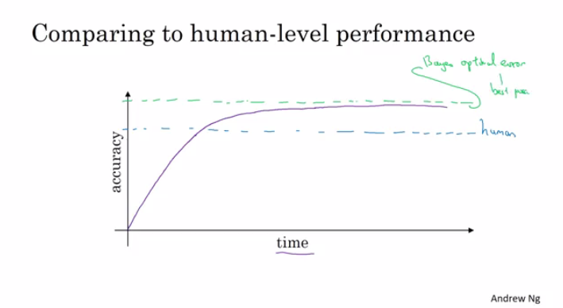

# Structuring Machine Learning Projects

This is the third course of the deep learning specialization at [Coursera](https://www.coursera.org/specializations/deep-learning) which is moderated by [DeepLearning.ai](http://deeplearning.ai/). The course is taught by Andrew Ng.

## Table of contents

* [Structuring Machine Learning Projects](#structuring-machine-learning-projects)
   * [Table of contents](#table-of-contents)
   * [Course summary](#course-summary)
   * [ML Strategy 1](#ml-strategy-1)
      * [Why ML Strategy](#why-ml-strategy)
      * [Orthogonalization](#orthogonalization)
      * [Single number evaluation metric](#single-number-evaluation-metric)
      * [Satisfying and Optimizing metric](#satisfying-and-optimizing-metric)
      * [Train/dev/test distributions](#traindevtest-distributions)
      * [Size of the dev and test sets](#size-of-the-dev-and-test-sets)
      * [When to change dev/test sets and metrics](#when-to-change-devtest-sets-and-metrics)
      * [Why human-level performance?](#why-human-level-performance)
      * [Avoidable bias](#avoidable-bias)
      * [Understanding human-level performance](#understanding-human-level-performance)
      * [Surpassing human-level performance](#surpassing-human-level-performance)
      * [Improving your model performance](#improving-your-model-performance)
   * [ML Strategy 2](#ml-strategy-2)
      * [Carrying out error analysis](#carrying-out-error-analysis)
      * [Cleaning up incorrectly labeled data](#cleaning-up-incorrectly-labeled-data)
      * [Build your first system quickly, then iterate](#build-your-first-system-quickly-then-iterate)
      * [Training and testing on different distributions](#training-and-testing-on-different-distributions)
      * [Bias and Variance with mismatched data distributions](#bias-and-variance-with-mismatched-data-distributions)
      * [Addressing data mismatch](#addressing-data-mismatch)
      * [Transfer learning](#transfer-learning)
      * [Multi-task learning](#multi-task-learning)
      * [What is end-to-end deep learning?](#what-is-end-to-end-deep-learning)
      * [Whether to use end-to-end deep learning](#whether-to-use-end-to-end-deep-learning)

## Course summary

Here are the course summary as its given on the course [link](https://www.coursera.org/learn/machine-learning-projects):

> You will learn how to build a successful machine learning project. If you aspire to be a technical leader in AI, and know how to set direction for your team's work, this course will show you how.
>
> Much of this content has never been taught elsewhere, and is drawn from my experience building and shipping many deep learning products. This course also has two "flight simulators" that let you practice decision-making as a machine learning project leader. This provides "industry experience" that you might otherwise get only after years of ML work experience.
>
> After 2 weeks, you will: 
> - Understand how to diagnose errors in a machine learning system, and 
> - Be able to prioritize the most promising directions for reducing error
> - Understand complex ML settings, such as mismatched training/test sets, and comparing to and/or surpassing human-level performance
> - Know how to apply end-to-end learning, transfer learning, and multi-task learning
>
> I've seen teams waste months or years through not understanding the principles taught in this course. I hope this two week course will save you months of time.
>
> This is a standalone course, and you can take this so long as you have basic machine learning knowledge. This is the third course in the Deep Learning Specialization.


## ML Strategy 1

### Why ML Strategy

- You have a lot of ideas for how to improve the accuracy of your deep learning system:
  - Collect more data.
  - Collect more diverse training set.
  - Train algorithm longer with gradient descent.
  - Try different optimization algorithm (e.g. Adam).
  - Try bigger network.
  - Try smaller network.
  - Try dropout.
  - Add L2 regularization.
  - Change network architecture (activation functions, # of hidden units, etc.)
- This course will give you some strategies to help analyze your problem to go in a direction that will help you get better results.

### Orthogonalization

- Some deep learning developers know exactly what hyperparameter to tune in order to try to achieve one effect. This is a process we call orthogonalization.
- In orthogonalization, you have some controls, but each control does a specific task and doesn't affect other controls.
- For a supervised learning system to do well, you usually need to tune the knobs of your system to make sure that four things hold true - chain of assumptions in machine learning:
  1. You'll have to fit training set well on cost function (near human level performance if possible).
     - If it's not achieved you could try bigger network, another optimization algorithm (like Adam)...
  2. Fit dev set well on cost function.
     - If its not achieved you could try regularization, bigger training set...
  3. Fit test set well on cost function.
     - If its not achieved you could try bigger dev. set...
  4. Performs well in real world.
     - If its not achieved you could try change dev. set, change cost function...

### Single number evaluation metric

- Its better and faster to set a single number evaluation metric for your project before you start it.
- Difference between precision and recall (in cat classification example):
  - Suppose we run the classifier on 10 images which are 5 cats and 5 non-cats. The classifier identifies that there are 4 cats, but it identified 1 wrong cat.
  - Confusion matrix:

      |                | Predicted cat  | Predicted non-cat |
      | -------------- | -------------- | ----------------- |
      | Actual cat     | 3              | 2                 |
      | Actual non-cat | 1              | 4                 |
  - **Precision**: percentage of true cats in the recognized result: P = 3/(3 + 1) 
  - **Recall**: percentage of true recognition cat of the all cat predictions: R = 3/(3 + 2)
  - **Accuracy**: (3+4)/10
- Using a precision/recall for evaluation is good in a lot of cases, but separately they don't tell you which algothims is better. Ex:

  | Classifier | Precision | Recall |
  | ---------- | --------- | ------ |
  | A          | 95%       | 90%    |
  | B          | 98%       | 85%    |
- A better thing is to combine precision and recall in one single (real) number evaluation metric. There a metric called `F1` score, which combines them
  - You can think of `F1` score as an average of precision and recall
    `F1 = 2 / ((1/P) + (1/R))`

### Satisfying and Optimizing metric

- Its hard sometimes to get a single number evaluation metric. Ex:

  | Classifier | F1   | Running time |
  | ---------- | ---- | ------------ |
  | A          | 90%  | 80 ms        |
  | B          | 92%  | 95 ms        |
  | C          | 92%  | 1,500 ms     |
- So we can solve that by choosing a single optimizing metric and decide that other metrics are satisfying. Ex:
  ```
  Maximize F1                     # optimizing metric
  subject to running time < 100ms # satisficing metric
  ```
- So as a general rule:
  ```
  Maximize 1     # optimizing metric (one optimizing metric)
  subject to N-1 # satisficing metric (N-1 satisficing metrics)
  ```

### Train/dev/test distributions

- Dev and test sets have to come from the same distribution.
- Choose dev set and test set to reflect data you expect to get in the future and consider important to do well on.
- Setting up the dev set, as well as the validation metric is really defining what target you want to aim at.

### Size of the dev and test sets

- An old way of splitting the data was 70% training, 30% test or 60% training, 20% dev, 20% test. 
- The old way was valid for a number of examples ~ <100000 
- In the modern deep learning if you have a million or more examples a reasonable split would be 98% training, 1% dev, 1% test. 

### When to change dev/test sets and metrics

- Let's take an example. In a cat classification example we have these metric results:

  | Metric      | Classification error                                         |
  | ----------- | ------------------------------------------------------------ |
  | Algorithm A | 3% error (But a lot of porn images are treated as cat images here) |
  | Algorithm B | 5% error                                                     |
  - In the last example if we choose the best algorithm by metric it would be "A", but if the users decide it will be "B"
  - Thus in this case, we want and need to change our metric. 
  - `OldMetric = (1/m) * sum(y_pred[i] != y[i] ,m)`
    - Where m is the number of Dev set items.
  - `NewMetric = (1/sum(w[i])) * sum(w[i] * (y_pred[i] != y[i]) ,m)`
    - where:
       - `w[i] = 1                   if x[i] is not porn`
       - `w[i] = 10                 if x[i] is porn`

- This is actually an example of an orthogonalization where you should take a machine learning problem and break it into distinct steps: 

  1. Figure out how to define a metric that captures what you want to do - place the target. 
  2. Worry about how to actually do well on this metric - how to aim/shoot accurately at the target.

- Conclusion: if doing well on your metric + dev/test set doesn't correspond to doing well in your application, change your metric and/or dev/test set.

### Why human-level performance?

- We compare to human-level performance because of two main reasons:
  1. Because of advances in deep learning, machine learning algorithms are suddenly working much better and so it has become much more feasible in a lot of application areas for machine learning algorithms to actually become competitive with human-level performance. 
  2. It turns out that the workflow of designing and building a machine learning system is much more efficient when you're trying to do something that humans can also do.
- After an algorithm reaches the human level performance the progress and accuracy slow down.
    
- You won't surpass an error that's called "Bayes optimal error".
- There isn't much error range between human-level error and Bayes optimal error.
- Humans are quite good at a lot of tasks. So as long as Machine learning is worse than humans, you can:
  - Get labeled data from humans.
  - Gain insight from manual error analysis: why did a person get it right?
  - Better analysis of bias/variance.

### Avoidable bias

- Suppose that the cat classification algorithm gives these results:

  | Humans             | 1%   | 7.5% |
  | ------------------ | ---- | ---- |
  | **Training error** | 8%   | 8%   |
  | **Dev Error**      | 10%  | 10%  |
  - In the left example, because the human level error is 1% then we have to focus on the **bias**.
  - In the right example, because the human level error is 7.5% then we have to focus on the **variance**.
  - The human-level error as a proxy (estimate) for Bayes optimal error. Bayes optimal error is always less (better), but human-level in most cases is not far from it.
  - You can't do better then Bayes error unless you are overfitting.
  - `Avoidable bias = Training error - Human (Bayes) error`
  - `Variance = Dev error - Training error`

### Understanding human-level performance

- When choosing human-level performance, it has to be chosen in the terms of what you want to achieve with the system.
- You might have multiple human-level performances based on the human experience. Then you choose the human-level performance (proxy for Bayes error) that is more suitable for the system you're trying to build.
- Improving deep learning algorithms is harder once you reach a human-level performance.
- Summary of bias/variance with human-level performance:
  1. human-level error (proxy for Bayes error)
     - Calculate `avoidable bias = training error - human-level error`
     - If **avoidable bias** difference is the bigger, then it's *bias* problem and you should use a strategy for **bias** resolving.
  2. training error
     - Calculate `variance = dev error - training error`
     - If **variance** difference is bigger, then you should use a strategy for **variance** resolving.
  3. Dev error
- So having an estimate of human-level performance gives you an estimate of Bayes error. And this allows you to more quickly make decisions as to whether you should focus on trying to reduce a bias or trying to reduce the variance of your algorithm.
- These techniques will tend to work well until you surpass human-level performance, whereupon you might no longer have a good estimate of Bayes error that still helps you make this decision really clearly. 

### Surpassing human-level performance

- In some problems, deep learning has surpassed human-level performance. Like:
  - Online advertising.
  - Product recommendation.
  - Loan approval.
- The last examples are not natural perception task, rather learning on structural data. Humans are far better in natural perception tasks like computer vision and speech recognition.
- It's harder for machines to surpass human-level performance in natural perception task. But there are already some systems that achieved it.

### Improving your model performance

- The two fundamental asssumptions of supervised learning:
  1. You can fit the training set pretty well. This is roughly saying that you can achieve low **avoidable bias**. 
  2. The training set performance generalizes pretty well to the dev/test set. This is roughly saying that **variance** is not too bad.
- To improve your deep learning supervised system follow these guidelines:
  1. Look at the difference between human level error and the training error - **avoidable bias**.
  2. Look at the difference between the dev/test set and training set error - **Variance**.
  3. If **avoidable bias** is large you have these options:
     - Train bigger model.
     - Train longer/better optimization algorithm (like Momentum, RMSprop, Adam).
     - Find better NN architecture/hyperparameters search.
  4. If **variance** is large you have these options:
     - Get more training data.
     - Regularization (L2, Dropout, data augumentation).
     - Find better NN architecture/hyperparameters search.


## ML Strategy 2

### Carrying out error analysis

- Error analysis - process of manually examining mistakes that your algorithm is making. It can give you insights into what to do next. E.g.:
  - In the cat classification example, if you have 10% error on your dev set and you want to decrease the error.
  - You discovered that some of the mislabeled data are dog pictures that look like cats. Should you try to make your cat classifier do better on dogs (this could take some weeks)?
  - Error analysis approach:
    - Get 100 mislabeled dev set examples at random.
    - Count up how many are dogs.
    - if 5 of 100 are dogs then training your classifier to do better on dogs will decrease your error up to 9.5% (called ceiling), which can be too little.
    - if 50 of 100 are dogs then you could decrease your error up to 5%, which is reasonable and you should work on that.
- Based on the last example, error analysis helps you to analyze the error before taking an action that could take lot of time with no need.
- Sometimes, you can evaluate multiple error analysis ideas in parallel and choose the best idea. Create a spreadsheet to do that and decide, e.g.:

  | Image        | Dog    | Great Cats | blurry  | Instagram filters |    Comments    |
  | ------------ | ------ | ---------- | ------- | ----------------- |--------------- |
  | 1            | ✓      |            |         | ✓                 |  Pitbul        |
  | 2            | ✓      |            | ✓       | ✓                 |                |
  | 3            |        |            |         |                   |Rainy day at zoo|
  | 4            |        | ✓          |         |                   |                |
  | ....         |        |            |         |                   |                |
  | **% totals** | **8%** | **43%**    | **61%** |      **12%**      |                |
- In the last example you will decide to work on great cats or blurry images to improve your performance.
- This quick counting procedure, which you can often do in, at most, small numbers of hours can really help you make much better prioritization decisions, and understand how promising different approaches are to work on. 

### Cleaning up incorrectly labeled data

- DL algorithms are quite robust to random errors in the training set but less robust to systematic errors. But it's OK to go and fix these labels if you can.
- If you want to check for mislabeled data in dev/test set, you should also try error analysis with the mislabeled column. Ex:

  | Image        | Dog    | Great Cats | blurry  | Mislabeled | Comments |
  | ------------ | ------ | ---------- | ------- | ---------- | -------- |
  | 1            | ✓      |            |         |            |          |
  | 2            | ✓      |            | ✓       |            |          |
  | 3            |        |            |         |            |          |
  | 4            |        | ✓          |         |            |          |
  | ....         |        |            |         |            |          |
  | **% totals** | **8%** | **43%**    | **61%** | **6%**     |          |
  - Then:
    - If overall dev set error: 10%
      - Then errors due to incorrect data: 0.6%
      - Then errors due to other causes: 9.4%
    - Then you should focus on the 9.4% error rather than the incorrect data.
- Consider these guidelines while correcting the dev/test mislabeled examples:
  - Apply the same process to your dev and test sets to make sure they continue to come from the same distribution.
  - Consider examining examples your algorithm got right as well as ones it got wrong. (Not always done if you reached a good accuracy)
  - Train and (dev/test) data may now come from a slightly different distributions.
  - It's very important to have dev and test sets to come from the same distribution. But it could be OK for a train set to come from slighly other distribution.

### Build your first system quickly, then iterate

- The steps you take to make your deep learning project:
  - Setup dev/test set and metric
  - Build initial system quickly
  - Use Bias/Variance analysis & Error analysis to prioritize next steps.

### Training and testing on different distributions

- A lot of teams are working with deep learning applications that have training sets that are different from the dev/test sets due to the hunger of deep learning to data.
- There are some strategies to follow up when training set distribution differs from dev/test sets distribution.
  - Option one (not recommended): shuffle all the data together and extract randomly training and dev/test sets.
    - Advantages: all the sets now come from the same distribution.
    - Disadvantages: the other (real world) distribution that was in the dev/test sets will occur less in the new dev/test sets and that might be not what you want to achieve.
  - Option two: take some of the dev/test set examples and add them to the training set.
    - Advantages: the distribution you care about is your target now.
    - Disadvantage: the distributions in training and dev/test sets are now different. But you will get a better performance over a long time.

### Bias and Variance with mismatched data distributions

- Bias and Variance analysis changes when training and Dev/test set is from the different distribution.
- Example: the cat classification example. Suppose you've worked in the example and reached this
  - Human error: 0%
  - Train error: 1%
  - Dev error: 10%
  - In this example, you'll think that this is a variance problem, but because the distributions aren't the same you can't tell for sure. Because it could be that train set was easy to train on, but the dev set was more difficult.
- To solve this issue we create a new set called train-dev set as a random subset of the training set (so it has the same distribution) and we get:
  - Human error: 0%
  - Train error: 1%
  - Train-dev error: 9%
  - Dev error: 10%
  - Now we are sure that this is a high variance problem.
- Suppose we have a different situation:
  - Human error: 0%
  - Train error: 1%
  - Train-dev error: 1.5%
  - Dev error: 10%
  - In this case we have something called *Data mismatch* problem.
- Conclusions:
  1. Human-level error (proxy for Bayes error)
  2. Train error
     - Calculate `avoidable bias = training error - human level error`
     - If the difference is big then its **Avoidable bias** problem then you should use a strategy for high **bias**.
  3. Train-dev error
     - Calculate `variance = training-dev error - training error`
     - If the difference is big then its high **variance** problem then you should use a strategy for solving it.
  4. Dev error
     - Calculate `data mismatch = dev error - train-dev error`
     - If difference is much bigger then train-dev error its **Data mismatch** problem.
  5. Test error
     - Calculate `degree of overfitting to dev set = test error - dev error`
     - Is the difference is big (positive) then maybe you need to find a bigger dev set (dev set and test set come from the same distribution, so the only way for there to be a huge gap here, for it to do much better on the dev set than the test set, is if you somehow managed to overfit the dev set).
- Unfortunately, there aren't many systematic ways to deal with data mismatch. There are some things to try about this in the next section.

### Addressing data mismatch

- There aren't completely systematic solutions to this, but there some things you could try.
1. Carry out manual error analysis to try to understand the difference between training and dev/test sets.
2. Make training data more similar, or collect more data similar to dev/test sets.
- If your goal is to make the training data more similar to your dev set one of the techniques you can use **Artificial data synthesis** that can help you make more training data.
    - Combine some of your training data with something that can convert it to the dev/test set distribution.
      - Examples:
        1. Combine normal audio with car noise to get audio with car noise example.
        2. Generate cars using 3D graphics in a car classification example.
    - Be cautious and bear in mind whether or not you might be accidentally simulating data only from a tiny subset of the space of all possible examples because your NN might overfit these generated data (like particular car noise or a particular design of 3D graphics cars).

### Transfer learning

- Apply the knowledge you took in a task A and apply it in another task B.
- For example, you have trained a cat classifier with a lot of data, you can use the part of the trained NN it to solve x-ray classification problem.
- To do transfer learning, delete the last layer of NN and it's weights and:
  1. Option 1: if you have a small data set - keep all the other weights as a fixed weights. Add a new last layer(-s) and initialize the new layer weights and feed the new data to the NN and learn the new weights.
  2. Option 2: if you have enough data you can retrain all the weights.
- Option 1 and 2 are called **fine-tuning** and training on task A called **pretraining**.
- When transfer learning make sense:
  - Task A and B have the same input X (e.g. image, audio).
  - You have a lot of data for the task A you are transferring from and relatively less data for the task B your transferring to.
  - Low level features from task A could be helpful for learning task B.

### Multi-task learning

- Whereas in transfer learning, you have a sequential process where you learn from task A and then transfer that to task B. In multi-task learning, you start off simultaneously, trying to have one neural network do several things at the same time. And then each of these tasks helps hopefully all of the other tasks. 
- Example:
  - You want to build an object recognition system that detects pedestrians, cars, stop signs, and traffic lights (image has multiple labels).
  - Then Y shape will be `(4,m)` because we have 4 classes and each one is a binary one.
  - Then   
  `Cost = (1/m) * sum(sum(L(y_hat(i)_j, y(i)_j))), i = 1..m, j = 1..4`, where   
  `L = - y(i)_j * log(y_hat(i)_j) - (1 - y(i)_j) * log(1 - y_hat(i)_j)`
- In the last example you could have trained 4 neural networks separately but if some of the earlier features in neural network can be shared between these different types of objects, then you find that training one neural network to do four things results in better performance than training 4 completely separate neural networks to do the four tasks separately. 
- Multi-task learning will also work if y isn't complete for some labels. For example:
  ```
  Y = [1 ? 1 ...]
      [0 0 1 ...]
      [? 1 ? ...]
  ```
  - And in this case it will do good with the missing data, just the loss function will be different:   
    `Loss = (1/m) * sum(sum(L(y_hat(i)_j, y(i)_j) for all j which y(i)_j != ?))`
- Multi-task learning makes sense:
  1. Training on a set of tasks that could benefit from having shared lower-level features.
  2. Usually, amount of data you have for each task is quite similar.
  3. Can train a big enough network to do well on all the tasks.
- If you can train a big enough NN, the performance of the multi-task learning compared to splitting the tasks is better.
- Today transfer learning is used more often than multi-task learning.

### What is end-to-end deep learning?

- Some systems have multiple stages to implement. An end-to-end deep learning system implements all these stages with a single NN.
- Example 1:
  - Speech recognition system:
    ```
    Audio ---> Features --> Phonemes --> Words --> Transcript    # non-end-to-end system
    Audio ---------------------------------------> Transcript    # end-to-end deep learning system
    ```
  - End-to-end deep learning gives data more freedom, it might not use phonemes when training!
- To build the end-to-end deep learning system that works well, we need a big dataset (more data then in non end-to-end system). If we have a small dataset the ordinary implementation could work just fine.
- Example 2:
  - Face recognition system:
    ```
    Image ---------------------> Face recognition    # end-to-end deep learning system
    Image --> Face detection --> Face recognition    # deep learning system - best approach for now
    ```
  - In practice, the best approach is the second one for now.
  - In the second implementation, it's a two steps approach where both parts are implemented using deep learning.
  - Its working well because it's harder to get a lot of pictures with people in front of the camera than getting faces of people and compare them.
  - In the second implementation at the last step, the NN takes two faces as an input and outputs if the two faces are the same person or not.
- Example 3:
  - Machine translation system:
    ```
    English --> Text analysis --> ... --> French    # non-end-to-end system
    English ----------------------------> French    # end-to-end deep learning system - best approach
    ```
  - Here end-to-end deep leaning system works better because we have enough data to build it.
- Example 4:
  - Estimating child's age from the x-ray picture of a hand:
  ```
  Image --> Bones --> Age    # non-end-to-end system - best approach for now
  Image ------------> Age    # end-to-end system
  ```
  - In this example non-end-to-end system works better because we don't have enough data to train end-to-end system.

### Whether to use end-to-end deep learning

- Pros of end-to-end deep learning:
  - Let the data speak. By having a pure machine learning approach, your NN learning input from X to Y may be more able to capture whatever statistics are in the data, rather than being forced to reflect human preconceptions.
  - Less hand-designing of components needed.
- Cons of end-to-end deep learning:
  - May need a large amount of data.
  - Excludes potentially useful hand-design components (it helps more on the smaller dataset).
- Applying end-to-end deep learning:
  - Key question: Do you have sufficient data to learn a function of the **complexity** needed to map x to y?
  - Use ML/DL to learn some individual components.
  - When applying supervised learning you should carefully choose what types of X to Y mappings you want to learn depending on what task you can get data for.


<br><br>
<br><br>
These Notes were made by [Mahmoud Badry](mailto:mma18@fayoum.edu.eg) @2017
