# Convolutional Neural Networks

This is the forth course of the deep learning specialization at [Coursera](https://www.coursera.org/specializations/deep-learning) which is moderated by [DeepLearning.ai](deeplearning.ai). The course is taught by Andrew Ng.

## Table of contents

[TOC]

## Course summary

Here are the course summary as its given on the course [link](https://www.coursera.org/learn/convolutional-neural-networks):

> This course will teach you how to build convolutional neural networks and apply it to image data. Thanks to deep learning, computer vision is working far better than just two years ago, and this is enabling numerous exciting applications ranging from safe autonomous driving, to accurate face recognition, to automatic reading of radiology images. 
>
> You will:
> - Understand how to build a convolutional neural network, including recent variations such as residual networks.
> - Know how to apply convolutional networks to visual detection and recognition tasks.
> - Know to use neural style transfer to generate art.
> - Be able to apply these algorithms to a variety of image, video, and other 2D or 3D data.
>
> This is the fourth course of the Deep Learning Specialization.


## Foundations of CNNs

### Computer vision

- Computer vision is from the applications that are rapidly active thanks to deep learning.
- One of the applications of computer vision that are using deep learning includes:
  - Self driving cars.
  - Face recognition.
- Deep learning also is making new arts to be created to in computer vision as we will see.
- Rabid changes to computer vision are making new applications that weren't possible a few years ago.
- Computer vision deep leaning techniques are always evolving making a new architectures which can help us in other areas other than computer vision.
  - For example, Andrew Ng took some ideas of computer vision and applied it in speech recognition.
- Examples of a computer vision problems includes:
  - Image classification.
  - Object detection.
    - Detect object and localize them.
  - Neural style transfer
    - Changes the style of an image using another image.
- On of the challenges of computer vision problem that images can be so large and we want a fast and accurate algorithm to work with that.
  - For example, a `1000x1000` image will represent 3 million feature/input to the full connected neural network. If the following hidden layer contains 1000, then we will want to learn weights of the shape `[1000, 3 million]` which is 3 billion parameter only in the first layer and thats so computationally expensive!
- On of the solutions is to build this using **convolution layers** instead of the **fully connected layers**.

### Edge detection example

- The convolution operation is one of the fundamentals blocks of a CNN. One of the examples about convolution is the image edge detection operation.
- Early layers of CNN might detect edges then the middle layers will detect parts of objects and the later layers will put the these parts together to produce an output.
- In an image we can detect vertical edges, horizontal edges, or full edge detector.
- Vertical edge detection:
  - An example of convolution operation to detect vertical edges:
    - 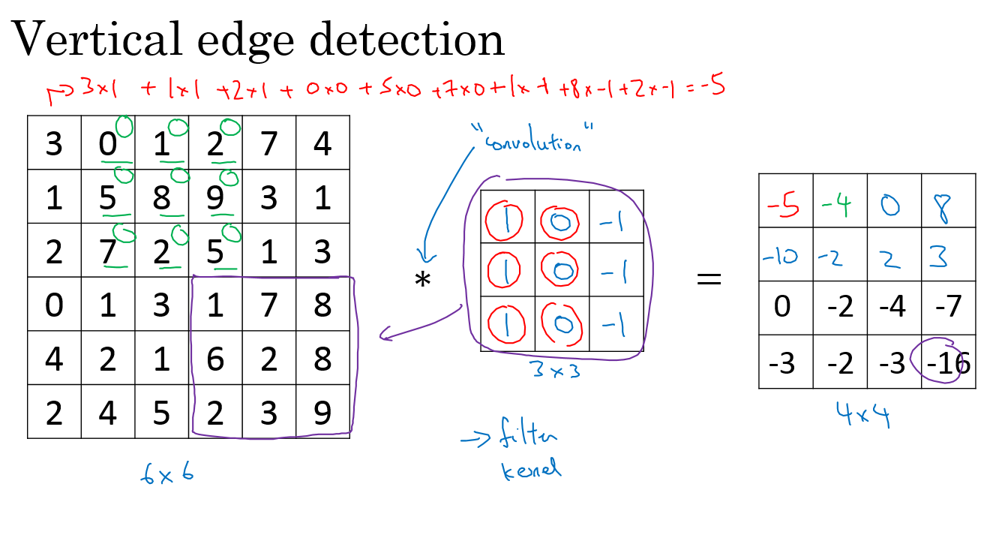
  - In the last example a `6x6` matrix convolved with `3x3` filter/kernel gives us a `4x4` matrix.
  - If you make the convolution operation in TensorFlow you will find the function `tf.nn.conv2d`. In keras you will find `Conv2d` function.
  - The vertical edge detection filter will find a `3x3` place in an image where there are a bright region followed by a dark region.
  - If we applied this filter to a white region followed by a dark region, it should find the edges in between the two colors as a positive value. But if we applied the same filter to a dark region followed by a white region it will give us negative values. To solve this we can use the abs function to make it positive.
- Horizontal edge detection
  - Filter would be like this

    ```
    1	1	1
    0	0	0
    -1	-1	-1
    ```

- There are a lot of ways we can put number inside the horizontal of vertical edge detections. For example here are the vertical **Sobel** filter (The idea is taking care of the middle row):

  ```
  1	0	-1
  2	0	-2
  1	0	-1
  ```

- Also something called **Scharr** filter (The idea is taking great care of the middle row):

  ```
  3	0	-3
  10	0	-10
  3	0	-3
  ```

- What we learned in the deep learning is that we don't need to hand craft these numbers, we can treat them as weights and then learn them. It can learn horizontal, vertical, angled, or any edge type automatically rather than getting them by hand.

### Padding

- In order to to use deep neural networks we really need to use **paddings**.
- In the last section we saw that a `6x6` matrix convolved with `3x3` filter/kernel gives us a `4x4` matrix.
- To give it a general rule, if a matrix `nxn` is convolved with `fxf` filter/kernel give us `n-f+1,n-f+1` matrix. 
- The convolution operation shrinks the matrix if f>1.
- We want to apply convolution operation multiple times, but if the image shrinks we will lose a lot of data on this process. Also the edges pixels are used less than other pixels in an image.
- So the problems with convolutions are:
  - Shrinks output.
  - throwing away a lot of information that are in the edges.
- To solve these problems we can pad the input image before convolution by adding some rows and columns to it. We will call the padding amount `P` the number of row/columns that we will insert in top, bottom, left and right of the image.
- In almost all the cases the padding values are zeros.
- The general rule now,  if a matrix `nxn` is convolved with `fxf` filter/kernel and padding `p` give us `n+2p-f+1,n+2p-f+1` matrix. 
- If n = 6, f = 3, and p = 1 Then the output image will have `n+2p-f+1 = 6+2-3+1 = 6`. We maintain the size of the image.
- Same convolutions is a convolution with a pad so that output size is the same as the input size. Its given by the equation:

  ```
  P = (f-1) / 2
  ```

- In computer vision f is usually odd. Some of the reasons is that its have a center value.

### Strided convolution

- Strided convolution is another piece that are used in CNNs.

- We will call stride `S`

- When we are making the convolution operation we used `S` to tell us the number of pixels we will jump when we are convolving filter/kernel. The last examples we described S was 1.

- Now the general rule are:
  -  if a matrix `nxn` is convolved with `fxf` filter/kernel and padding `p` and stride `s` it give us `(n+2p-f)/s+1,(n+2p-f)/s+1` matrix. 

- In case `(n+2p-f)/s + 1` is fraction we can take **floor** of this value.

- In math textbooks the conv operation is filpping the filter before using it. What we were doing is called cross-correlation operation but the state of art of deep learning is using this as conv operation.

- Same convolutions is a convolution with a pad so that output size is the same as the input size. Its given by the equation:

  ```
  p = (n*s - n + f - s) / 2
  When s = 1 ==> P = (f-1) / 2
  ```

### Convolutions over volumes

- We see how convolution works with 2D images, now lets see if we want to convolve 3D images (RGB image)
- We will convolve an image of height, width, # of channels with a filter of a height, width, same # of channels. Hint that the image number channels and the filter number of channels are the same.
- We can call this as stacked filters for each channel!
- Example:
  - Input image: `6x6x3`
  - Filter: `3x3x3`
  - Result image: `4x4x1`
  - In the last result p=0, s=1
- Hint the output here is only 2D.
- We can use multiple filters to detect multiple features or edges. Example.
  - Input image: `6x6x3`
  - 10 Filters: `3x3x3`
  - Result image: `4x4x10`
  - In the last result p=0, s=1

### One Layer of a Convolutional Network

- First we convolve some filters to a given input and then add a bias to each filter output and then get RELU of the result. Example:
  - Input image: `6x6x3`         `# a0`
  - 10 Filters: `3x3x3`         `#W1`
  - Result image: `4x4x10`     `#W1a0`
  - Add b (bias) with `10x1` will get us : `4x4x10` image      `#W1a0 + b`
  - Apply RELU will get us: `4x4x10` image                `#A1 = RELU(W1a0 + b)`
  - In the last result p=0, s=1
  - Hint number of parameters here are: `(3x3x3x10) + 10 = 280`
- The last example forms a layer in the CNN.
- Hint that no matter how the size of the input, the number of the parameters for the same filter will still the same. That makes it less prune to overfitting.
- Here are some notations we will use. If layer l is a conv layer:

  ```
  Hyperparameters
  f[l] = filter size
  p[l] = padding	# Default is zero
  s[l] = stride
  nc[l] = number of filters

  Input:  n[l-1] x n[l-1] x nc[l-1]	Or	 nH[l-1] x nW[l-1] x nc[l-1]
  Output: n[l] x n[l] x nc[l]	Or	 nH[l] x nW[l] x nc[l]
  Where n[l] = (n[l-1] + 2p[l] - f[l] / s[l]) + 1

  Each filter is: f[l] x f[l] x nc[l-1]

  Activations: a[l] is nH[l] x nW[l] x nc[l]
  		     A[l] is m x nH[l] x nW[l] x nc[l]   # In batch or minbatch training
  		     
  Weights: f[l] * f[l] * nc[l-1] * nc[l]
  bias:  (1, 1, 1, nc[l])
  ```

### A simple convolution network example

- Lets build a big example.
  - Input Image are:   `a0 = 39x39x3`
    - `n0 = 39` and `nc0 = 3`
  - First layer (Conv layer):
    - `f1 = 3`, `s1 = 1`, and `p1 = 0`
    - `number of filters = 10`
    - Then output are `a1 = 37x37x10`
      - `n1 = 37` and `nc1 = 10`
  - Second layer (Conv layer):
    - `f2 = 5`, `s2 = 2`, `p2 = 0`
    - `number of filters = 20`
    - The output are `a2 = 17x17x20`
      - `n2 = 17`, `nc2 = 20`
    - Hint shrinking goes much faster because the stride is 2
  - Third layer (Conv layer):
    - `f3 = 5`, `s3 = 2`, `p2 = 0`
    - `number of filters = 40`
    - The output are `a3 = 7x7x40`
      - `n3 = 7`, `nc3 = 40`
  - Forth layer (Fully connected Softmax)
    - `a3 = 7x7x40 = 1960`  as a vector..
- In the last example you seen that the image are getting smaller after each layer and thats the trend now.
- Types of layer in a convolutional network:
  - Convolution. 		`#Conv`
  - Pooling      `#Pool`
  - Fully connected     `#FC`

### Pooling layers

- Other than the conv layers, CNNs often uses pooling layers to reduce the size of the inputs, speed up computation, and to make some of the features it detects more robust.
- Max pooling example:
  - 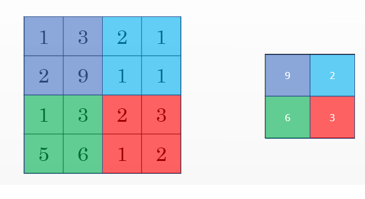
  - This example has `f = 2`, `s = 2`, and `p = 0` hyperparameters
- The max pooling is saying, if the feature is detected anywhere in this filter then keep a high number. But the main reason why people are using pooling because its works well in practice and reduce computations.
- Max pooling has no parameters to learn.
- Example of Max pooling on 3D input:
  - Input: `4x4x10`
  - `Max pooling size = 2` and `stride = 2`
  - Output: `2x2x10`
- Average pooling is taking the averages of the values instead of taking the max values.
- Max pooling is used more often than average pooling in practice.
- If stride of pooling equals the size, it will then apply the effect of shrinking.
- Hyperparameters summary
  - f : filter size.
  - s : stride.
  - Padding are rarely uses here.
  - Max or average pooling.

### Convolutional neural network example

- Now we will deal with a full CNN example. This example is something like the ***LeNet-5*** that was invented by Yann Lecun.
  - Input Image are:   `a0 = 32x32x3`
    - `n0 = 39` and `nc0 = 3`
  - First layer (Conv layer):        `#Conv1`
    - `f1 = 5`, `s1 = 1`, and `p1 = 0`
    - `number of filters = 6`
    - Then output are `a1 = 28x28x6`
      - `n1 = 28` and `nc1 = 6`
    - Then apply (Max pooling):         `#Pool1`
      - `f1p = 2`, and `s1p = 2`
      - The output are `a1 = 14x14x6`
  - Second layer (Conv layer):   `#Conv2`
    - `f2 = 5`, `s2 = 1`, `p2 = 0`
    - `number of filters = 16`
    - The output are `a2 = 10x10x16`
      - `n2 = 10`, `nc2 = 16`
    - Then apply (Max pooling):         `#Pool2`
      - `f1p = 2`, and `s1p = 2`
      - The output are `a2 = 5x5x16`
  - Third layer (Fully connected)   `#FC3`
    - Number of neurons are 120
    - The output `a3 = 120 x 1` . 400 came from `5x5x16`
  - Forth layer (Fully connected)  `#FC4`
    - Number of neurons are 84
    - The output `a4 = 84 x 1` .
  - Fifth layer (Softmax)
    - Number of neurons is 10 if we need to identify for example the 10 digits.
- Hint a Conv1 and Pool1 is treated as one layer.
- Some statistics about the last example:
  - 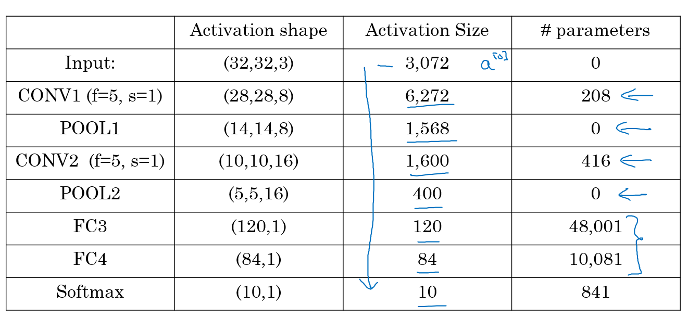
- Hyperparameters are a lot. For choosing the value of each you should follow the guideline that we will discuss later or check the literature and takes some ideas and numbers from it.
- Usually the input size decreases over layers while the number of filters increases.
- A CNN usually consists of one or more convolution (Not just one as the shown examples) followed by a pooling.
- Fully connected layers has the most parameters in the network.
- To consider using these blocks together you should look at other working examples firsts to get some intuitions.

### Why convolutions?

- Two main advantages of Convs are:
  - Parameter sharing.
    - A feature detector (such as a vertical edge detector) that’s useful in one part of the image is probably useful in another part of the image.
  - sparsity of connections.
    - In each layer, each output value depends only on a small number of inputs which makes it translation invariance.
- Putting it all together:
  - 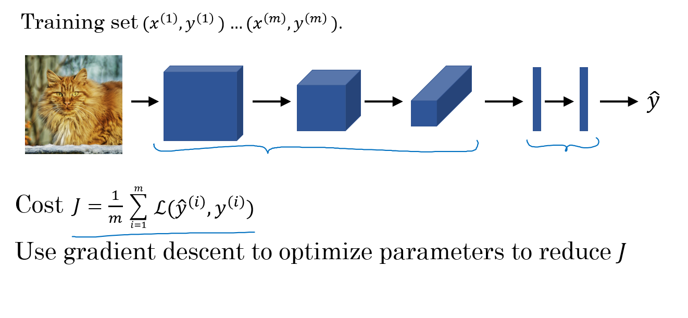

## Deep convolutional models: case studies

### Why look at case studies?

- We learned about Conv layer, pooling layer, and fully connected layers. It turns out that computer vision researchers spent the past few years on how to put these layers together.
- To get some intuitions you have to see the examples that has been made.
- Some neural networks architecture that works well in some tasks can also work well in other tasks.
- Here are some classical CNN networks:
  - **LeNet-5**
  - **AlexNet**
  - **VGG**
- The best CNN architecture that won the last ImageNet competation is called **ResNet** and it has 152 layers!
- There are also an architecture called **Inception** that was made by Google that are very useful to learn and apply to your tasks.
- Reading and trying the mentioned models can boost you and give you a lot of ideas to solve your task.

### Classic networks

- In this section we will talk about classic networks which are **LeNet-5**, **AlexNet**, and **VGG**.

- **LeNet-5**

  - The goal for this model was to identify handwritten digits in a `32x32x1` gray image. Here are the drawing of it:
  - 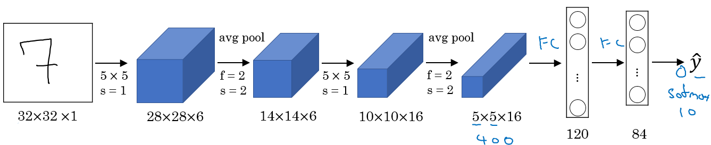
  - This model was published in 1998. The last layer wasn't using softmax back then.
  - It has 60k parameters.
  - The dimensions of the image decreases as the number of channels increases.
  - `Conv ==> Pool ==> Conv ==> Pool ==> FC ==> FC ==> softmax` this type of arrangement is quite common.
  - The activation function used in the paper was Sigmoid and Tanh. Modern implementation uses RELU in most of the cases.
  - [LeCun et al., 1998. Gradient-based learning applied to document recognition]

- **AlexNet**

  - Named after Alex Krizhevsky who was the first author of this paper. The other authors includes Jeoffery Hinton.

  - The goal for the model was the ImageNet challenge which classifies images into 1000 classes. Here are the drawing of the model:

  - 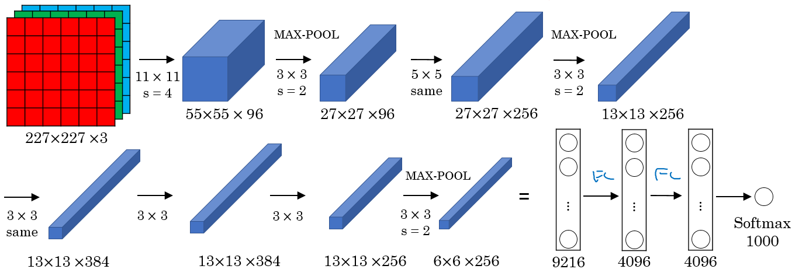

  - Summary:

    - ```
      Conv => Max-pool => Conv => Max-pool => Conv => Conv => Conv => Max-pool ==> Flatten ==> FC ==> FC ==> Softmax
      ```

  - Similar to LeNet-5 but bigger.

  - Has 60 Million parameter compared to 60k parameter of LeNet-5.

  - It used the RELU activation function.

  - The original paper contains Multiple GPUs and Local Response normalization (RN).

    - Multiple GPUs was used because the GPUs was so fast back then.
    - Researchers proved that Local Response normalization doesn't help much so for now don't bother yourself for understanding or implementing it. 

  - This paper convinced the computer vision researchers that deep learning is so important.

  - [Krizhevsky et al., 2012. ImageNet classification with deep convolutional neural networks]

- **VGG-16**

  - A modification for AlexNet.
  - Instead of having a lot of hyperparameters lets have some simpler network.
  - Focus on having only these blocks:
    - CONV = 3×3 filter, s = 1, same  
    - MAX-POOL = 2×2 , s = 2
  - Here are the architecture:
    - 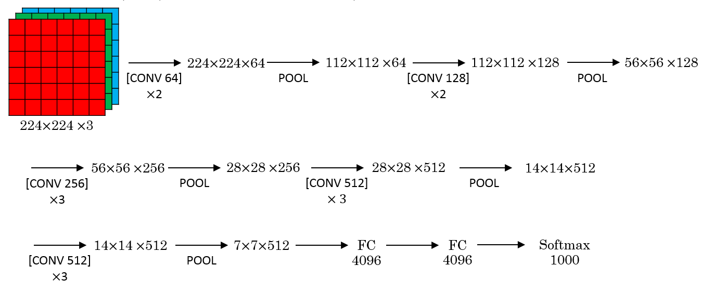
  - This network is large even by modern standards. It has around 138 million parameters.
    - Most of the parameters are in the fully connected layers.
  - It has a total memory of 96MB per image for only forward propagation!
    - Most memory are in the earlier layers.
  - Number of filters increases from 64 to 128 to 256 to 512. 512 was made twice.
  - Pooling was the only one who is responsible for shrinking the dimensions.
  - There are another version called **VGG-19** which is a bigger version. But most people uses the VGG-16 instead of the VGG-19 because it does the same.
  - VGG paper is attractive it tries to make some rules regarding using CNNs.
  - [Simonyan & Zisserman 2015. Very deep convolutional networks for large-scale image recognition]

### Residual Networks (ResNets)

- Very, very deep NNs are difficult to train because of vanishing and exploding gradients problems.
- In this section we will learn about skip connection which makes you take the activation from one layer and suddenly feed it to another layer even much deeper in NN which allows you to train large NNs even with layers greater than 100.
- **Residual block**
  - ResNets are built out of some Residual blocks.
  - 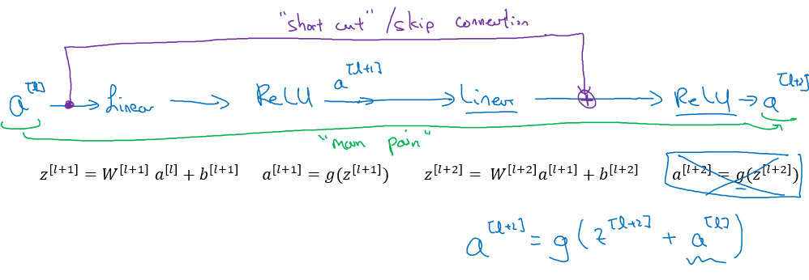
  - They add a shortcut/skip connection before the second activation.
  - The authors of this block find that you can train a deeper NNs using stacking this block.
  - [He et al., 2015. Deep residual networks for image recognition]
- **Residual Network**
  - Are a NN that consists of some Residual blocks.
  - 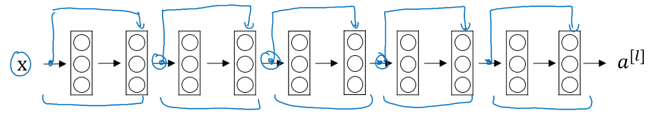
  - These networks can go deeper without hurting the performance. In the normal NN - Plain networks - the theory tell us that if we go deeper we will get a better solution to our problem, but because of the vanishing and exploding gradients problems the performance of the network suffers as it goes deeper. Thanks to Residual Network we can go deeper as we want now.
  - 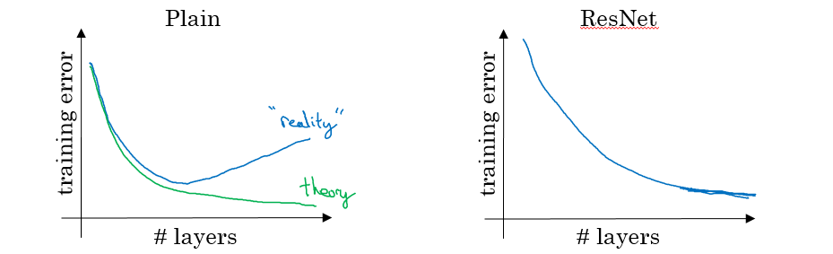
  - On the left is the normal NN and on the right are the ResNet. As you can see the performance of ResNet increases as the network goes deeper.
  - In some cases going deeper won't effect the performance and that depends on the problem on your hand.
  - Some people are trying to train 1000 layer now which isn't used in practice. 
  - [He et al., 2015. Deep residual networks for image recognition]

### Why ResNets work

- Lets see some example that illustrates why resNet work.

  - We have a big NN as the following:

    - `X --> Big NN --> a[l]`

  - Lets add two layers to this network as a residual block:

    - `X --> Big NN --> a[l] --> Layer1 --> Layer2 --> a[l+2]`
    - And a`[l]` has a direct connection to `a[l+2]`

  - Suppose we are using RELU activations.

  - Then:

    - ```
      a[l+2] = g( z[l+2] + a[l] )
      	   = g( W[l+2] a[l+1] + b[l+2] + a[l] )
      ```

  - Then if we are using L2 regularization for example, `W[l+2]` will be zero. Lets say that `b[l+2]` will be zero too.

  - Then `a[l+2] = g( a[l] ) = a[l]` with no negative values.

  - This show that identity function is easy for a residual block to learn. And that why it can train deeper NNs.

  - Also that the two layers we added doesn't hurt the performance of big NN we made.

  - Hint: dimensions of z[l+2] and a[l] have to be the same in resNets. In case they have different dimensions what we put a matrix parameters (Which can be learned or fixed)

    - `a[l+2] = g( z[l+2] + ws * a[l] ) # The added Ws should make the dimentions equal`
    - ws also can be a zero padding.

- Using a skip-connection helps the gradient to backpropagate and thus helps you to train deeper networks

- Lets take a look at ResNet on images.

  - Here are the architecture of **ResNet-34**:
  - 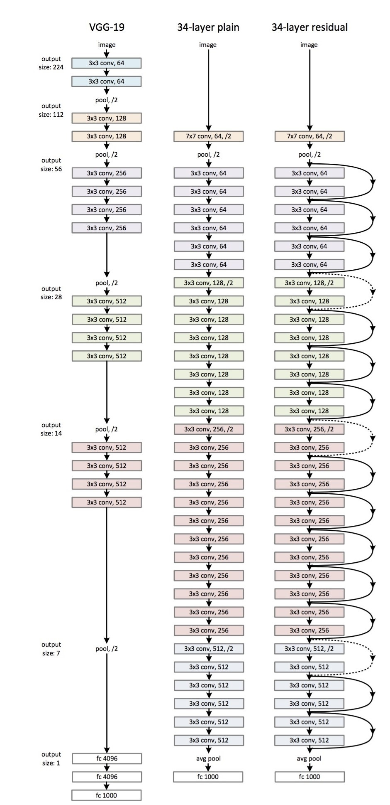
  - All the 3x3 Conv are same Convs.
  - Keep it simple in design of the network.
  - spatial size /2 => # filters x2
  - No FC layers, No dropout is used.
  - Two main types of blocks are used in a ResNet, depending mainly on whether the input/output dimensions are same or different. You are going to implement both of them.
  - The dotted lines is the case when the dimensions are different. To solve then they down-sample the input by 2 and then pad zeros to match the two dimensions. There's another trick which is called bottleneck which we will explore later.

- Useful concept (**Spectrum of Depth**):

  - 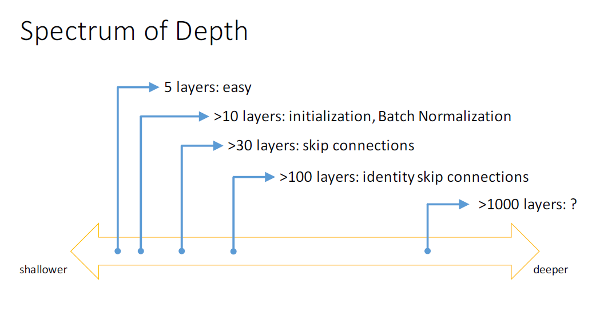
  - Taken from [icml.cc/2016/tutorials/icml2016_tutorial_deep_residual_networks_kaiminghe.pdf](icml.cc/2016/tutorials/icml2016_tutorial_deep_residual_networks_kaiminghe.pdf)

- Residual blocks types:

  - Identity block:
    - 
    - Hint the conv is followed by a batch norm `BN` before `RELU`. Dimensions here are same.
    - This skip is over 2 layers. The skip connection can jump n connections where n>2
    - This drawing represents [Keras](https://keras.io/) layers.
  - The convolutional block:
    - 
    - The conv can be bottleneck 1 x 1 conv

### Network in Network and 1×1 convolutions

- A 1 x 1 convolution  - We also call it Network in Network- is so useful in many CNN models.

- What does a 1 × 1 convolution do? Isn't it just multiplying by a number?

  - Lets first consider an example:
    - Input: `6x6x1`
    - Conv: `1x1x1` one filter.        `# The 1 x 1 Conv`
    - Output: `6x6x1`
  - Another example:
    - Input: `6x6x32`
    - Conv: `1x1x32` 5 filters.     `# The 1 x 1 Conv`
    - Output: `6x6x5`

- The Network in Network is proposed in [Lin et al., 2013. Network in network]

- It has been used in a lot of modern CNN implementations like ResNet and Inception models.

- A 1 x 1 convolution is useful when:

  - We want to shrink the number of channels. We also call this feature transformation.
    - In the second discussed example above we have shrieked the input from 32 to 5.
  - We will later see that by shrinking it can save a lot of computations.
  - If we have specified the number of 1 x 1 Conv filters to be the same as the input number of channels then the output will contain the same number of channels. Then the 1 x 1 Conv will act like a non linearity and will learn non linearity operator. 

- Replace fully connected layers with 1 x 1 convolutions as Yann LeCun believes they are the same.

  - > “fully-connected layers”. There are only convolution layers with 1x1 convolution kernels and a full connection table. – [Yann LeCun](https://www.facebook.com/yann.lecun/posts/10152820758292143) 

- [Lin et al., 2013. Network in network]

### Inception network motivation

- When you design a CNN you have to decide all the layers yourself. Will you pick a 3 x 3 Conv or 5 x 5 Conv or maybe a max pooling layer. You have so many choices.
- What **inception** tells us is, Why not use all of them at once?
- **Inception module**, naive version:
  - 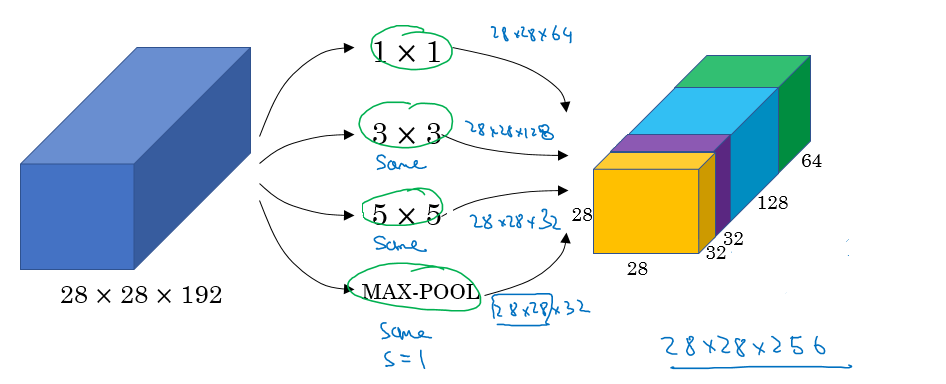
  - Hint that max-pool are same here.
  - Input to the inception module are 28 x 28 x 192 and the output are 28 x 28 x 256
  - We have done all the Convs and pools we might want and will let the NN learn and decide which it want to use most.
  - [Szegedy et al. 2014. Going deeper with convolutions]
- The problem of computational cost in Inception model:
  - If we have just focused on a 5 x 5 Conv that we have done in the last example.
  - There are 32 same filters of 5 x 5, and the input are 28 x 28 x 192.
  - Output should be 28 x 28 x 32
  - The total number of multiples needed here are:
    - Number of outputs * Filter size * Filter size * Input dimensions
    - Which equals: `28 * 28 * 32 * 5 * 5 * 192 = 120 Mil` 
    - 120 Mil multiply operation still a problem in the modern day computers.
  - Using a 1 x 1 convolution we can reduce 120 mil to just 12 mil. Lets see how.
- Using 1×1 convolution to reduce computational cost:
  - The new architecture are:
    - X0 shape is (28, 28, 192)
    - We then apply 16 (1 x 1 Convolution)
    - That produces X1 of shape (28, 28, 16)
      - Hint, we have reduced the dimensions here.
    - Then apply 32  (5 x 5 Convolution)
    - That produces X2 of shape (28, 28, 32)
  - Now lets calculate the number of multiplications:
    - For the first Conv: `28 * 28 * 16 * 1 * 1 * 192 = 2.5 Mil`
    - For the second Conv: `28 * 28 * 32 * 5 * 5 * 16 = 10 Mil`
    - So the total number are 12.5 Mil approx. which is so good compared to 120 Mil
- A 1 x 1 Conv here is called Bottleneck `BN`.
- It turns out that the 1 x 1 Conv won't hurt the performance.
- **Inception module**, dimensions reduction version:
  - 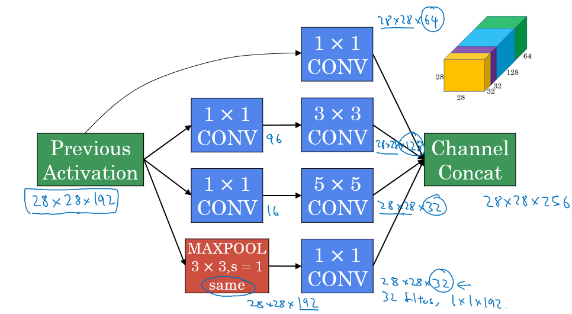

### Inception network (GoogleNet)

- The inception network consist of concatenated blocks of the Inception module.
- The name inception was taken from a *meme* image which was taken from **Inception movie**
- Here are the full model:
  - 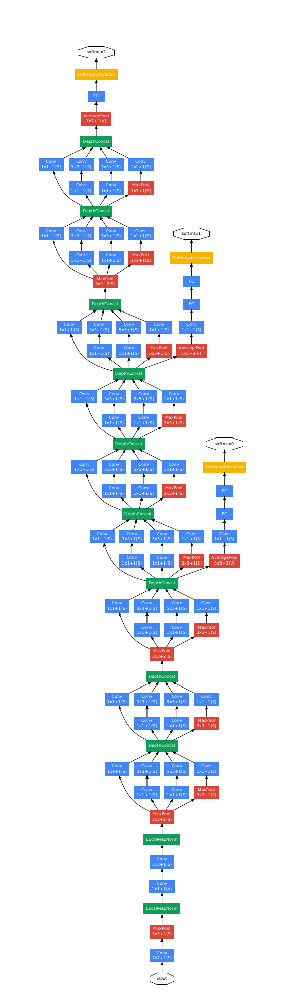
- Some times a Max-Pool block is used before the inception module to reduce the dimensions of the inputs.
- There are a 3 Sofmax branches at different positions to push the network toward its goal. and helps to ensure that the intermediate features are good enough to the network to learn and it turns out that softmax0 and sofmax1 gives regularization effect.
- Since the development of the Inception module, the authors and the others have built another versions of this network. Like inception v2, v3, and v4. Also there are a network that has used the inception module and the ResNet together.
- [Szegedy et al., 2014, Going Deeper with Convolutions]

### Using Open-Source Implementation

- We have learned a lot of NNs and ConvNets architectures.
- It turns out that a lot of these NN are difficult to replicated. because there are some details that may not presented on its papers. There are some other reasons like:
  - Learning decay.
  - Parameter tuning.
- A lot of deep learning researchers are opening sourcing their code into Internet on sites like [Github](Github.com).
- If you see a research paper and you want to build over it, the first thing you should do is to look for an open source implementation for this paper.
- Some advantage of doing this is that you might download the network implementation along with its parameters/weights. The author might used a multiple GPUs and some weeks to reach this result and its right in front of you after you download it.

### Transfer Learning

- It you are using a specific NN architecture that has been trained before, you can use this pretrained parameters/weights instead of random initialization to solve your problem.
- It can help you boost the performance of the NN.
- The pretrained models might have trained of a large datasets like ImageNet, Ms COCO, or pascal and took a lot of time to learn those parameters/weights with optimized hyperparameters. This can save you a lot of time.
- Lets see an example:
  - Lets say you have a cat classification problem which contains 3 classes Tigger, Misty and neither.
  - You don't have much a lot of data to train a NN on these images.
  - Andrew recommends to go online and download a good NN with its weights, remove the softmax activation layer and put your own one and make the network learn only the new layer while other layer weights are fixed/frozen.
  - Frameworks have options to make the parameters frozen in some layers using `trainable = 0` or `freeze = 0`
  - One of the tricks that can speed up your training, is to run the pretrained NN without final softmax layer and get an intermediate representation of your images and save them to disk. And then use these representation to a shallow NN network. This can save you the time needed to run an image through all the layers.
    - Its like converting your images into vectors.
- Another example:
  - What if in the last example you have a lot of pictures for your cats.
  - One thing you can do is to freeze few layers from the beginning of the pretrained network and learn the other weights in the network.
  - Some other idea is to through away the layers that aren't freeze and put your own layers there.
- Another example:
  - If you have enough data, you can fine tune all the layers in your pretrained network but don't random initialize the parameters, leave the learned parameters as it is and learn from there. 

### Data Augmentation

- If data is increases, your deep NN will perform better. Data augmentation is one of the techniques that deep learning uses to increase the performance of deep NN.
- The majority of computer vision applications needs more data right now.
- Some data augmentation methods that are used for computer vision tasks includes:
  - Mirroring.
  - Random cropping.
    - The issue with this technique is that you might take a wrong crop.
    - The solution is to make your crops big enough.
  - Rotation.
  - Shearing.
  - Local warping.
  - Color shifting.
    - For example, we add to R, G, and B some distortions that will make the image identified as the same for the human but is different for the computer.
    - In practice the added value are pulled from some probability distribution and these shifts are some small.
    - Makes your algorithm more robust in changing colors in images. 
    - There are an algorithm which is called ***PCA color augmentation*** that decides the shifts needed automatically.
- Implementing distortions during training:
  - You can use a different CPU thread to make you a distorted mini batches while you are training your NN.
- Data Augmentation has also some hyperparameters. A good place to start is to find an open source data augmentation implementation and then use it or fine tune these hyperparameters.

### State of Computer Vision

- For a specific problem we may have a little data for it or a lots of data.
- Speech recognition problems for example has a big amount of data, while image recognition has a medium amount of data and the object detection has a small amount of data nowadays.
- If your problem has a large amount of data, researchers are tend to use:
  - Simpler algorithms.
  - Less hand engineering.
- If you don't have that much data people are tend to try more hand engineering for the problem "Hacks". Like choosing a more complex NN architecture.
- Because we haven't that much data in a lot of computer vision problems, It relies a lot on hand engineering.
- We will see in the next chapter that because the object detection has a less data, a more complex NN architectures will be presented.
- Tips for doing well on benchmarks/winning competitions:
  - Ensembling.
    - Train several networks independently and average their outputs. Merging down some classifiers.
    - After you decide the best architecture for your problem, initialize some of that randomly and train them independently.
    - This can give you a push by 2%
    - But this will slow down your production by the number of the ensembles. Also it takes more memory as it saves all the models in the memory.
    - People use this in competitions but few uses this in a real production.
  - Multi-crop at test time.
    - Run classifier on multiple versions of test versions and average results.
    - There is a technique called 10 crops that uses this.
    - This can give you a better result in the production.
- Use open source code
  - Use architectures of networks published in the literature.
  - Use open source implementations if possible.
  - Use pretrained models and fine-tune on your dataset.

## Object detection

## Special applications: Face recognition & Neural style transfer

## Extras

### Keras

- Keras is a high-level neural networks API (programming framework), written in Python and capable of running on top of several lower-level frameworks including TensorFlow, Theano, and CNTK.
- Keras was developed to enable deep learning engineers to build and experiment with different models very quickly.
- Just as TensorFlow is a higher-level framework than Python, Keras is an even higher-level framework and provides additional abstractions.
- Keras will work fine for many common models.
- Layers in Keras:
  - Dense (Fully connected layers).
    - A linear function followed by a non linear function.
  - Convolutional layer.
  - Pooling layer.
  - Normalisation layer.
    - A batch normalization layer.
  - Flatten layer
    - Flatten a matrix into vector.
  - Activation layer
    - Different activations include: relu, tanh, sigmoid, and softmax.
- To train and test a model in Keras there are four steps:
  1. Create the model.
  2. Compile the model by calling `model.compile(optimizer = "...", loss = "...", metrics = ["accuracy"])`
  3. Train the model on train data by calling `model.fit(x = ..., y = ..., epochs = ..., batch_size = ...)`
  4. Test the model on test data by calling `model.evaluate(x = ..., y = ...)`
- Summarize of step in Keras: Create->Compile->Fit/Train->Evaluate/Test
- `Model.summary()` gives a lot of useful informations regarding your model including each layers inputs, outputs, and number of parameters at each layer.
- To choose the Keras backend you should go to `$HOME/.keras/keras.json` and change the file to the desired backend like Theano or Tensorflow.
- After you create the model you can run it in a tensorflow session without compiling, training, and testing capabilities.


These Notes was made by [Mahmoud Badry](mailto:mma18@fayoum.edu.eg) @2017