# Sequence Models

This is the fifth and final course of the deep learning specialization at [Coursera](https://www.coursera.org/specializations/deep-learning) which is moderated by [deeplearning.ai](http://deeplearning.ai/). The course is taught by Andrew Ng.

## Table of contents
* [Sequence Models](#sequence-models)
   * [Table of contents](#table-of-contents)
   * [Course summary](#course-summary)
   * [Recurrent Neural Networks](#recurrent-neural-networks)
      * [Why sequence models](#why-sequence-models)
      * [Notation](#notation)
      * [Recurrent Neural Network Model](#recurrent-neural-network-model)
      * [Backpropagation through time](#backpropagation-through-time)
      * [Different types of RNNs](#different-types-of-rnns)
      * [Language model and sequence generation](#language-model-and-sequence-generation)
      * [Sampling novel sequences](#sampling-novel-sequences)
      * [Vanishing gradients with RNNs](#vanishing-gradients-with-rnns)
      * [Gated Recurrent Unit (GRU)](#gated-recurrent-unit-gru)
      * [Long Short Term Memory (LSTM)](#long-short-term-memory-lstm)
      * [Bidirectional RNN](#bidirectional-rnn)
      * [Deep RNNs](#deep-rnns)
      * [Back propagation with RNNs](#back-propagation-with-rnns)
   * [Natural Language Processing &amp; Word Embeddings](#natural-language-processing--word-embeddings)
      * [Introduction to Word Embeddings](#introduction-to-word-embeddings)
         * [Word Representation](#word-representation)
         * [Using word embeddings](#using-word-embeddings)
         * [Properties of word embeddings](#properties-of-word-embeddings)
         * [Embedding matrix](#embedding-matrix)
      * [Learning Word Embeddings: Word2vec &amp; GloVe](#learning-word-embeddings-word2vec--glove)
         * [Learning word embeddings](#learning-word-embeddings)
         * [Word2Vec](#word2vec)
         * [Negative Sampling](#negative-sampling)
         * [GloVe word vectors](#glove-word-vectors)
      * [Applications using Word Embeddings](#applications-using-word-embeddings)
         * [Sentiment Classification](#sentiment-classification)
         * [Debiasing word embeddings](#debiasing-word-embeddings)
   * [Sequence models &amp; Attention mechanism](#sequence-models--attention-mechanism)
      * [Various sequence to sequence architectures](#various-sequence-to-sequence-architectures)
         * [Basic Models](#basic-models)
         * [Picking the most likely sentence](#picking-the-most-likely-sentence)
         * [Beam Search](#beam-search)
         * [Refinements to Beam Search](#refinements-to-beam-search)
         * [Error analysis in beam search](#error-analysis-in-beam-search)
         * [BLEU Score](#bleu-score)
         * [Attention Model Intuition](#attention-model-intuition)
         * [Attention Model](#attention-model)
      * [Speech recognition - Audio data](#speech-recognition---audio-data)
         * [Speech recognition](#speech-recognition)
         * [Trigger Word Detection](#trigger-word-detection)
   * [Extras](#extras)
      * [Machine translation attention model (From notebooks)](#machine-translation-attention-model-from-notebooks)

## Course summary
Here are the course summary as its given on the course [link](https://www.coursera.org/learn/nlp-sequence-models):

> This course will teach you how to build models for natural language, audio, and other sequence data. Thanks to deep learning, sequence algorithms are working far better than just two years ago, and this is enabling numerous exciting applications in speech recognition, music synthesis, chatbots, machine translation, natural language understanding, and many others. 
>
> You will:
> - Understand how to build and train Recurrent Neural Networks (RNNs), and commonly-used variants such as GRUs and LSTMs.
> - Be able to apply sequence models to natural language problems, including text synthesis. 
> - Be able to apply sequence models to audio applications, including speech recognition and music synthesis.
>
> This is the fifth and final course of the Deep Learning Specialization.

## Recurrent Neural Networks

> Learn about recurrent neural networks. This type of model has been proven to perform extremely well on temporal data. It has several variants including LSTMs, GRUs and Bidirectional RNNs, which you are going to learn about in this section.

### Why sequence models

- Sequence Models like RNN and LSTMs have greatly transformed learning on sequences in the past few years.
- Examples of sequence data in applications:
  - Speech recognition (**Sequence to sequence**):
    - X:           Wave sequence
    - Y:           Text sequence
  - Music generation (**one to sequence**):
    - X:           (Can be nothing or an integer)
    - Y:           Wave sequence
  - Sentiment classification (**sequence to one**):
    - X:          Text sequence
    - Y:           Integer rating from one to five
  - DNA sequence analysis (**sequence to sequence**):
    - X:           DNA sequence
    - Y:            DNA Labels
  - Machine translation (**sequence to sequence**):
    - X:            Text sequence (In a language)
    - Y:            Text sequence (In other language)
  - Video activity recognition (**Sequence to one**):
    - X:            Video frames
    - Y:             Label (Activity)
  - Name entity recognition  (**Sequence to sequence**):
    - X:            Text sequence
    - Y:             Label sequence
    - Can be used by seach engines to index different type of words inside a text.
- As you can see there are different data with different input and outputs - sequence or one - that can be learned by supervised learning models.
- There are different ways and models to tackle different sequence problem.

### Notation

- In this section we will discuss the notations that we will use through the course.
- **Motivating example**:
  - In the content of name entity recognition application let:
    - X: "Harry Potter and Hermoine Granger invented a new spell."
    - Y:   1   1   0   1   1   0   0   0   0
    - Both elements has a shape of 9. 1 means its a name, while 0 means its not a name.
- We will index the first element of X by X<1>, the second X<2> and so on.
  - X<1> = Harry
  - X<2> = Potter
- Similarly, we will index the first element of Y by Y<1>, the second Y<2> and so on.
  - Y<1> = 1
  - Y<2> = 1
- X\<t> gets an element by index t.
- Tx is the size of the input sequence and Ty is the size of the output sequence.
  - Tx = Ty = 9 in the last example although they can be different in other problems than name entity one.
- X(i)\<t> is the element t of the sequence i in the training. Similarly for Y
- Tx (i) is the size of the input sequence i.  It can be different across the sets. Similarly for Y
- **Representing words**:
  - We will now work in this course with **NLP** which stands for nature language processing. One of the challenges of NLP is how can we represent a word?
  - <u>The first thing</u> we need a **vocabulary** list that contains all the words in our target sets.
    - Example:
      - [a ... And   ... Harry ... Potter ... Zulu ]
      - Each word will have a unique index that it can be represented with.
      - The sorting here is by alphabetic order.
  - Vocabulary sizes in modern applications are from 30,000 to 50,000. 100,000 is not uncommon. Some of the bigger companies uses a million.
  - To build vocabulary list, you can read all the text you have and get m words with the most occurrence, or search online for m most occurrence words.
  - <u>The next step</u> is to create a one **hot encoding sequence** for each word in your dataset given the vocabulary you have created.
  - While converting, what if you meet a word thats not in your dictionary?
    - Well you can add a token in the vocabulary `<UNK>` which stands for unknown text and use its index in filling your one hot vector.
  - Full example can be found here:
    - 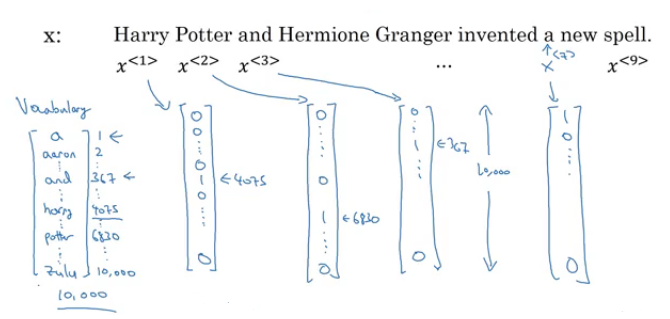

### Recurrent Neural Network Model
- Why not a standard network for sequence problems? There are two problems:
  - Inputs, outputs can be different lengths in different examples!
    - This can be solved in normal NNs by paddings with the maximum lengths but its not a good solution.
  - Doesn't share features learned across different positions of text/sequence.
    - Using a feature sharing like in CNNs can significantly reduce the number of parameters in your model. Thats what we will do in RNNs.
- Recurrent neural networks doesn't have the two mentioned problems.
- Lets build a RNN that solves **name entity recognition** task:
  - 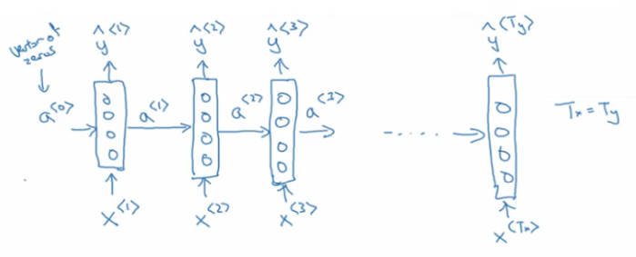
  - In this problem Tx = Ty. In other problems where they aren't equal, the RNN architecture may be different.
  - a<0> is usually initialized with zeros, but some others may initialize it randomly in some cases.
  - There are three weight matrices here: Wax, Waa, and Wya with shapes:
    - Wax: (NoOfHiddenNeurons, nx)
    - Waa: (NoOfHiddenNeurons, NoOfHiddenNeurons)
    - Wya: (ny, NoOfHiddenNeurons)
- The weight matrix Waa is the memory the RNN is trying to maintain from the previous layers.
- A lot of papers and books write the same architecture this way:
  - 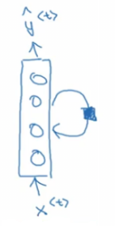
  - Its harder to interpreter. Its easier to roll this drawings to the unrolled version we have descried.
- In the discussed RNN architecture,  the current output y^\<t> depends on the previous inputs and activations.
- Lets have this example ' He Said, "Teddy Roosevelt was a great president"  '. In this example Teddy is a person name but we know that from the word **President** that came after Teddy not from **He** and **said** that is before it.
- So limitation of the discussed architecture is that it can not learn from behind. To address this problem we will later discuss **Bidirectional** RNNs  (BRNNs).
- Now lets discuss the forward propagation equations on the discussed architecture:
  - 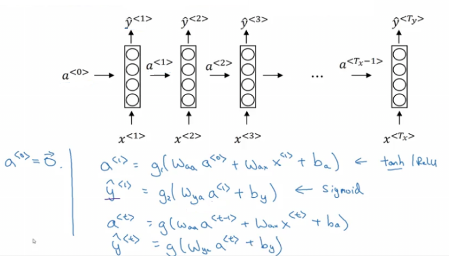
  - The activation function of a is usually tanh or RELU and for y depends on your task choosing some activation functions like sigmoid and softmax. In name entity recognition task we are solving, we will use Sigmoid because we only have two classes.
- In order to help us develop complex RNN architectures, the last equations needs to be simplified a bit.
- **Simplified RNN notation**:
  - 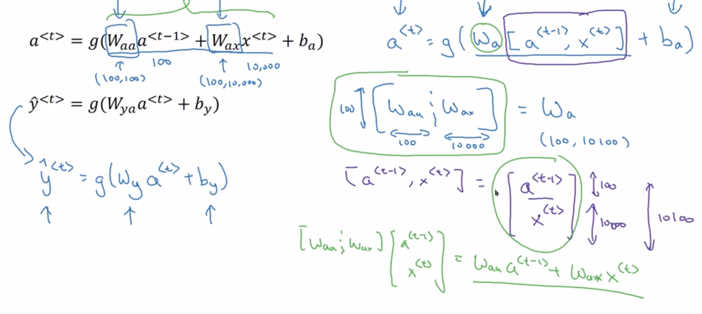
  - wa shape: (NoOfHiddenNeurons, NoOfHiddenNeurons + nx)
  - [a<t-1>, xt] shape: (NoOfHiddenNeurons + nx, 1)
### Backpropagation through time
- Lets see how backpropagation works with the RNN architecture we have developed.
- Often, Deep learning frameworks do backpropagation automatically for you. But its useful to know how it works especially in RNNs.
- Here is the graph:
  - 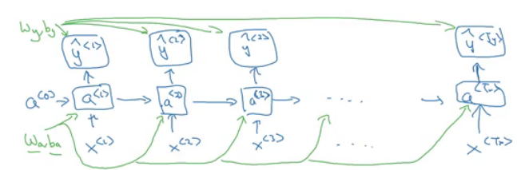
  - Where wa, ba, wy, and by are shared across each element in a sequence.
- We will use the cross entropy loss function:
  - 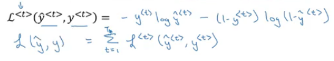
  - Where the first equation is the loss for one element and the loss for the whole sequence is given by the summation over all the calculated values.
- Graph with losses:
  - 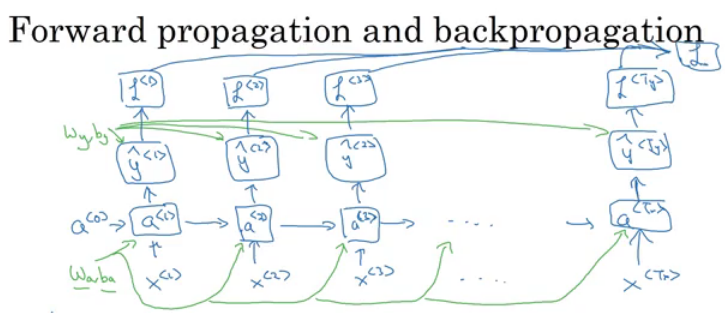
- The backpropagation here is called **backpropagation through time** because of the passed activation `a` from one sequence element to another.
### Different types of RNNs
- So far we have seen only one RNN architecture in which Tx equals TY always. In some other problems, they may not equal so we need different architectures.
- The ideas in this section was inspired by Andrej Karpathy [blog](http://karpathy.github.io/2015/05/21/rnn-effectiveness/). Mainly this image has all types:
  - 
- The architecture we have descried before is called **Many to Many**.
- In sentiment analysis problem, X is a text while Y is an integer that rangers from 1 to 5. The RNN architecture for that is **Many to One** as in Andrej Karpathy image.
  - 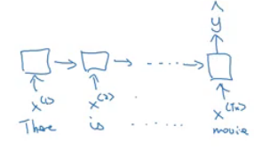
- A **One to Many** architecture application would be music generation.
  - 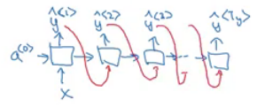
  - Note that starting the second layer we are feeding the generated output back to the network.
- There are another interesting architecture in **Many To Many**. Applications like machine translation inputs and outputs sequences have different lengths in most of the cases. So an alternative Many To Many architecture that fits the translation would be as follows:
  - 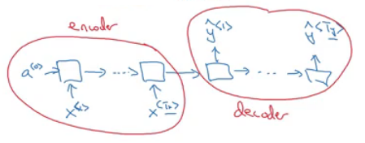
  - There are an encoder and a decoder in the architecture. The encoder encodes the input sequence into one matrix and feed it to the decoder to generate the outputs. Encoder and decoder have different weight matrices.
- There are another architecture which is the **attention** architecture which we will talk about in chapter 3.
### Language model and sequence generation
- RNNs do very well in language model problems. In this section we will build a language model using RNNs.
- **What is a language model**
  - Lets say we are solving a speech recognition problem and some one says a sentence that can be interpreted into to two sentences:
    - The apple and **pair** salad
    - The apple and **pear** salad
  - **Pair** and **pear** sounds exactly the same, so how would a speech recognition application choose from the two.
  - Thats where the language models comes. It gives a probability for the two sentences and the application decides the best based on this probability.
- The job of a language model is giving a probability of any given sentence .Also the probability of the next sentence.
- **How to build language modeling with RNNs?**
  - The first thing is to get a **training set**: Large corpus of target language text.
  - Then tokenize this training set by getting the vocabulary and then one-hot each word.
  - Put an end of sentence token `<EOS>` with the vocabulary and include it with each converted sentence. Also like we have mentioned before use the token `<UNK>` for the unknown words.
- Given the sentence "Cats average 15 hours of sleep a day. `<EOS>`"
  - In training time we will use this:
    - 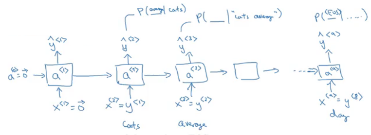
    - We pass to 0 vector - One hot -  to the first layer.
  - The loss function is defined by cross entropy loss:
    - 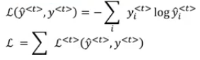
    - `i`  is for all elements in the training set.
- To use this model:
  1.  For predicting the chance of **next word**, we feed the sentence to the RNN and then get the final y^\<t> hot vector and sort it by maximum probability.
  2.  For taking the **probability of a sentence**, we compute this:
     - p(y<1>, y<2>, y<3>) = p(y<1>) * p(y<2> | y<1>) * p(y<3> | y<1>, y<2>)
     - This is simply feeding the sentence to the RNN and multiply the probability for the given word in all the output hot encoded.
### Sampling novel sequences
- After a sequence model is trained on a language model, to check what the model has learned you can apply it on a sample novel sequence.
- Lets see the steps of how we can sample a novel sequence from a trained sequence language model:
  1. Given this model:
     - 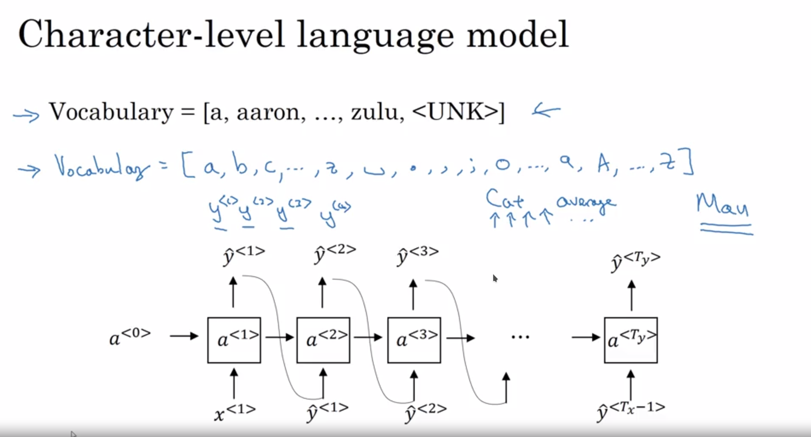
  2. We first pass a<0> = zeros vector, and x<1> = zeros vector.
  3. Then we choose a prediction from y^<1> using random distribution. For example it could be "The".
     - In Numpy this can be made using: `numpy.random.choice`
     - This is the line where you get a random sentences each time you run a novel sequence.
  4. We pass the last predicted word with the calculated  a<1>
  5. We keep doing 3 & 4 steps for a fixed length or until we get the `<EOS>` token.
  6. You can reject any `<UNK>` token if you mind finding it in you output.
- So far we have build a word level language model. A **character** level language model also can be made.
- In the character level language model the vocabulary will contain `[a-zA-Z0-9]`, space, and some special characters.
- Cons of character level language model compared to the word level language model:
  - There will be no `<UNK>` token.
  - It can deal with any word.
- But main disadvantage you will have a larger sequences! and also more computationally expensive and harder to train.
### Vanishing gradients with RNNs
- One of the problems with naive RNNs that it runs into **vanishing gradient** problems.

- An RNN that process a sequence data with the size of 10,000 time sets, has 10,000 deep layers which is so hard to optimize.

- To address the problem lets take an example. Suppose we are working with language modeling problem and there are two sequences that it tries to learn:

  - "The **cat**, which already ate ........................, **was** full"
  - "The **cats**, which already ate ........................, **were** full"
  - The dots represents many words

- What we need to learn here that "was" came with "cat" and that "were" came with "cats". The naive RNN will find it hard to get this relation.

- As we have discussed in Deep neural networks, deeper networks are luckily to get into the vanishing gradient problem. In deep nets to compute the weights of the earlier layers you have to compute all the weights after these weights which causes the gradient to vanish. That also happens with RNNs with a long sequence size.

  - 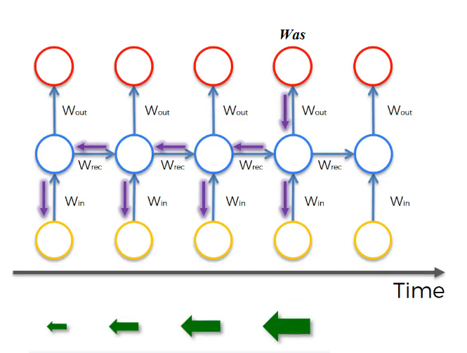
  - For computing the word "Was", we need to compute the gradient for everything behind. Multiplying by  fractions tends to vanish the gradient, while multiplication of large number tends to explode it.
  - Therefore half of your weights may not be updated properly!

- In the problem we descried it means that its hard for the network to memorize "was" word all over back to "cat". So in this case, the network won't be identify the singular/plural words so that it give it the right grammar word.

- The conclusion is that RNNs aren't good in **long term dependencies**.

- > In theory, RNNs are absolutely capable of handling such “long-term dependencies.” A human could carefully pick parameters for them to solve toy problems of this form. Sadly, in practice, RNNs don’t seem to be able to learn them. http://colah.github.io/posts/2015-08-Understanding-LSTMs/

- Vanishing gradients is tends to be the bigger problems with RNNs than the Exploding gradients problem. We will discuss how to solve it in the next sections.

- Exploding gradients can be easily seen when your weight values become `NAN` . So one of the ways solve exploding gradient is to apply **gradient clipping** means if your gradient is more than a threshold deal with the gradient as a fixed value. 

  - 

- **Extra**:

  - Solution for the Exploding gradient problem:
    - Truncated back propagation.
      - Not to update all the weights in the way back.
      - Not optimal. You won't update all the weights.
    - Gradient clipping.
  - Solution for the Vanishing gradient problem:
    - Weight initialization.
      - Like he initialization.
    - Echo state networks.
    - Use LSTM/GRU networks.
      - Most popular.
      - We will discuss it next.
### Gated Recurrent Unit (GRU)
- GRU is an RNN type that can help solve the vanishing gradient problem and can remember the long term dependencies.

- The basic RNN unit can be visualized to be like this:

  - 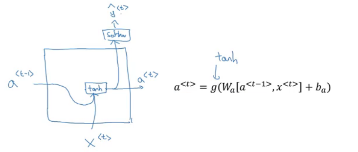

- We will represent the GRU with a similar drawings.

- Each layer in **GRUs**  has a new variable `C` which is the memory cell. It can tell to wether memorize a something or not.

- In GRUs, C\<t> = a\<t>

- Equations of the GRUs:

  - 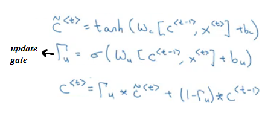
  - The update gate is between 0 and 1
    - To understand GRUs imagine that the update gate is either 0 or 1 most of the time.
  - So we update the memory cell based on the update cell and the previous cell.

- Lets take the cat sentence example and apply it to understand this equations:

  - Sentence: "The **cat**, which already ate ........................, **was** full"

  - We will suppose that U is 0 or 1 and is a bit that tells us if a singular word needs to be memorized.

  - Splitting the words and get values of C and U at each place:

    - | Word    | Update gate(U)             | Cell memory (C) |
      | ------- | -------------------------- | --------------- |
      | The     | 0                          | val             |
      | cat     | 1                          | newVal          |
      | which   | 0                          | newVal          |
      | already | 0                          | newVal          |
      | ...     | 0                          | newVal          |
      | was     | 1 (I dont need it anymore) | newerVal        |
      | full    | ..                         | ..              |
- Drawing for the GRUs
  - 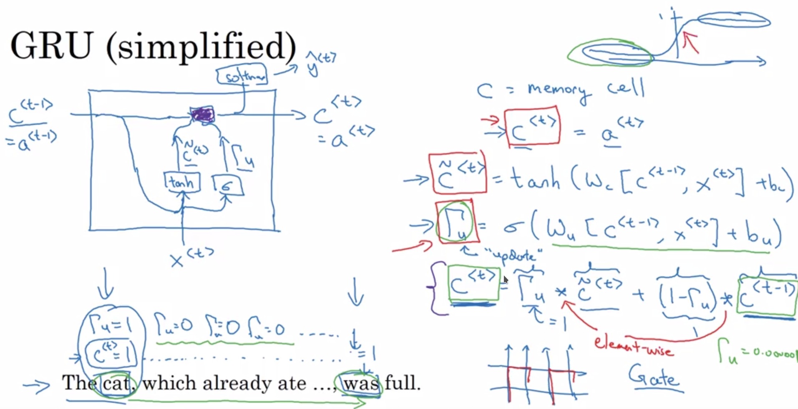
  - Drawings like in http://colah.github.io/posts/2015-08-Understanding-LSTMs/ is so popular and makes it easier to understand GRUs and LSTMs. But Andrew Ng finds its better to look at the equations.
- Because the update gate U is usually a small number like 0.00001, GRUs doesn't suffer the vanishing gradient problem.
  - In the equation this makes C\<t> = C\<t-1> in a lot of cases.
- Shapes:
  - a\<t> shape is (NoOfHiddenNeurons, 1)
  - c\<t> is the same as a\<t>
  - c~\<t> is the same as a\<t>
  - u\<t> is also the same dimensions of a\<t>
- The multiplication in the equations are element wise multiplication.
- What has been descried so var is the Simplified GRU unit. Lets now describe the full one:
  - The full GRU contains a new gate that is used with to calculate the candidate C. The gate tells you how relevance is C\<t-1> to C\<t>
  - Equations:
    - 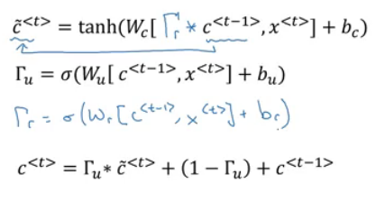
  - Shapes are the same
- So why we use these architectures, why don't we change them, how we know they will work, why not add another gate, why not use the simpler GRU instead of the full GRU; well researchers has experimented over years all the various types of these architectures with many many different versions and also addressing the vanishing gradient problem. They have found that full GRUs are one of the best RNN architectures  to be used for many different problems. You can make your design but put in mind that GRUs and LSTMs are standards.

### Long Short Term Memory (LSTM)

- Other unit that can make you do long term dependences is an LSTM unit and its more powerful and general than GRUs.
- In LSTMs , C\<t> != a\<t>
- Here are the equations of an LSTM unit:
  - 
- In GRUs we have an update gate `U`, a relevance gate `r`, and a candidate cell variables C~\<t> while in LSTMs we have an update gate `U` - Sometimes its called Input gate I -, a forget gate `F`, an output gate `O`, and a candidate cell variables C~\<t>
- Drawings - which is inspired from http://colah.github.io/posts/2015-08-Understanding-LSTMs/ -: 
  - 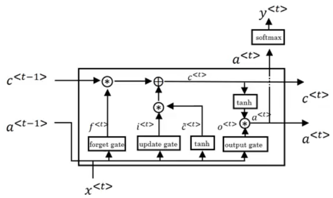
- Some Variants on LSTMs includes:
  - LSTM with **peephole connections**.
    - The normal LSTM with C\<t-1> included with every gate.
- There isn't a universal superior in choosing between LSTMs and its variants. Some win and some problems and some don't. One of the advantages of GRUs is that its simpler and can be used to build much bigger network but the LSTM is more powerful and general as we said.
### Bidirectional RNN
- There are still some ideas to make a powerful sequence model. One of them is bidirectional RNNs and another is Deep RNNs.
- As we saw before, here are an example on Name entity recognition:
  - 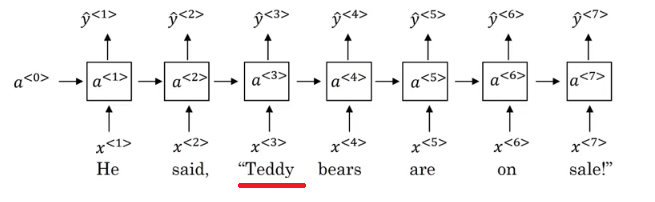
- The name Teddy cannot be learned from **He** and **said**, but can be learned from **bears**.
- BRNNs fixes this issue.
- Here are BRNNs architecture:
  - 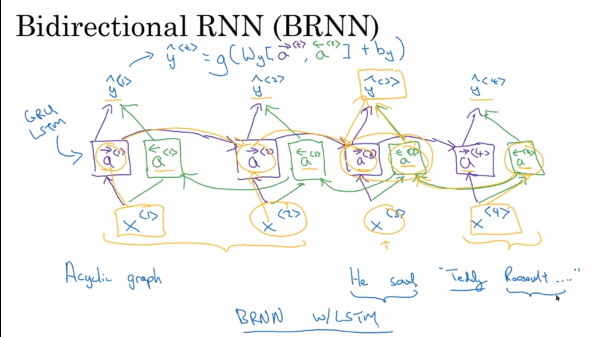
- Hint that BRNNs are **acyclic graph**!
- The forward propagation goes from left to right, and from right to left. It learns from both sides.
- To make predictions we use y^\<t> by using the two activations that comes from left and right.
- The blocks here can be any RNN block including the basic RNNs, LSTMs, or GRUs.
- For a lot of NLP or text processing problems, a BRNN with LSTM appears to be commonly used.
- The disadvantage of BRNNs that you need the entire sequence before you can process it. For example in live speech recognition if you used BRNNs you will need to wait for the person who speaks to stop to take the entire sequence and then make your predictions.
### Deep RNNs

- In a lot of cases the standard one layer RNNs will solve your problem. But in some problems its useful to stack some RNN layers to make a deeper network.
- For example, a deep RNN with 3 layers would look like this:
  - 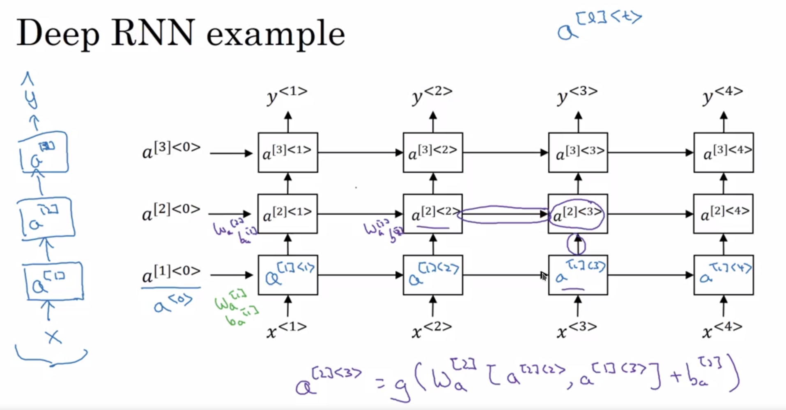
- In feed forward deep nets we can have till 100 or 200 layer and this would be a so big network. In deep RNNs stacking 3 layers is considered deep and already expensive.
- In some cases you might see a deep network that are connected after recurrent cell.

### Back propagation with RNNs

- > In modern deep learning frameworks, you only have to implement the forward pass, and the framework takes care of the backward pass, so most deep learning engineers do not need to bother with the details of the backward pass. If however you are an expert in calculus and want to see the details of backprop in RNNs, you can work through this optional portion of the notebook.

- The quote is taken from this [notebook](https://www.coursera.org/learn/nlp-sequence-models/notebook/X20PE/building-a-recurrent-neural-network-step-by-step). If you want the details of the back propagation with programming notes look at the linked notebook.

## Natural Language Processing & Word Embeddings

> Natural language processing with deep learning is an important combination. Using word vector representations and embedding layers you can train recurrent neural networks with outstanding performances in a wide variety of industries. Examples of applications are sentiment analysis, named entity recognition and machine translation.

### Introduction to Word Embeddings

#### Word Representation
- NLP has been revolutionized by deep learning and especially be RNNs and deep RNNs.
- Word embeddings is a way of representing words. It lets your algorithm automatically understand the analogies between words like "king" and "queen".
- So far we have defined our language by a vocabulary. Then represented our words with one hot vector that represent the word in the vocabulary.
  - An image example would be:
    - 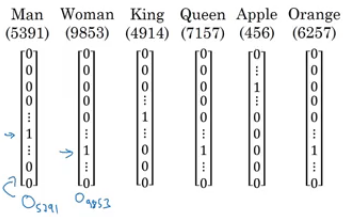
  - We will use the annotation **O** idx for any word that is represented with one hot like in the image.
  - One of  the weaknesses of this representation is that it treats a word as a thing that itself and it doesn't allow an algorithm to generalize across words.
    - For example: "I want a glass of **orange** ______" , a model should predict the next word as **Juice**.
    - A similar example "I want a glass of **apple** ______" , a model won't easily predict **juice** here if it doesn't trained on it. And if so the two examples aren't related although orange and apple are similar.
  - Inner product between any hot encoding word is zero. Also the distances between them are the same.
- So, instead of a one-hot presentation, won't it be nice if we can learn a featurized representation with each of these words: Man, Woman, King, Queen, Apple, and orange?
  - 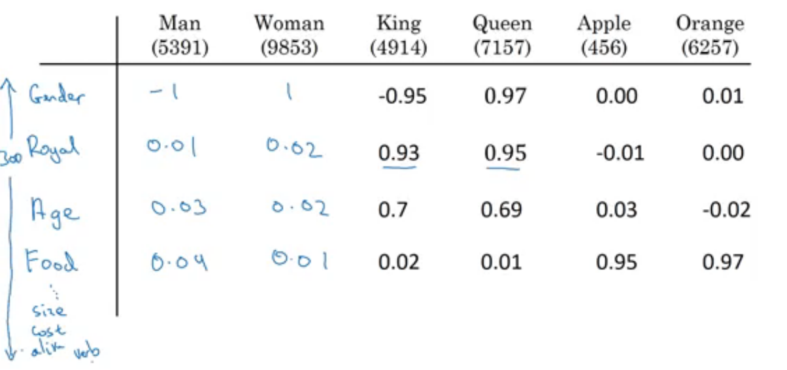
  - Each word will have a 300 features with type of float point number for example.
  - Each word column will be 300 dimensional vector which will be the representation.
  - We will use the notation **e**5391 to describe Man word features vector.
  - Now if we went to the examples we descried again:
    -  "I want a glass of **orange** ______" 
    -  I want a glass of **apple** ______
  - Orange and apple now shares a lot of similar features which makes it easier for an algorithm to generalize between them.
  - We call this representation **Word embeddings**.
- To visualize word embeddings we use t-SNE algorithm to reduce the features to 2 dimensions which makes it easy to visualize. 
  - 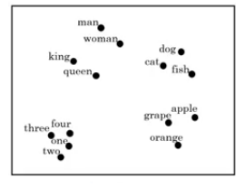
  - You will get a sense that more related words distance are smaller than other distances.
- The **word embeddings** came from that we need to embed a unique vector inside an n dimensions.

#### Using word embeddings
- Lets see how we can take the feature representation we have extracted from each word and apply it in Name entity recognition problem.
- Given this example - From named entity recognition - :
  - 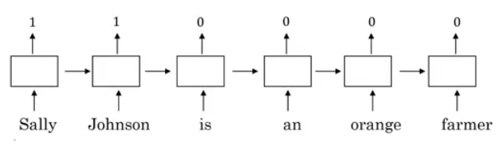
- **Sally Johnson** is a persons name.
- After training on this sentence the model should find out that the sentence "**Robert Lin** is an *apple* farmer" contains Robert Lin as a name, as apple and orange has near representations.
- Now if you have tested your model with this sentence "**Mahmoud Badry** is a *durian* cultivator" the network should learn the name even if it hasn't seen the word *durian* before. Thats the power of word representations.
- The algorithms that are used to learn **word embeddings** can exterminate billions of unlabeled text - for example 100 billion- words and learn the representation from them.
- Transfer learning and word embeddings:
  1. Learn word embeddings from large text corpus. say 100 billion word
     - Or download pre-trained embedding online.
  2. Transfer embeddings to new task with smaller training set. say 100k word.
  3. Optimal: Continue to finetune the word embeddings with new data.
     - This can be done if your smaller training set are big enough.
- Also one of the advantages of using word embeddings is that it reduces the size of the input!
  - 10,000 one hot compared to 300 features vector.
- Word embeddings has an interesting relationship to the face recognition task:
  - 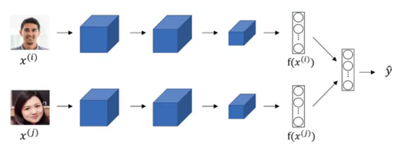
  - In this problem we encode each face into a vector and then check how similar is these vectors.
  - The word **encode** and **embeddings** has a similar meaning here.
  - In the word embeddings task, we are getting a vector say from e1 to e300 for each word in our vocabulary. We will discuss the algorithm in the next sections.

#### Properties of word embeddings
- One of the most fascinating properties of word embeddings is that they can also help with analogy reasoning. Analogy reasoning is one of the most important applications of NLP.
- Analogies example:
  - Given this word embeddings table:
    - 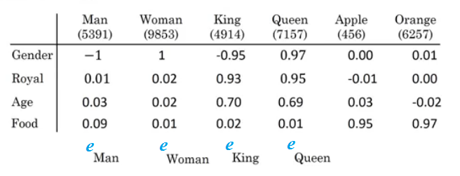
  - Can we conclude this relation:
    - Man ==> Woman
    - King ==> ??
  - Lets subtract eMan from eWoman. This will equal the vector `[-2  0  0  0]`
  - Similar eKing - eQueen = `[-2  0  0  0]`
  - So the difference is about the gender in both.
    - 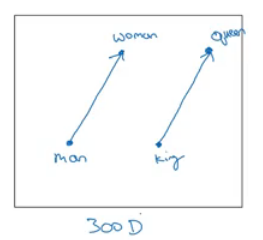
    - This vector represents the gender.
    - This drawing is 2D visualization of the 4D vector that has been extracted by t-SNE algorithm. It was drawing for just clarification! Don't rely on t-SNE algorithm in finding parallels.
  - So we can reformulate the problem to find:
    - eMan - eWoman ≈ eKing - e??
  - It can also represented mathematically by:
    - 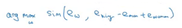
  - It turns out that eQueen is the best solution here that gets the the similar vector.
- Cosine similarity:
  - Equation:
    - 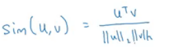
    - $$\text{CosineSimilarity(u, v)} = \frac {u . v} {||u||_2 ||v||_2} = cos(\theta)$$
    - The top part represents the inner product of `u` and `v` vectors. That will be large if the vectors are so similar.
  - We can use this equation to calculate the similarities between word embeddings and on the analogy problem where `u` = ew and `v` = eking - eman + ewoman

#### Embedding matrix
- When you implement an algorithm to learn a word embedding, what you end up learning is an **<u>embedding matrix</u>**.
- Lets take an example:
  - Suppose we are using 10,000 words as our vocabulary.
  - The algorithm should extract a matrix `E` of the shape (300, 10,000) in case we are extracting 300 features. (300, 10,001) if we have `<UNK>` token.
    - 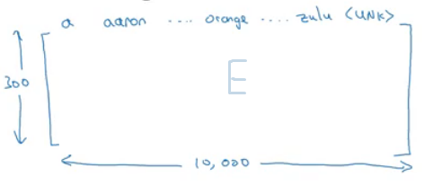
  - If O6257 is the one hot encoding of the word **orange**, then `E`. O6257 equals e6257 which shape is (300, 1)
  - Generally `E`. Oj  = ej
- In the next sections you will see that we first initialize `E` randomly and then try to learn all the parameters of this matrix.
- In practice its not efficient to use a dot multiplication when you are trying to extract the embeddings of a specific word, instead we will use slicing to slice a specific column. In keras there are a embedding layer that extracts this column with no multiplications!

### Learning Word Embeddings: Word2vec & GloVe

#### Learning word embeddings
- Lets start learning some algorithms that learns the word embeddings.
- At start, word embeddings algorithms - with deep learning - were complex but then it started to be simpler and simpler.
- We will start by learning the complex examples to make more sense.
- **<u>Neural language model</u>**:
  - Lets start by example:
    - 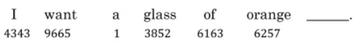
  - We want to build a language model so that we can predict the next word.
  - So we use this neural network to learn the language model
    - 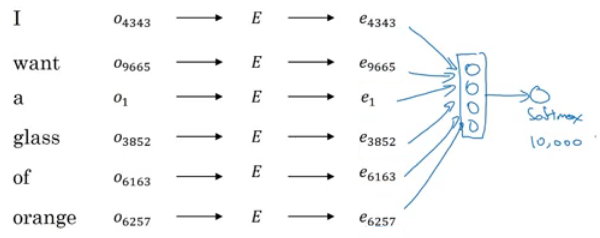
    - We get ej by `E`. oj
    - NN layer has parameters `W1` and `b1` while softmax layer has parameters `W2` and `b2`
    - Input dimension is (300*6, 1) if we the window size is 6.
    - Here we are optimizing `E` matrix and layers parameters. We need to maximize the likelihood in our training set.
  - This model was build on 2003 and tends to work very well to get the embeddings.
- In the last example we took a window of 6 words that fall behind the word that we want to predict. There are other choices when we are trying to learn word embeddings.
  - Suppose we have the example: "I want a glass of orange **juice** to go along with my cereal"
  - To learn juice, Choices of **Context** are:
    1. Last 4 words.
       - We use a window of last 4 words - 4 is the best -, "<u>a glass of orange</u>" and try to predict the next word from it.
    2. 4 words on the left and on the right.
       - "<u>a glass of orange</u>" and "<u>to go along with</u>"
    3. Last 1 word.
       - "<u>orange</u>"
    4. Nearby 1 word.
       - "<u>glass</u>" word is near juice
       - The idea of **skip grams** model. 
       - The idea is so simpler and works remarkably well.
       - We will talk about this in the next section.

#### Word2Vec
- Before presenting Word2Vec, lets talk about **Skip-grams**:

  - For example if we have the sentence: "I want a glass of orange juice to go along with my cereal"

  - We will choose Context and target.

  - The target is chosen randomly basing on a window with a specific size.

  - | Context | Target | How far |
    | ------- | ------ | ------- |
    | orange  | juice  | +1      |
    | orange  | glass  | -2      |
    | orange  | my     | +6      |

    We have converted the problem into a supervised problem.

  - This is not an easy learning problem because within -10/+10 words for example is hard.

  - We want to learn this to get our word embeddings model.

- Word2Vec model:

  - Vocabulary size = 10,000 word
  - Lets say that the context word are `c` and the target word are `t`
  - We want to learn `c` to `t`
  - we get ec by `E`. oc
  - We then use a softmax layer to get `P(t|c)` which is y^
  - Also we will use the cross-entropy loss function.
  - This model is called skip-grams model.

- The last model has a problem with the softmax classifier:

  - 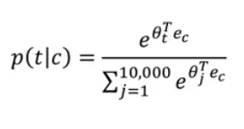
  - Here we are summing 10,000 numbers which corresponds to the number of words in our vocabulary.
  - If this number is larger say 1 million, the computation will become so slow.

- The solution for the past problem is to use "**Hierarchical softmax classifier**" which works as a tree classifier.

  - 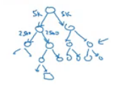

- In practice the hierarchical softmax classifier doesn't use a balanced tree like the drawn one. Common words are in the top and less common are in the bottom.

- How to sample the context c?

  - One way is to choose the context by random from your corpus.
  - If you have done it that way, there will be frequent words like "the, of, a, and, to, .." that can dominate other words like "orange, apple, Mahmoud,..."
  - So in practice, we don't take the context uniformly random, instead there are some heuristics to balance the common words and the non-common words.

#### Negative Sampling
- Negative sampling allows you to do something similar to the Skip-Gram model, but with a much more efficient learning algorithm. We will create a different learning problem

- Given this example:

  - "I want a glass of orange juice to go along with my cereal"

- The sampling will look like this:

- | Context | Word  | target |
  | ------- | ----- | ------ |
  | orange  | juice | 1      |
  | orange  | king  | 0      |
  | orange  | book  | 0      |
  | orange  | the   | 0      |
  | orange  | of    | 0      |

  We get positive example by using the same skip-grams technique, a fixed window that goes around.

- To generate a negative example, we pick a word randomly from the vocabulary.

- Notice that we got "of" although it was appeared in the same sentence.

- So the steps to generate the samples are:

  1. Pick a positive context
  2. Pick a k negative contexts from the dictionary.

- K is recommended to be from 5 to 20 in small datasets. For larger ones 2 to 5.

- We will have a k negative examples to 1 positive ones in the data we are collecting.

- Now lets define the model that will learn this supervised learning problem:

  - Lets say that the context word are `c` and the word are `t` and `y` is the target.
  - We will apply the simple logistic regression model.
  - 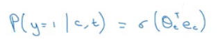
  - The logistic regression model can be drawn like this:
  - 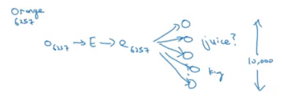
  - So we are like having 10,000 binary classification problem, and we only train k+1 classifier of them in each iteration.

- Now how to select negative samples:

  - We can sample according to empirical frequencies in words corpus which means according to how often different words appears. But the problem with that is that we will have more frequent words like the, of, and..
  - The best is to sample with this equation - According to authors - :
    - 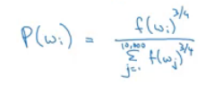

#### GloVe word vectors
- GloVe is another algorithm for learning the word embeddings, Its the simplest of them.
- This is not used much as word2vec or gram models, but it has some enthusiasts because of its simplicity.
- GloVe stands for Global vectors for word presentation.
- Given this example:
  - "I want a glass of orange juice to go along with my cereal"
- We will choose a context and a target from the choices we have mentioned in the previous sections.
- Then we will calculate this for every pair, Xct = # times `t` appears in context of `c`
- Xct = Xtc if we choose a window pair, but they will not equal if we choose the previous words for example. In GloVe they use a window which means they are equal
- The model is defined like this:
  - 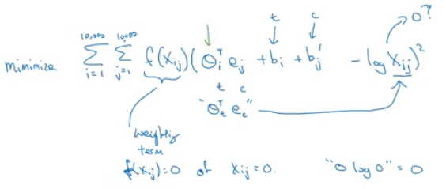
- f(x) -the weighting term- is used for many reasons which includes:
  - The `log(0)` problem, which might occur if there are no pairs for the given target and context values.
  - Giving low weights for stop words like "is", "the", and "this" because they occurs a lot.
  - Giving low weights for words that doesn't occur so much.
- ceta and e are symmetric which helps getting the final word embedding. 
- Conclusion on word embeddings:
  - If this is your first try, you should try to download a pretrained model that has been made and actually works best.
  - If you have enough data, you can try to implement one of the available algorithms.
  - Because word embeddings are very computationally expensive to train, most ML practitioners will load a pre-trained set of embeddings.
  - A final note that you can't guarantee that the axis used to represent the features will be well-aligned with what might be easily humanly interpretable axis like gender, and royal, and age.

### Applications using Word Embeddings

#### Sentiment Classification
- As we have discussed before, Sentiment classification is the process of finding if a text has a positive or a negative review. Its so useful in NLP and is used in so many applications. An example would be:
  - 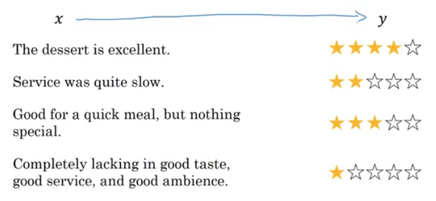
- One of the challenges with it, is that you might haven't a huge labeled training data for it, but using word embeddings can help getting rid of this.
- The common dataset sizes varies from 10,000 to 100,000 words.
- A simple sentiment classification model would be like this:
  - 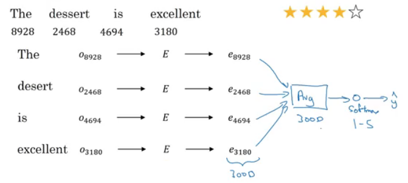
  - The embedding matrix may have been trained on say 100 billion words.
  - Number of features given a word is 300.
  - We can use **sum** or **average** given all the words then pass it to a softmax classifier. That makes this classifier works for short or long sentences.
- One of the problems with this simple model is that it ignores words order! for example "Completely lacking in **good** taste, **good** service, and **good** ambience" has the word good 3 times but its a negative review!
- A better model uses an RNN for solving this problem:
  - 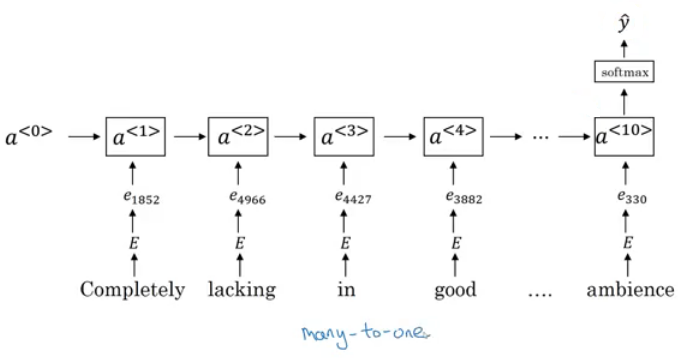
  - And so if you train this algorithm, you end up with a pretty decent sentiment classification algorithm.
  - Also it will generalize even if words aren't in your dataset, for example the sentencte "Completely **<u>absent of</u>** good taste, good service, and good ambience" will be the same as the trained word!

#### Debiasing word embeddings
- We want to make sure that our word embeddings free from undesirable forms of bias, such as gender bias, ethnicity bias and so on.
- A horrifying result on a trained word embeddings in the context of Analogies:
  - Man : Computer_programmer as Woman : **Homemaker**
  - Father : Doctor as Mother : **Nurse**
- Word embeddings can reflect gender, ethnicity, age, sexual orientation, and other biases of text used to train the model.
- Learning algorithms by general is making an important decision and it mustn't be biased.
- Andrew thinks we actually have better ideas for quickly reducing the bias in AI than for quickly reducing the bias in the human race, although it still needs a lot of work to be done.
- Addressing bias in word embeddings steps:
  - Idea is by paper: https://arxiv.org/abs/1607.06520
  - Given this learned embeddings: 
    - 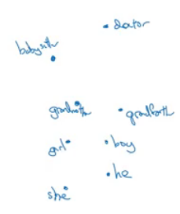
  - We need to solve the **gender bias** here. The steps we will discuss can help solve any bias problem but we are focusing here on gender bias.
  - Here are the steps:
    1. Identify the direction:
       - Calculate the difference between:
         - ehe - eshe
         - emale - efemale
         - ....
       - Choose some k differences and average them.
       - This will help you find this:
         - 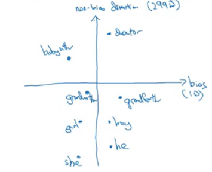
       - By that we have found the bias direction which is 1D vector and the non-bias vector which is 299D vector.
    2. Neutralize: For every word that is not definitional, project to get rid of bias.
       - Babysitter and doctor needs to be neutral so we project them on nonbias with the direction of the bias:
         - 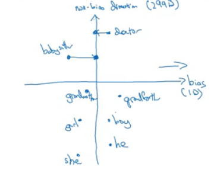
         - After that they will be equal in the term of gender.
         - To do this the authors of the paper trained a classifier to tell the words that they need to be  neutralized or not.
    3. Equalize pairs
       - We want each pair to have difference only in gender. Like:
         - Grandfather - Grandmother
         - He - She
         - Boy - Girl
       - We want to do this because the distance between grandfather and babysitter is bigger than babysitter and grandmother:
         - 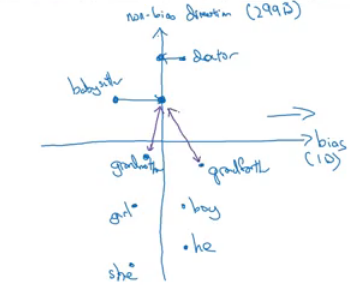
       - To do that, we move grandfather and grandmother to a point where they will be in the middle of the non-bias axis.
       - There are some words you need to do this for in your steps. The size of these words are relatively small.

## Sequence models & Attention mechanism

> Sequence models can be augmented using an attention mechanism. This algorithm will help your model understand where it should focus its attention given a sequence of inputs. This week, you will also learn about speech recognition and how to deal with audio data.

### Various sequence to sequence architectures

#### Basic Models
- In this section we will learn about sequence to sequence - Many to Many -  models which are useful in various applications including machine translation and speech recognition.
- Lets start by the basic model:
  - Given this machine translation problem in which X is a French sequence and Y is an English sequence.
    - 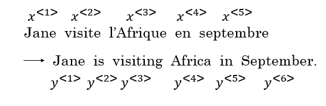
  - Our architecture will include **encoder** and **decoder**.
  - The encoder is built with RNNs - LSTM or GRU are included - and takes the input sequence and then outputs a vector that should represent the whole input.
  - After that the decoder network, are also built with RNNs and outputs the output sequence using the vector that has been built by the encoder.
  - 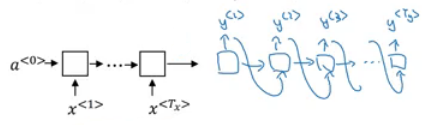
  - These ideas are from these papers:
    - [[Sutskever](https://arxiv.org/abs/1409.3215) et al., 2014. Sequence to sequence learning with neural networks]
    - [[Cho et](https://arxiv.org/abs/1406.1078) al., 2014. Learning phrase representations using RNN encoder-decoder for statistical machine translation]
- With an architecture similar to the one previously mentioned works for image captioning problem:
  - In this problem X is an image, while Y is a sentence.
  - The model architecture image:
    - 
  - The architecture uses a CNN pretrained AlexNet as an encoder for the image, and the decoder is an RNN.
  - The ideas are from these papers (They share similar ideas):
    - [[Maoet](https://arxiv.org/abs/1412.6632). al., 2014. Deep captioning with multimodal recurrent neural networks]
    - [[Vinyalset](https://arxiv.org/abs/1411.4555). al., 2014. Show and tell: Neural image caption generator]
    - [[Karpathy](https://cs.stanford.edu/people/karpathy/cvpr2015.pdf) and Li, 2015. Deep visual-semantic alignments for generating imagedescriptions]

#### Picking the most likely sentence
- There are some similarities between the language model we have learned previously, and the machine translation model we have just discussed, but there are some differences as well.
- The language model we have learned as so similar to the decoder of the machined translation model, except for a0
  - 
- The problems formations also are different:
  - In language model: P(y\<1>, ....y\<Ty>)
  - In machine translation: P(y\<1>, ....y\<Ty> | x\<1>, ....x\<Tx>)
- What we don't want in machine translation model, is not to sample the output at random. This may provide some choices as an output. Sometimes you may sample a bad output.
  - Example: 
    - X = "Jane visite l’Afrique en septembre."
    - Y may be:
      - Jane is visiting Africa in September.
      - Jane is going to be visiting Africa in September.
      - In September, Jane will visit Africa.
- So we need to get the best output, this can be take by the equation:
  - 
- The most common algorithm is the beam search, which we will explain in the next section.
- Why not use greedy search? Why not get the best choices each time?
  - It turns out that this approach doesn't really work!
  - Lets explain it with an example:
    - The best output for the example we talked about is "Jane is visiting Africa in September."
    - Suppose that you when you are choosing with greedy approach, the first two words were "Jane is", the word that may come after that will be "going" as "going" is the most common word that comes after "Noun is" so the result may look like this: "Jane is going to be visiting Africa in September." and that isn't the best/optimal solution.
- So what is better than greedy approach, is trying to get an approximate solution, that will try to maximize the output.

#### Beam Search
- Beam search is the most widely used algorithm to get the best output sequence. Its a heuristic search algorithm.
- To illustrate the algorithm we will be stick with the example from the previous section. We need Y = "Jane is visiting Africa in September."
- The algorithm has a parameter `B`  which is the beam width. Lets take `B = 3` which means the algorithm will get 3 outputs at a time.
- For the first step you will get ["in", "jane", "september"] words that are the best candidates.
- Then for each word in the first output, get B words from the 3 where the best are the result of multiplying both probabilities. Se we will have then ["In September", "jane is", "jane visit"]. Notice that we automatically ignored September.
- Repeat the same process and get the best B words for ["September", "is", "visit"]  and so so.
- In this algorithm, keep only B instances of your network.
- If `B = 1` this will become the greedy search.

#### Refinements to Beam Search
- In the previous section we have discussed the basic beam search. In this section we will try to do some refinements to it to work even better.
- The first thing is **Length optimization**
  - In beam search we are trying to optimize:
    - 
  - And to do that we multiply:
    - P(y\<1> | x) * P(y\<2> | x, y\<1>) * ..... P(y\<t> | x, y\<y(t-1)>)
  - Each probability is a fraction. Also maybe a small fraction.
  - Multiplying small fractions will cause a **numerical overflow**! Meaning that it's too small for the floating part representation in your computer to store accurately.
  - So in practice we use **summing** **logs** instead of multiplying directly.
    - 
  - But theres another problem. The two optimization functions we have mentions tends to find small sequences! Because multiplying a lot of fractions gives a smaller value.
  - So theres another change , by dividing by the number of elements in the sequence.
    - 
    - alpha is a hyper parameter to tune.
    - If alpha = 0, Then its like we do nothing.
    - If alpha = 1, Then its like we are using full sequence length.
    - In practice alpha = 0.7 is a good thing. 
- The second thing is who can we choose best `B`?
  - The larger B, the larger possibilities, the better are the results. But it will be more computationally expensive.
  - In practice, you might see a in the production sentence `B=10`
  - `B=100`, `B=1000` are uncommon.
  - Unlike exact search algorithms like BFS (Breadth First Search) or  DFS (Depth First Search), Beam Search runs faster but is not guaranteed to find exact solution.

#### Error analysis in beam search
- We have talked before on **Error analysis** in <u>Structuring Machine Learning Projects</u> chapter. We will apply these concepts to improve our beam search algorithm.
- We will use error analysis to figure out if the `B` hyperparameter of the beam search is the problem - because it doesn't get an optimal solution  - or to in other hyperparameters like the RNN parameters.
- Lets take an example:
  - Our examples information:
    - x = "Jane visite l’Afrique en septembre."
    - y* = "Jane visits Africa in September."
    - y^ = "Jane visited Africa last September."
  - Our model that has produced a sentence that are different in meaning because of the word "last"
  - We now want to know who to blame, the RNN or the beam search.
  - To do that, we calculate P(y* | X) and P(y^ | X). There are two cases:
    - Case 1 (P(y* | X)  > P(y^ | X)): 
      - Conclusion: Beam search is at fault.
    - Case 2 (P(y* | X)  <= P(y^ | X)): 
      - Conclusion: RNN model is at fault.
- The error analysis process is as following:
  - You choose N error examples and make the following table:
    - 
  - `B`  for beam search, `R` is for the RNN.
  - Get counts and decide.

#### BLEU Score
- One of the challenges of machine translation, is that given a sentence in a language there are one or more possible good translation in another language. So how do we evaluate our results?
- The way we do this is by using **BLEU score**. BLEU stands for bilingual evaluation understudy.
- The intuition is so long as the machine generated translation is pretty close to any of the references provided by humans, then it will get a high BLEU score.

- Lets take an example:

  - X = "Le chat est sur le tapis."
  - Y1 = "The cat is on the mat."
  - Y2 = "There is a cat on the mat."
  - Suppose that the machine outputs: "<u>the the the the the the the.</u>"
  - One way to evaluate the machine output is to look at each word in the output and check it in the references. This is called precision:
    - precision = 7/7  because the appeared in Y1 or Y2
  - This is not a useful measure!
  - We can use a modified precision in which we are looking for the reference with the maximum number of a particular word and set the maximum appearing of this word to this number. So:
    - modified precision = 2/7 because the max is 2 in Y1
    - We clipped the 7 times by the max which is 2.
  - The problem here is that we are looking at one word at a time, we may need to look at pairs

- Another example (BLEU score on bigrams)

  - The n-**grams** typically are collected from a text or speech corpus. When the items are words, n-**grams** may also be called shingles. An n-**gram** of size 1 is referred to as a "unigram"; size 2 is a "bigram" (or, less commonly, a "digram"); size 3 is a "trigram".

  - X = "Le chat est sur le tapis."

  - Y1 = "The cat is on the mat."

  - Y2 = "There is a cat on the mat."

  - Suppose that the machine outputs: "<u>The cat the cat on the mat.</u>"

  - The bigrams in the machine output:

  - | Pairs      | Count | Count clip |
    | ---------- | ----- | ---------- |
    | the cat    | 2     | 1 (Y1)     |
    | cat the    | 1     | 0          |
    | cat on     | 1     | 1 (Y2)     |
    | on the     | 1     | 1 (Y1)     |
    | the mat    | 1     | 1 (Y1)     |
    | **Totals** | 6     | 4          |

    Score = Count clip / Count = 4/6

- So here are the equations for the n-grams:

  - 

- Lets put this together to formalize the BLEU score:

  - **Pn** = Bleu score on n-grams only
  - **Combined Bleu score** equation:
    - 
    - For example if we want Bleu for 4, we compute P1, P2, P3, P4 and then average them and take the exp.
  - Another equation is **BP penalty** which stands for brevity penalty. It turns out that if a machine outputs a small number of words it will get a better score so we need to handle that.
    - 

- Blue score is has several open source implementations and used in variety of systems like machine translation and image captioning.

#### Attention Model Intuition

- So far we are using sequence to sequence models with an encoder and decoders. There are a technique called attention which makes these models even better.
- The attention algorithm, the attention idea has been one of the most influential ideas in deep learning. 
- The problem of long sequences:
  - Given this model, inputs, and outputs.
    - 
  - The encoder should memorize this long sequence into one vector, and the decoder has to process this vector to generate the translation.
  - If a human would translate this sentence, he wouldn't read the whole sentence and memorize it then try to translate it. He translates a part at a time.
  - The performance of this model decreases if a sentence is so long.
  - We will discuss the attention model that works like a human that looks at parts at a time. That will significantly increase the accuracy even with bigger sequence:
    -  
    -  Blue is the normal model, while green is the model with attention mechanism.
- In this section we will give just some intuitions about the attention model and in the next section we will discuss its details.
- At first the attention model was developed for machine translation but then other applications used it like computer vision and new architectures like Neural Turing machine.
- The attention model was descried in this paper:
  - [[Bahdanau](https://arxiv.org/abs/1409.0473) et. al., 2014. Neural machine translation by jointly learning to align and translate]
- Now for the intuition:
  - Suppose that our decoder is a bidirectional RNN:
    - 
  - We gave the French sentence to the encoder and it should generate a vector that represents the inputs.
  - Now to generate the first word in English which is "Jane" we will make another RNN which is the decoder.
  - attention weights are used to specify which words are needed when to generate a word. So to generate "jane" we will look at "jane", "visite", "l'Afrique"
    - 
  - alpha1,1, alpha1,2, and alpha1,3 are the attention weights used.
  - And so to generate any word there will be a set of attention weights that controls which words we are looking at right now.
    - 
  - ​

#### Attention Model

- Lets formalize the intuition from the last section into the exact details on how this can be implemented.
- First we will have an bidirectional RNN - most common is LSTMs - that encodes French language:
  - 
- For learning purposes, lets assume that a\<t> will include the both directions.
- We will have an RNN to extract the output using a context `c` which is computer using the attention weights. This denotes how much information do it needs to look in a\<t>
  - 
- Sum of the attention weights for each element in the sequence should be 1:
  - 
- Also the context `c` are calculated using this equation:
  - 
- Lets see how can we compute the attention weights:
  - So alpha\<t, t'> = amount of attention y\<t> should pay to a\<t'>
    - Like for example we payed attention to the first three words through alpha\<1,1>, alpha\<1,2>, alpha\<1,3>
  - We are going to softmax the attention weights so that their sum is 1:
    - 
  - Now we need to know how to calculate e\<t, t'>. We will compute e using a small neural network:
    - 
    - s\<t-1> is the hidden state of the RNN s, and a\<t'> is the activation of the other bidirectional RNN. 
- One of the disadvantages of this algorithm is that it takes quadratic time or quadratic cost to run.
- One fun way to see how attention works is by visualizing the attention weights:
  - 

### Speech recognition - Audio data

#### Speech recognition
- The rise of accurate speech recognition was the most exciting work done in sequence to sequence deep learning models.
- Lets define the speech recognition problem:
  - X: audio clip
  - Y: transcript
  - If you plot an audio clip it should look like this:
    - 
    - The horizontal axis is time while the vertical is changes in air pressure.
  - What really is an audio recording? A microphone records little variations in air pressure over time, and it is these little variations in air pressure that your ear also perceives as sound. You can think of an audio recording is a long list of numbers measuring the little air pressure changes detected by the microphone. We will use audio sampled at 44100 Hz (or 44100 Hertz). This means the microphone gives us 44100 numbers per second. Thus, a 10 second audio clip is represented by 441000 numbers (= $10 \times 44100$).
  - It is quite difficult to work with "raw" representation of audio.
  - Because even human ear doesn't process raw wave forms, the human ear can process different frequencies.
  - There's a common preprocessing step for an audio to generate a spectrogram which works similarly to human ears.
    - 
    - The horizontal axis is time while the vertical is frequencies. Intensity of different colors shows the amount of energy.
  - A spectrogram is computed by sliding a window over the raw audio signal, and calculates the most active frequencies in each window using a Fourier transform.
  - In the past days, speech recognition systems was built with phonemes that are a hand engineered basic units of sound. Linguists use to hypothesize any writing down audio in terms of phonemes which they thought would be the best way to do speech recognition.
  - End to end deep learning found that phonemes was no longer needed. One of the things that made this possible is the large audio datasets.
  - Research papers has 300 - 3000 hours while the best commercial systems are now trained on over 100,000 hours of audio.
- You can build an accurate speech recognition system using the attention model that we have descried in the previous section:
  - 
- One of the methods that seem to work well is CTC cost which stands for "Connectionist temporal classification" 
  - To explain this lets say that Y = "<u>the quick brown fox</u>"
  - We are going to use an RNN with input, output structure:
    - 
  - Hint: this is a bidirectional RNN, but it practice a bidirectional RNN are used.
  - Notice that the number of inputs and number of outputs are the same here, but in speech recognition problem X tends to be a lot larger than Y.
    - 10 seconds of audio gives us X with shape (1000, ). This 10 seconds can't have 1000 character!
  - The CTC cost function allows the RNN to output something like this:
    - `ttt_h_eee\<SPC>___\<SPC>qqq___`
    - This covers from "The quick".
    - The _ is a special character called blank and `<SPC>` is for space character.
  - So the 19 character in our Y can be generated into 1000 character output using CTC and its special blanks.
  - The ideas were taken from this paper:
    - [[Graves](https://dl.acm.org/citation.cfm?id=1143891) et al., 2006. Connectionist Temporal Classification: Labeling unsegmented sequence data with recurrent neural networks]
    - This paper also are used by baidue deep speech.
- Both options attention models and CTC cost can give you an accurate speech recognition system.

#### Trigger Word Detection
- With the rise of deep learning speech recognition, there are a lot of devices that can be waked up by saying some words with your voice. These systems are called trigger word systems.
- For example, Alexa - a smart device made by amazon - can answer your call "Alexa, What time is it" and then Alexa will reply you.
- Trigger word detection system includes:
  - 
- Now the trigger word detection literature is still evolving so there actually isn't a single universally agreed on algorithm for trigger word detection yet. But lets discuss an algorithm that can be used.
- Lets now build a model that can solve this problem:
  - X: audio clip
  - X has been preprocessed and spectrogram features has been returned of X
    - X\<1>, X\<2>, ... , X\<t>
  - Y will be labels 0 or 1. 0 represents the non trigger word, while 1 is that trigger word that we need to detect.
  - The model architecture can be like this:
    - 
    - The vertical lines in the audio clip represents the trigger words. The corresponding to this will be 1.
  - One disadvantage of this is the imbalanced dataset outputs. There will be a lot of zeros and little ones.
  - A hack to solve this is to make an output a few ones for several times or for a fixed period of time before reverting back to zero.
    - 
    - 
  - ​

## Extras

### Machine translation attention model (From notebooks)

- The model is built with keras layers.
- The attention model.
  - 
  - There are two separate LSTMs in this model. Because the one at the bottom of the picture is a Bi-directional LSTM and comes *before* the attention mechanism, we will call it *pre-attention* Bi-LSTM. The LSTM at the top of the diagram comes *after* the attention mechanism, so we will call it the *post-attention* LSTM. The pre-attention Bi-LSTM goes through $T_x$ time steps; the post-attention LSTM goes through $T_y$ time steps. 
  - The post-attention LSTM passes $s^{\langle t \rangle}, c^{\langle t \rangle}$ from one time step to the next. In the lecture videos, we were using only a basic RNN for the post-activation sequence model, so the state captured by the RNN output activations $s^{\langle t\rangle}$. But since we are using an LSTM here, the LSTM has both the output activation $s^{\langle t\rangle}$ and the hidden cell state $c^{\langle t\rangle}$. However, unlike previous text generation examples (such as Dinosaurus in week 1), in this model the post-activation LSTM at time $t$ does will not take the specific generated $y^{\langle t-1 \rangle}$ as input; it only takes $s^{\langle t\rangle}$ and $c^{\langle t\rangle}$ as input. We have designed the model this way, because (unlike language generation where adjacent characters are highly correlated) there isn't as strong a dependency between the previous character and the next character in a YYYY-MM-DD date. 
- What one "Attention" step does to calculate the attention variables $\alpha^{\langle t, t' \rangle}$, which are used to compute the context variable $context^{\langle t \rangle}$ for each timestep in the output ($t=1, \ldots, T_y$). 
  - 
  - The diagram uses a `RepeatVector` node to copy $s^{\langle t-1 \rangle}$'s value $T_x$ times, and then `Concatenation` to concatenate $s^{\langle t-1 \rangle}$ and $a^{\langle t \rangle}$ to compute $e^{\langle t, t'}$, which is then passed through a softmax to compute $\alpha^{\langle t, t' \rangle}$. 

  
  
These Notes were made by [Mahmoud Badry](mailto:mma18@fayoum.edu.eg) @2018
