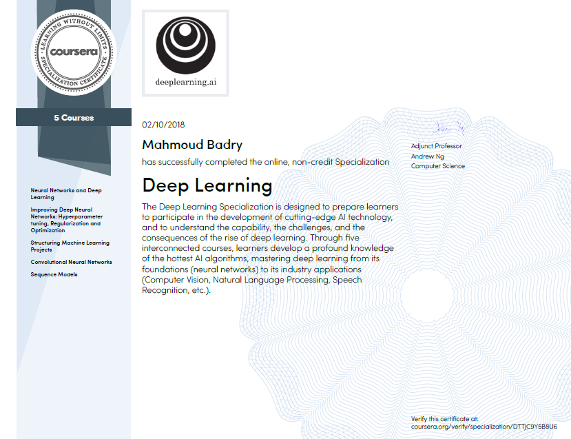

# DeepLearning.ai Courses Notes

This repository contains my personal notes and summaries on [DeepLearning.ai](https://deeplearning.ai) specialization courses. I've enjoyed every little bit of the course hope you enjoy my notes too.

[DeepLearning.ai](https://deeplearning.ai)  contains five courses which can be taken on [Coursera](https://www.coursera.org/specializations/deep-learning). The five courses titles are:

1. Neural Networks and Deep Learning.
2. Improving Deep Neural Networks: Hyperparameter tuning, Regularization and Optimization.
3. Structuring Machine Learning Projects.
4. Convolutional Neural Networks.
5. Sequence Models.

This is by far the best course series on deep learning that I've taken. Enjoy!

## About This Specialization (From the official Deep Learning Specialization page)

> If you want to break into AI, this Specialization will help you do so. Deep Learning is one of the most highly sought after skills in tech. We will help you become good at Deep Learning.
>
> In five courses, you will learn the foundations of Deep Learning, understand how to build neural networks, and learn how to lead successful machine learning projects. You will learn about Convolutional networks, RNNs, LSTM, Adam, Dropout, BatchNorm, Xavier/He initialization, and more. You will work on case studies from healthcare, autonomous driving, sign language reading, music generation, and natural language processing. You will master not only the theory, but also see how it is applied in industry. You will practice all these ideas in Python and in TensorFlow, which we will teach.
>
> You will also hear from many top leaders in Deep Learning, who will share with you their personal stories and give you career advice.
>
> AI is transforming multiple industries. After finishing this specialization, you will likely find creative ways to apply it to your work.
>
> We will help you master Deep Learning, understand how to apply it, and build a career in AI.

## Specialization Certificate

At last I've successfully completed the specialization and earned my [certificate](https://coursera.org/verify/specialization/DTTJC9Y5B8U6)!

## Similar Notes

- Beautifully drawn notes by Tess Ferrandez:
  - https://www.slideshare.net/TessFerrandez/notes-from-coursera-deep-learning-courses-by-andrew-ng

## Reviews

As [DeepLearning.ai](https://deeplearning.ai) is one of the most popular courses in the field of AI/ML/DL, there are some good reviews regarding some or whole of the specialization courses.

The list of reviews includes:

- [Ryan Shrott](https://towardsdatascience.com/@ryanshrott?source=post_header_lockup) Reviews:
  - [Deep Learning Specialization by Andrew Ng — 21 Lessons Learned](https://towardsdatascience.com/deep-learning-specialization-by-andrew-ng-21-lessons-learned-15ffaaef627c)
  - [Computer Vision by Andrew Ng — 11 Lessons Learned](https://towardsdatascience.com/computer-vision-by-andrew-ng-11-lessons-learned-7d05c18a6999)
- [Arthur Chan](https://www.linkedin.com/in/arthchan2003/) Reviews:
  - [Review of Ng's deeplearning.ai Course 1: Neural Networks and Deep Learning](https://www.linkedin.com/pulse/review-ngs-deeplearningai-course-1-neural-networks-deep-arthur-chan/?lipi=urn%3Ali%3Apage%3Ad_flagship3_profile_view_base_post_details%3BVLk6TK8sThiFt5gZF%2B25Ug%3D%3D)
  - [Review of Ng's deeplearning.ai Course 2: Improving Deep Neural Networks](https://www.linkedin.com/pulse/review-ngs-deeplearningai-course-2-improving-deep-neural-arthur-chan/?lipi=urn%3Ali%3Apage%3Ad_flagship3_profile_view_base_post_details%3BVLk6TK8sThiFt5gZF%2B25Ug%3D%3D)
  - [Review of Ng's deeplearning.ai Course 3: Structuring Machine Learning Projects](https://www.linkedin.com/pulse/review-ngs-deeplearningai-course-3-structuring-machine-arthur-chan/?lipi=urn%3Ali%3Apage%3Ad_flagship3_profile_view_base_post_details%3BVLk6TK8sThiFt5gZF%2B25Ug%3D%3D)
  - [Review of Ng's deeplearning.ai Course 4: Convolutional Neural Networks](https://www.linkedin.com/pulse/review-ngs-deeplearningai-course-4-convolutional-neural-arthur-chan/?lipi=urn%3Ali%3Apage%3Ad_flagship3_profile_view_base_post_details%3BVLk6TK8sThiFt5gZF%2B25Ug%3D%3D)
- [Thoughts after taking the Deeplearning.ai courses](https://towardsdatascience.com/thoughts-after-taking-the-deeplearning-ai-courses-8568f132153)
- [Learning Deep Learning — fast.ai vs. deeplearning.ai](https://medium.com/@markryan_69718/learning-deep-learning-fast-ai-vs-deeplearning-ai-34f9c42cf701)

A good Facebook group that discusses the courses are here: https://www.facebook.com/groups/DeepLearningAISpecialization/.

Group description:

> This group is for current, past or future students of Prof Andrew Ng's deeplearning.ai class in Coursera. The purpose is for students to get to know each other, ask questions, and share insights. However, remember the Coursera Honor Code - please do not post any solution in the forum! 

## Next steps

Taking [fast.ai](http://www.fast.ai/) courses series as it focuses more on the practical works.

## Acknowledgements

Thanks to [VladKha](https://github.com/VladKha), [wangzhenhui1992](https://github.com/wangzhenhui1992), [jarpit96](https://github.com/jarpit96), and other contributors for helping me revising and fixing mistakes in the notes.

 

 

 

Mahmoud Badry @ 2018
